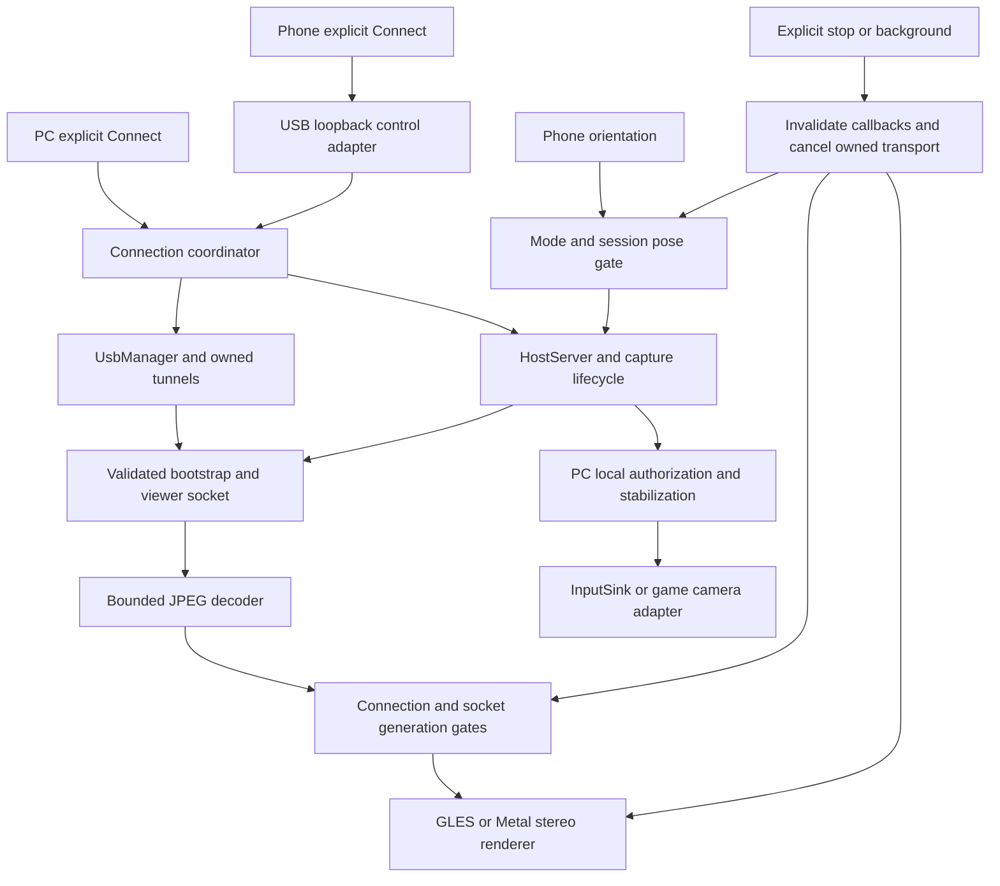
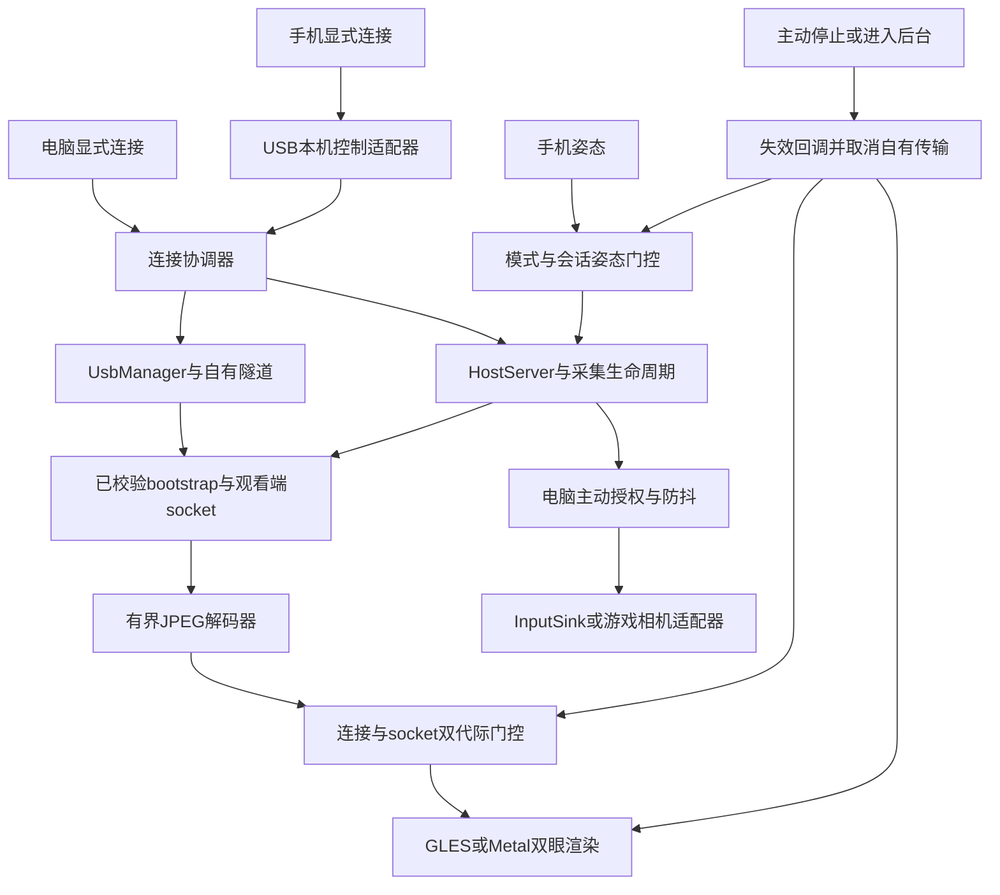

# 🤝 VRization AI handoff / AI 接手指南

[English](#english) · [简体中文](#简体中文)

<!-- vrization:english -->
## English

This is a technical handoff for continuing VRization or integrating its components into another application or game. It does not grant new permissions. Follow the user's latest instructions and preserve existing work. Start with [architecture](docs/ARCHITECTURE.md), [protocol](docs/PROTOCOL.md), [build instructions](docs/BUILD.md), [validation](docs/VALIDATION.md) and [change history](CHANGELOG.md). For a file-by-file production module map, entry points and reuse boundaries, see [Module catalogue](docs/MODULES.md).

### Status and source of truth

This handoff targets **v0.3.3-alpha**, application version **0.3.3**, mobile build **6**. The connection repair addresses USB requiring unplugging/replugging, live frames surviving phone Disconnect and stale host connection state. Final Windows / Huawei checks and Mac native acceptance are recorded in [validation](docs/VALIDATION.md); obtain exact published binaries and checksums from [Releases](https://github.com/LexZeon/VRization/releases/tag/v0.3.3-alpha). Acceptance must prove transport closure and rendering stop, rather than checking button text alone. Source code or a successful build alone never establishes a future hardware pass or latency measurement.

Use the Git checkout containing `desktop/`, `android/`, `ios/` and tracked source as the source root. Run `git status --short` and `git ls-files` before editing; an empty newly initialized directory is not the complete project. `artifacts/` contains build/test outputs, not the authoritative source. The local runnable archive is normally `%USERPROFILE%/Documents/VRization-Releases/`: `versions/<tag>/` retains each published version, `latest/` is the current extracted copy, and `tools/` holds separately installed USB tools. The repository's release notes and manifest, not folder names alone, identify a binary.

### Module map

| Module / path | Owns | Integration boundary |
| --- | --- | --- |
| `desktop/src/vrization_host/capture.py`, `windows_gpu.py`, `windows_capture.py` | Capture source, frame pacing, GPU/CPU capture and JPEG output. | Replace `CaptureSource.read(config)` / `close()` with your application's image source. |
| `desktop/src/vrization_host/server.py`, `protocol.py` | Validated v1 messages, one viewer session, settings revisions and latest-frame transport. | Embed `HostServer`; keep authorization separate from image delivery. |
| `desktop/src/vrization_host/connection.py` | Connection coordinator and independent loopback USB control service. | Let an explicit Connect on either device coordinate host startup through `request` / `accept` / `complete` / `cancel`. |
| `desktop/src/vrization_host/usb.py`, `usb_tools.py` | Device detection, owned ADB mappings, AppleMux pairing and official tools lookup/import. | Supply authorized adapters; stop only owned resources. |
| `desktop/src/vrization_host/ios_usb.py` | Explicit PC Connect / acknowledged Stop and bounded paired iOS video readiness / relay. | Inject `start_request`; retain its identity until startup or cancellation. |
| `desktop/src/vrization_host/input.py`, `pose_filter.py` | Local input authorization, pose validation, deltas and optional stabilization. | Replace `InputSink.move`; a game camera can consume pose without system mouse injection. |
| `desktop/src/vrization_host/view_edit.py`, `view_editor.py`, `storage.py` | Fit geometry, preview/commit and local preferences. | Reuse pure geometry; keep draft and committed settings distinct. |
| `desktop/src/vrization_host/gui.py`, `i18n.py` | Tk controls, user actions and English/Chinese presentation. | UI adapter; keep connection policy out of button labels. |
| `android/vr-core/src/main/java/org/vrization/core/` | `VrSettings`, pose/fit mathematics, `VrRenderer` and sensors. `SocketAttempt`, `UsbConnectRequest`, `UsbConnectionAttempt`, `TransportEndpoints` separate pure connection policy. | Reuse the AAR on Android. Pure helpers have no Android/OkHttp dependency; the renderer and sensors still require Android. |
| `android/app/src/main/java/org/vrization/app/StreamClient.java` | Thin OkHttp/Handler transport adapter, bootstrap, decoding and session-gated delivery. | Supply your UI listener; do not manipulate UI from its decoder-thread `onFrame` callback. |
| `android/app/src/main/java/org/vrization/app/MainActivity.java` | Phone UI, explicit connection requests, local profile, editor and foreground lifecycle. | Replace UI while retaining stop, settings and renderer ownership contracts. |
| `ios/Sources/VRizationCore/` | Foundation protocol, framing, settings synchronization, generation gates, pose and fit math. | Reuse the local Swift package without UIKit/Metal/Core Motion. |
| `ios/VRizationApp/` | URLSession/Network transports, JPEG decoder, Core Motion, UIKit and Metal. | Platform adapters; preserve generation checks and background teardown. |
| `scripts/`, `.github/workflows/build.yml` | Build, package, archive, checks and publication gates. | Build success and release acceptance are different records. |

### Calls and ownership



Android endpoints keep control and video separate: phone loopback `18764` uses one explicit `POST /connect`, and phone loopback `18765` uses `/usb-bootstrap` followed by authenticated `/ws`. The independent PC control listener stays loopback-only when capture stops. `ConnectionCoordinator.request()` returns a request identity / Future; the GUI must `accept()` that identity before starting capture, then `complete()` it, and Stop must `cancel()` pending identities. Native iOS uses foreground control `18767` and explicit-attempt video `18766`. `ios_usb.py` exports `request_ios_connect(mux, device)` for one PC request and `IosRelay(..., start_request=coordinator.request)`. A paired video connection must first send bounded framed `{v:1,type:"connect"}` readiness; TCP acceptance alone cannot start capture. The relay consumes readiness, waits for that same Future and host startup, and fails a pending identity when its bounded wait or peer ends. Disconnect closes video and clears decoded output; foreground control survives until background/destruction. PC Stop gates relay startup and sends `request_ios_stop(mux, device)`: native video cleanup precedes the bounded stopped acknowledgment. A paired explicit video-port refusal can also confirm absence; service/trust failures cannot. Late ACK/absence results retain their Stop epoch, and new PC Connect can replace it. PC control cannot launch a background iOS app. Control requests never choose a capture target or arm mouse input. The new iOS USB pre-handshake requires a matching native viewer; see [protocol](docs/PROTOCOL.md) for version boundaries.

`IosRelay.start(device, start_request=..., on_video_absent=...)` captures both callbacks per attempt. `UsbManager` binds readiness to the selected device and Stop epoch; changing the selected phone, acknowledging Stop or pressing Connect later cannot authorize a delayed old readiness callback. Stop notification resolves the selected phone's serial against a fresh USB device list because mux device IDs can change or be reused.

Two identities matter on Android: the user's whole connection attempt and an individual socket inside that attempt. A retry replaces the socket while retaining the bounded attempt deadline. Main-thread control/settings callbacks recheck both identities after dispatch; decoded frames recheck them before ownership transfer. Cancelling/replacing a socket cancels its actual transport, including a socket attached after cancellation. An old failure, hello, frame, timer or pose must not restart or stop a newer session. Explicit Disconnect and backgrounding end the attempt and must win over queued retries and restored intents.

`VrRenderer.submitFrame(bitmap)` transfers Bitmap ownership. Clearing a session rejects new old-session handoffs, recycles the pending slot and invalidates the displayed texture on the GL thread; a GL upload already in progress must not restore a stale texture. Never recycle a Bitmap after handing it to the renderer. iOS likewise invalidates its generation before cancelling transport and rejects old decoded images before display. Keep receive/decode work off the UI thread and queues bounded.

USB connection never authorizes computer mouse input. First-person control needs explicit PC arming; preserve **F8** emergency stop and disarm on capture failure, disconnect or editor entry. Stop only this project's owned socket, mapping, capture and timers. Do not restart the shared ADB service, remove another program's reverse mapping or change drivers as a routine reconnect method.

Capture safety follows DXGI semantics: layout / identity changes, access loss and fatal resource failures stop that capture session. `ProtectedContentMaskedOut` reports an image whose protected regions Windows already blacked out; continue only that OS-masked surface and record the condition once. Never unmask pixels or fall back to another backend to recover them. A failed initial hardware run is not a passing connection / video check; retest the final packaged build and record its exact scope. See [capture architecture](docs/ARCHITECTURE.md).

### Checks, builds and release acceptance

Run commands from the verified source root with the project's Python environment and JDK 17 / Android SDK configured:

```powershell
Push-Location desktop
python -m pytest
Pop-Location
python -m unittest discover -s scripts -p test_archive_releases.py -v
python -m unittest discover -s scripts -p test_verify_android_release.py -v
python -m unittest discover -s scripts -p test_ios_fixture_readiness.py -v
python scripts/check_docs.py
```

Build/check Android in `android/`:

```powershell
.\gradlew.bat --no-daemon :vr-core:testDebugUnitTest :app:testDebugUnitTest :vr-core:assembleDebug :app:assembleDebug :app:lintDebug
```

Build Windows using `scripts/build-windows.ps1` with an absolute Python path; it produces `desktop/dist/VRization-Host.exe`. Android's APK is `android/app/build/outputs/apk/debug/app-debug.apk`, and reusable AARs are under `android/vr-core/build/outputs/aar/`. On a Mac, `swift test --package-path ios` checks the pure core and `python3 scripts/build_ios.py` performs the configured native builds/UI checks. An iOS Simulator archive is not a directly installable iPhone package; physical installation needs the owner's Apple signing. See [build details](docs/BUILD.md) and [iOS guide](docs/IOS.md).

Before calling a connection fix accepted, exercise the actual packaged launcher and phone app: phone first, PC first, either side's explicit Connect, multiple Disconnect/reconnect cycles with the cable left in place, host close/reopen, timeout, late callbacks and background/foreground. After Disconnect, verify host viewer ownership is released, frame count stops, phone output clears and pose input stops; wait long enough to catch late callbacks. Confirm repeated PC requests do not reset an already active session. Synthetic tests use an original image source and a fake input sink; real screen capture and mouse tests need their authorized scope. Record device/build/hash, exact result and remaining limits in [validation](docs/VALIDATION.md).

All three modes use the same saved per-eye display bounds. Test Full, Cinema and First person after editing, Save/Discard, reconnect and restart. Preserve mirrored horizontal eye spacing, contact at the middle seam, local preferences, PC/phone saved-setting synchronization and English as the default. Link RTT, decoded FPS and local texture-upload time are distinct measurements; none alone is end-to-end latency.

### Public Android signing gate

`scripts/android-release-certificate.sha256` contains the public upgrade certificate fingerprint:

```text
c8221633041e9b4551cd6e9f4f657e7beeb0901a4b77999d1bfc11d3825b6d74
```

Before publication, run the official verifier through the gate:

```powershell
python scripts/verify_android_release.py --apk <candidate.apk> --apksigner <Android-SDK/build-tools/35.0.0/apksigner.bat>
```

Use `apksigner` instead of `apksigner.bat` on Linux/macOS. The gate requires successful signature verification, exactly one signer and the canonical SHA-256 fingerprint. A fresh runner's random debug key is suitable for a CI testing artifact, but it must fail public publication when it differs. Existing published releases remain immutable. A locally signed, verified matching APK can be released through the normal reviewed process. Do not change the fingerprint to make an unrelated build pass. Never request, read, commit, paste or upload a private keystore/key or credential in an AI handoff; only the public certificate identity is needed to verify the package.

After packaging, verify SHA-256 for every public asset and the extracted Windows executable, then preserve original downloads/manifests and each historical version. Keep the independent USB tools and committed preferences. Update English first, Chinese below, [change history](CHANGELOG.md), notices and precise test records for each release. Passing the diagnostic-only Windows ZIP smoke test does not prove real USB streaming or Disconnect behavior.

### Smallest reusable integration

1. **Image producer:** implement `CaptureSource` and feed an embeddable `HostServer`, or implement the same JPEG/message protocol in your engine. Start with a synthetic source and no OS input.
2. **Android viewer:** reuse `vr-core` settings/fit/renderer and pure connection helpers, supplying your own transport/UI adapters. Forward Bitmap ownership once and explicitly own lifecycle teardown.
3. **Apple/other viewer:** reuse `VRizationCore` validation, synchronization, generations and pose/fit math; implement platform transport/decoder/rendering adapters. Other platforms can implement the protocol independently.
4. **Game camera:** consume validated pose in a local camera adapter instead of system mouse injection, retaining session/sequence validation and emergency stop where input is remote.

Current v1 sends the same 2D JPEG to both eyes. Native engine stereo, 6DoF, audio and H.264/H.265 need additional contracts and acceptance; changing a decoder alone does not add them. Retain MIT and third-party license notices and record copied code or referenced algorithms in [credits](THIRD_PARTY_NOTICES.md). Alpha APIs are not a stable Unity/Unreal SDK.

### Copyable AI continuation prompt

```text
Continue VRization in the verified Git source checkout. Read AI_HANDOFF.md,
docs/ARCHITECTURE.md, docs/PROTOCOL.md, docs/BUILD.md, docs/VALIDATION.md and
CHANGELOG.md. First inspect Git status, current versions and actual release
manifests; preserve existing user/other-agent edits and historical binaries.
Follow the latest user authorizations. Keep full English first, Chinese below
for public pages, and selectable English-default UI.

Trace the real connection/cancellation resources through the pure coordinator,
USB adapters, Android dual generation gates, decoder and renderer. Either
device's explicit Connect should establish the session in its supported flow;
explicit Disconnect must close transport, release host ownership, clear video
and stop pose. Old retries, callbacks and intents must not revive it. Inspect
iOS independently and do not infer physical-iPhone results from Android or a
Simulator. Preserve PC-only mouse arming and F8 emergency stop.

Make the smallest modular fix and run relevant synthetic regressions, then
test the authorized actual packaged BAT/EXE/APK with repeated reconnects while
USB stays plugged in. Record what was actually tested and what remains open;
do not announce an unverified candidate as released. Verify public APK signing
with scripts/verify_android_release.py against the checked-in public canonical
fingerprint, and validate release hashes/archives. Never ask to upload/read a
private signing key, token or credential. Publish only within existing user
authorization, preserve immutable releases, and update bilingual change and
validation records before handing the result back.
```

<!-- vrization:chinese -->
## 简体中文

本指南用于继续开发 VRization，或把模块集成到其他软件和游戏，不新增任何操作权限。遵循用户最新指示，保留已有工作。先阅读 [架构](docs/ARCHITECTURE.md)、[协议](docs/PROTOCOL.md)、[构建说明](docs/BUILD.md)、[验证记录](docs/VALIDATION.md) 与 [版本日志](CHANGELOG.md)。

### 状态与权威来源

逐文件的生产模块职责、重要入口和移植边界见[模块目录](docs/MODULES.md)。

本指南对应 **v0.3.3-alpha**，应用版本 **0.3.3**、手机构建号 **6**。连接修复处理 USB 有时必须拔插、手机断开后实时帧继续及电脑连接状态未更新的问题。最终 Windows / 华为真机和 Mac 原生验收见 [验证记录](docs/VALIDATION.md)，准确公开二进制与校验值见 [Releases](https://github.com/LexZeon/VRization/releases/tag/v0.3.3-alpha)。验收必须证明传输关闭与渲染停止，不能只检查按钮文字；源码或构建成功本身也不能证明未来硬件测试通过或已有延迟测量。

源码根目录应是包含 `desktop/`、`android/`、`ios/` 和受 Git 跟踪源码的 checkout。修改前运行 `git status --short` 与 `git ls-files`；新初始化的空目录不是完整项目。`artifacts/` 是构建／测试产物，不是权威源码。可运行本地档案通常在 `%USERPROFILE%/Documents/VRization-Releases/`：`versions/<tag>/` 保留每个公开版本，`latest/` 是当前已解压副本，`tools/` 放另行安装的 USB 工具。二进制身份以仓库发布说明与校验清单为准，不能只看文件夹名称。

### 模块职责表

| 模块／路径 | 职责 | 集成切口 |
| --- | --- | --- |
| `desktop/src/vrization_host/capture.py`、`windows_gpu.py`、`windows_capture.py` | 图像来源、帧节奏、GPU／CPU 采集与 JPEG 输出。 | 用宿主图像来源替换 `CaptureSource.read(config)`／`close()`。 |
| `desktop/src/vrization_host/server.py`、`protocol.py` | 协议 v1 校验、单观看端会话、设置修订与最新帧传输。 | 嵌入 `HostServer`，输入授权与画面发送分开。 |
| `desktop/src/vrization_host/connection.py` | 连接协调器与独立本机 USB 控制服务。 | 任一端显式连接通过 `request` / `accept` / `complete` / `cancel` 协调电脑启动。 |
| `desktop/src/vrization_host/usb.py`、`usb_tools.py` | 设备检测、自有 ADB 映射、AppleMux 配对和官方工具查找／导入。 | 提供已授权适配器，只停止自有资源。 |
| `desktop/src/vrization_host/ios_usb.py` | 已配对 iOS 主动连接／确认停止和有限等待的视频就绪／中继。 | 注入 `start_request`，保留请求身份至启动或取消。 |
| `desktop/src/vrization_host/input.py`、`pose_filter.py` | 电脑主动输入授权、姿态校验、增量与可选防抖。 | 替换 `InputSink.move`；游戏相机可直接消费姿态而不注入系统鼠标。 |
| `desktop/src/vrization_host/view_edit.py`、`view_editor.py`、`storage.py` | 适配几何、预览／提交与本地偏好。 | 复用纯几何，区分草稿和已提交设置。 |
| `desktop/src/vrization_host/gui.py`、`i18n.py` | Tk 控件、用户动作与中英文显示。 | 界面适配层；连接策略不依赖按钮文字。 |
| `android/vr-core/src/main/java/org/vrization/core/` | `VrSettings`、姿态／适配数学、`VrRenderer` 与传感器。`SocketAttempt`、`UsbConnectRequest`、`UsbConnectionAttempt`、`TransportEndpoints` 独立纯连接策略。 | Android 复用 AAR；纯辅助模块不依赖 Android／OkHttp，渲染器和传感器仍需 Android。 |
| `android/app/src/main/java/org/vrization/app/StreamClient.java` | 薄 OkHttp／Handler 传输适配、bootstrap、解码和会话门控交付。 | 提供自己的界面监听器，解码线程 `onFrame` 不操作界面。 |
| `android/app/src/main/java/org/vrization/app/MainActivity.java` | 手机界面、主动连接请求、本地配置、编辑器与前台生命周期。 | 可以替换界面，保留停止、设置和渲染所有权合同。 |
| `ios/Sources/VRizationCore/` | Foundation 协议、分帧、设置同步、代际门控、姿态和适配数学。 | 复用不含 UIKit／Metal／Core Motion 的本地 Swift 包。 |
| `ios/VRizationApp/` | URLSession／Network 传输、JPEG 解码、Core Motion、UIKit 和 Metal。 | 平台适配层；保留代际检查与后台释放。 |
| `scripts/`、`.github/workflows/build.yml` | 构建、打包、归档、检查和发布门槛。 | 构建成功与发行验收分别记录。 |

### 调用关系与所有权



Android 控制和视频分开：手机回环 `18764` 用一次显式 `POST /connect`，`18765` 经 `/usb-bootstrap` 后连接鉴权 `/ws`。电脑独立控制监听仅绑定本机，采集停止后仍可接收主动动作。`ConnectionCoordinator.request()` 返回请求身份／Future；GUI 开始采集前须 `accept()` 该身份，再 `complete()`，停止时 `cancel()` 待处理身份。原生 iOS 在前台监听控制 `18767`，主动连接才开放视频 `18766`；`ios_usb.py` 提供电脑一次请求 `request_ios_connect(mux, device)` 和 `IosRelay(..., start_request=coordinator.request)`。已配对视频连接先发有限长 framed `{v:1,type:"connect"}` 就绪消息，仅 TCP 接受不能启动采集。中继消费就绪消息，等待同一 Future 和主机启动；等待超时或连接终止使待处理身份失败。断开关闭视频并清解码画面；前台控制保留到后台／销毁。电脑停止先门控中继启动，发送 `request_ios_stop(mux, device)`；原生视频清理后才有限等待回复 stopped。已配对端口明确拒绝也可确认监听消失，服务／信任失败不能；晚到 ACK／端口结果保留停止代际，新电脑主动连接可替代它。电脑控制不能启动后台 iOS 应用，控制请求不能选择采集目标或授权鼠标。新 iOS USB 预握手需要匹配的原生观看端，版本边界见[协议](docs/PROTOCOL.md)。

`IosRelay.start(device, start_request=..., on_video_absent=...)` 为每次尝试固定两个回调。`UsbManager` 把就绪请求绑定到选定设备和停止代际；更换手机、确认停止或后续再按连接，都不能授权晚到的旧就绪回调。停止通知按选定手机序列号查询最新 USB 列表，因为 mux 设备编号可能变化或复用。

Android 有两个身份：用户的整次连接尝试，以及其中单个 socket。重试替换 socket，但保留有限尝试的原截止时间。主线程控制／设置回调在派发后复查双身份；解码帧在所有权转移前再次检查。取消／替换 socket 必须取消实际传输，包括取消之后才登记的 socket。旧失败、hello、帧、定时器和姿态不能恢复或关闭新会话。主动断开和后台操作结束尝试，必须胜过排队重试与恢复的 intent。

`VrRenderer.submitFrame(bitmap)` 转移 Bitmap 所有权。清会话时拒绝旧会话新交付、回收待显示槽，并在 GL 线程使已显示纹理失效；正在进行的旧 GL 上传不能重新恢复过期纹理。提交给渲染器后不要再回收该 Bitmap。iOS 同样先失效代际，再取消传输，并在显示前拒绝旧解码图片。接收／解码不阻塞界面线程，队列保持有界。

USB 连接不授权电脑鼠标。第一人称控制需要电脑主动启用，保留 **F8** 紧急停止，采集失败、断开或进入编辑器时解除授权。只停止本项目拥有的 socket、映射、采集与定时器，不把重启共享 ADB、删除其他软件反向映射或更改驱动当作日常重连方法。

采集遵循 DXGI 语义：布局／身份改变、访问丢失和致命资源失败停止当前采集会话。`ProtectedContentMaskedOut` 表示 Windows 已将图像中受保护区域置黑，只继续使用该系统遮罩 surface、记录一次状态，不解除遮罩，也不换后端恢复这些像素。首次硬件运行失败不等于连接／视频通过，应重新检查最终打包程序并记录准确范围。见[采集架构](docs/ARCHITECTURE.md)。

### 检查、构建与发行验收

从已确认源码根目录运行，使用项目 Python 环境，并配置 JDK 17／Android SDK：

```powershell
Push-Location desktop
python -m pytest
Pop-Location
python -m unittest discover -s scripts -p test_archive_releases.py -v
python -m unittest discover -s scripts -p test_verify_android_release.py -v
python -m unittest discover -s scripts -p test_ios_fixture_readiness.py -v
python scripts/check_docs.py
```

在 `android/` 构建／检查 Android：

```powershell
.\gradlew.bat --no-daemon :vr-core:testDebugUnitTest :app:testDebugUnitTest :vr-core:assembleDebug :app:assembleDebug :app:lintDebug
```

Windows 用 `scripts/build-windows.ps1` 和绝对 Python 路径构建，输出 `desktop/dist/VRization-Host.exe`。Android APK 位于 `android/app/build/outputs/apk/debug/app-debug.apk`，可复用 AAR 在 `android/vr-core/build/outputs/aar/`。Mac 上 `swift test --package-path ios` 检查纯核心，`python3 scripts/build_ios.py` 执行配置好的原生构建／界面检查。iOS 模拟器包不能直接安装到 iPhone，真机需要所有者的 Apple 签名。参见 [构建细节](docs/BUILD.md) 和 [iOS 教程](docs/IOS.md)。

宣告连接修复验收前，要操作实际打包启动器和手机应用：手机先开、电脑先开、任一端主动连接、USB 不拔线反复断开／重连、电脑端关闭／重开、超时、晚到回调、后台／前台。断开后确认电脑观看端所有权释放、帧数停止、手机画面清空与姿态输入停止，等待足够时间捕捉晚到回调。重复电脑请求不能重置已活动会话。合成测试使用原创图片源和假输入接收器；实际屏幕采集与鼠标测试需在对应已授权范围内。将设备／构建／哈希、准确结果和剩余边界写入 [验证记录](docs/VALIDATION.md)。

三个模式共用已保存的单眼显示范围。编辑、保存／放弃、重连与重启后分别检查全屏、大屏幕和第一人称。保留镜像水平眼间距、中缝接触、本地偏好、电脑／手机保存设置同步和默认英文。链路 RTT、解码 FPS、手机纹理上传时间是不同指标，单独任何一个都不是端到端延迟。

### Android 公开签名门槛

`scripts/android-release-certificate.sha256` 记录公开升级证书指纹：

```text
c8221633041e9b4551cd6e9f4f657e7beeb0901a4b77999d1bfc11d3825b6d74
```

发布前经门槛调用官方验证器：

```powershell
python scripts/verify_android_release.py --apk <candidate.apk> --apksigner <Android-SDK/build-tools/35.0.0/apksigner.bat>
```

Linux／macOS 使用 `apksigner` 而非 `apksigner.bat`。门槛要求官方签名校验成功、恰好一个签名者、SHA-256 指纹匹配权威记录。新 runner 随机 debug key 可以生成 CI 测试产物，身份不一致时必须禁止公开发布。已有公开版本保持不可变；本地用同签名构建并验证的 APK 可走正常审核发布流程。不要为了通过而把指纹换成无关构建的身份。AI 接手不应请求、读取、提交、粘贴或上传私有 keystore／key 或凭据；验证包只需公开证书身份。

打包后验证所有公开产物与已解压 Windows EXE 的 SHA-256，保留原下载／清单及每个历史版本，保留独立 USB 工具和已提交偏好。每版更新先完整英文、后完整中文的页面、[版本日志](CHANGELOG.md)、鸣谢与准确测试记录。Windows ZIP 的只读诊断 smoke test 通过，不证明真实 USB 串流或断开行为。

### 最小可复用集成

1. **图像生产端：** 实现 `CaptureSource` 接入可嵌入的 `HostServer`，或在引擎实现相同 JPEG／消息协议，先用合成图像且不输出系统输入。
2. **Android 显示端：** 复用 `vr-core` 设置／适配／渲染器与纯连接辅助模块，自行提供传输／界面适配器，Bitmap 所有权仅转移一次，明确负责生命周期释放。
3. **Apple／其他显示端：** 复用 `VRizationCore` 校验、同步、代际与姿态／适配数学，补平台传输／解码／渲染；其他平台也可独立实现协议。
4. **游戏相机：** 本地相机适配器消费已校验姿态，替代系统鼠标注入；远程输入仍保留会话／序号验证与紧急停止。

当前 v1 向两眼发送同一张二维 JPEG。原生引擎立体画面、6DoF、音频和 H.264／H.265 需要额外合同与验收，单独更换解码器不会自动增加这些功能。保留 MIT 和第三方许可，引用代码或算法在 [来源鸣谢](THIRD_PARTY_NOTICES.md) 记录。Alpha API 不是稳定 Unity／Unreal SDK。

### 可复制 AI 接手提示词

```text
在已经确认的 Git 源码 checkout 中继续开发 VRization。阅读 AI_HANDOFF.md、
docs/ARCHITECTURE.md、docs/PROTOCOL.md、docs/BUILD.md、docs/VALIDATION.md 和
CHANGELOG.md。先检查 Git 状态、当前版本与实际发行清单，保留用户／其他代理
已有修改及历史二进制。遵循用户最新授权。公开页面先完整英文、后完整中文，
软件可选中英文，默认英文。

沿纯连接协调器、USB 适配器、Android 双代际门控、解码器和渲染器追踪实际
连接／取消资源。任一端主动连接应在其受支持流程内建立会话；主动断开必须
关闭传输、释放主机观看端所有权、清画面并停姿态。旧重试、回调和 intent
不能重新恢复会话。单独核查 iOS，不能从 Android 或模拟器推导真实 iPhone
结果。保留电脑主动鼠标授权和 F8 紧急停止。

做最小模块化修复，运行有关合成回归，再按授权操作实际打包的 BAT／EXE／APK，
在 USB 不拔线情况下反复重连。记录真正完成的测试与待验证内容，不能把未验证
候选说成已经发布。用 scripts/verify_android_release.py 对仓库公开权威证书
指纹验证 APK 签名，并核对发行哈希和归档。绝不要求上传／读取私有签名密钥、
token 或凭据。发布仅在用户已有授权内进行，保留不可变发行物，交付前更新
双语版本日志与验证记录。
```
