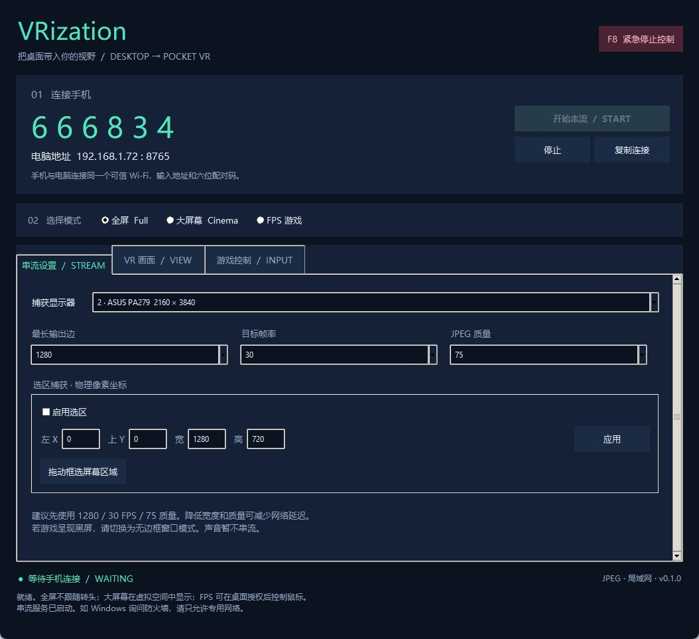
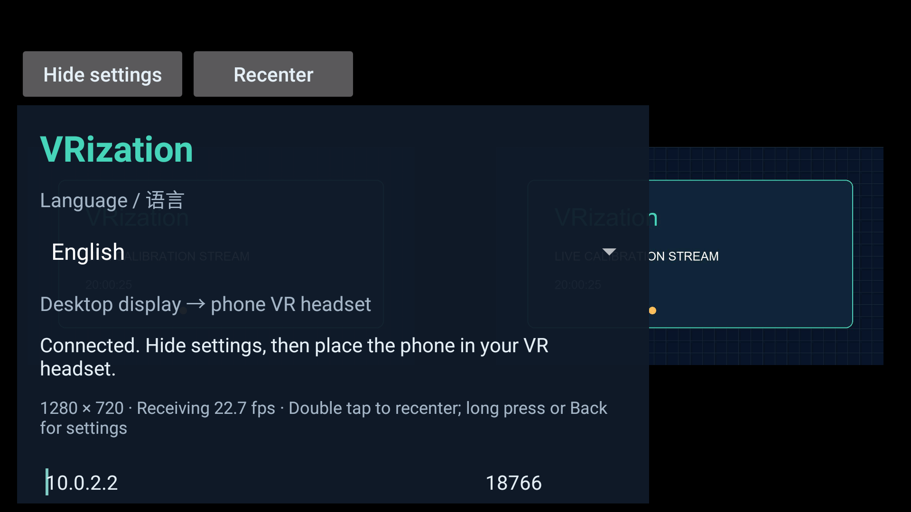
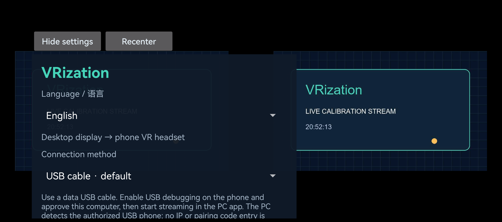
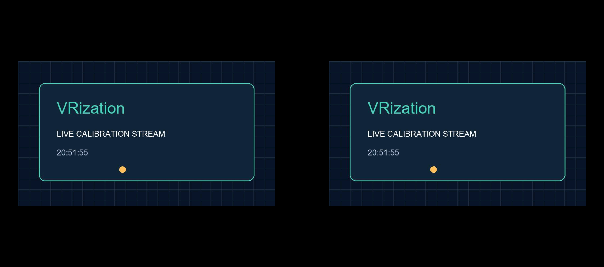
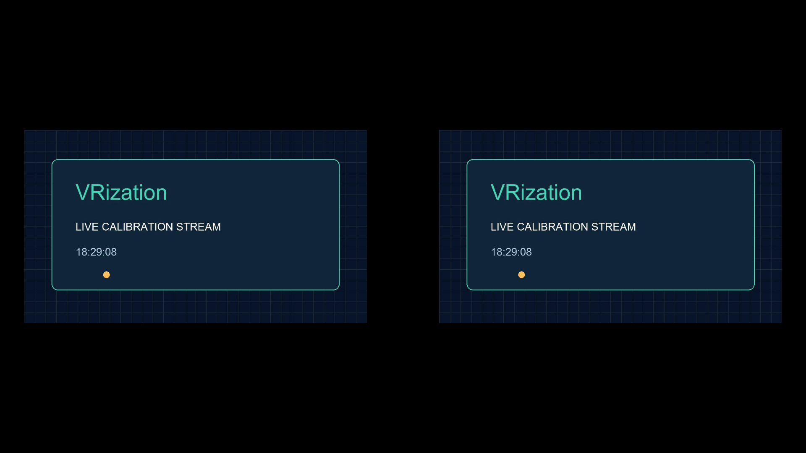
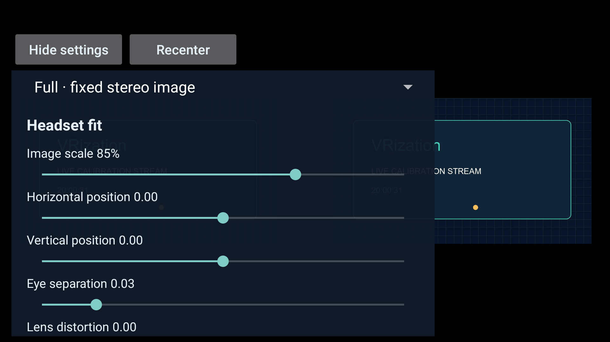
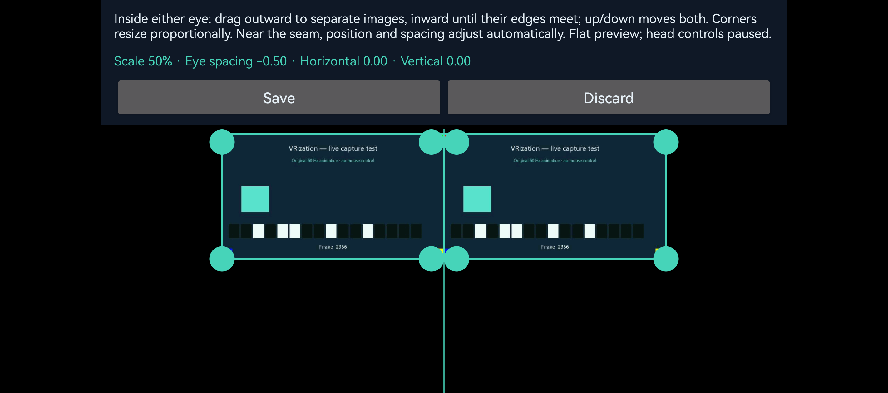
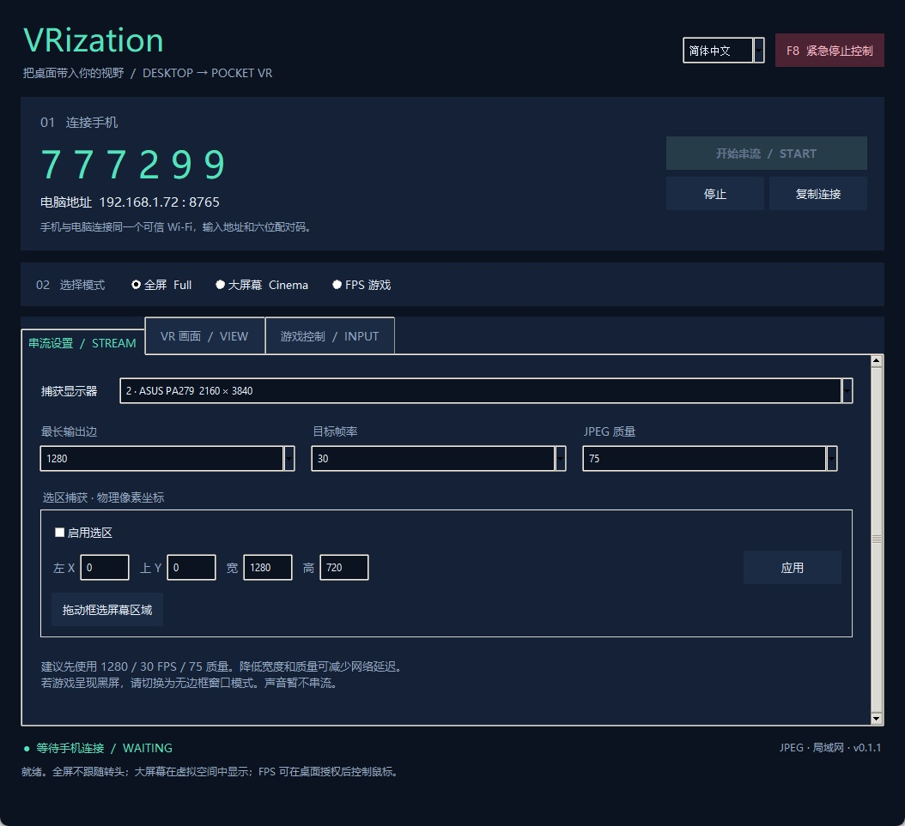

# 🥽 VRization

[English](#english) · [简体中文](#简体中文)

<!-- vrization:english -->
## English

**Put your PC screen inside a phone VR viewer.**


[](https://github.com/LexZeon/VRization/actions/workflows/build.yml)

[简体中文](#简体中文) · [Quick start](docs/QUICKSTART.md) · [📝 Changelog](CHANGELOG.md) · [🔌 USB setup](docs/USB.md) · [🥽 Edit and save](docs/EDITING.md) · [🌀 Enhanced view](docs/ENHANCED_FIRST_PERSON.md) · [🎯 Stabilization](docs/STABILIZATION.md) · [⚡ Performance](docs/PERFORMANCE.md) · [📦 Downloads](docs/DOWNLOADS.md) · [🍎 iPhone + Windows](docs/IOS.md) · [Build](docs/BUILD.md) · [Architecture](docs/ARCHITECTURE.md) · [🤝 AI handoff](AI_HANDOFF.md)

VRization streams a Windows desktop or rectangular region to an Android phone, iPhone or iPad, renders the image side by side, and optionally maps phone rotation to PC mouse movement. Its reusable Android library, Swift core package and separated host components provide a starting point for embedding these features in other applications.

**🧪 Separate [v0.5.0 SteamVR preview](https://github.com/LexZeon/VRization/releases/tag/v0.5.0-steamvr-preview).** Choose original direct-phone streaming, a phone as a rotation-only **3DOF SteamVR HMD** with independent eye images, or a desktop overlay on an existing SteamVR headset. The preview has independent phone apps, settings and ports. Stable **v0.4.0-alpha** and all earlier files/downloads remain available. Real phone/PCVR acceptance, achieved FPS and physical latency tests are deferred to the next hardware session. Follow the [illustrated tutorial](https://github.com/LexZeon/VRization/blob/codex/steamvr-experimental/experimental/steamvr/docs/TUTORIAL.md), [verification record](https://github.com/LexZeon/VRization/blob/codex/steamvr-experimental/experimental/steamvr/docs/VALIDATION.md) and [AI handoff](https://github.com/LexZeon/VRization/blob/codex/steamvr-experimental/experimental/steamvr/docs/AI_HANDOFF.md) on the separate experimental branch.

**v0.4.0-alpha — Enhanced first person adds a fourth mode.** Each eye keeps a physical 1:1 square with GPU wide-angle deformation, proportional scaling, movement and mirrored spacing. Both first-person modes use the saved default-enabled gyro policy and existing F8/PC Resume boundaries. Completed software/package, real Windows editor and native iOS Simulator checks are [recorded with their limits](docs/VALIDATION.md). Published [v0.3.4](https://github.com/LexZeon/VRization/releases/tag/v0.3.4-alpha) remains the previous release. Read the [projection tutorial](docs/ENHANCED_FIRST_PERSON.md), [current notes](docs/RELEASE_NOTES.md) and [AI handoff](AI_HANDOFF.md).

Visual headset fitting and saved phone profiles from v0.3 remain available. An original Windows DXGI / D3D11 backend crops, rotates and scales on the GPU before smaller pixel readback; the CPU encodes JPEG for the existing WebSocket protocol. GDI / MSS remain compatibility paths. Both eyes receive the same 2D source: ordinary games do not acquire stereoscopic depth. See [performance and measurement limits](docs/PERFORMANCE.md).

| Mode | Behavior |
| --- | --- |
| 🖥️ Full screen | A fixed image in each eye; no sensor control. |
| 🎬 Cinema | A virtual screen viewed through phone rotation. |
| 🎯 First person | Side-by-side viewing with gyro mouse control enabled by default on Windows. Press **F8** to pause; use **Resume gyro control** on the PC to resume. |
| 🌀 Enhanced first person | Fixed 1:1 square per eye, GPU wide-angle warp, scalable/movable fit and the same gyro control. |

Windows enables gyro mouse control in First person and Enhanced first person by default. A validated connection, either first-person mode, available capture and fresh valid rotation data are required; the first pose sets a baseline before movement. Control works on the desktop, ordinary applications, games and VRization's own window regardless of foreground-window changes, with no five-second target-window deadline. A temporary sensor gap stops output and rebaselines on fresh poses before continuing. **F8**, the PC emergency stop, editor entry, PC Reset all settings, capture-region selection, capture/input failure and stream Stop latch a pause: late poses, settings and reconnecting cannot clear it. Click **Resume gyro control** on the PC, or explicitly turn the control checkbox off and on, to resume. Full screen and Cinema stop mouse output. The PC saves only the enabled preference, never the live armed state or pause latch.

Adjust image scale and offsets for large phones, eye separation, field of view, screen distance, distortion, recentering, mouse sensitivity, First-person stabilization and vertical inversion. See [how to tune stabilization](docs/STABILIZATION.md); stronger smoothing can add following lag. **USB is the default on both phone platforms and the Windows host**, with authorized-device detection. Profiles use longest edge / target FPS / JPEG quality: low latency **640 / 60 / Q45**, stable **640 / 30 / Q50**, quality **960 / 30 / Q60**, or custom. Targets are not guaranteed achieved frame rates.

The first production ASUS full-output → Huawei USB check showed phone decoded-FPS readings of **59.9 and 57.7**, with mean host sent FPS **59.66**. Repeated static frames and physical presentation are separate; these results do not establish 60 unique displayed images per second or end-to-end latency. See [the measured configuration and limits](docs/PERFORMANCE.md).

### 📸 Interface

| Windows host | Android client |
| --- | --- |
|  |  |

The USB screenshots below show **v0.2.0 on a physical HUAWEI Pura 70 Ultra** receiving the original calibration card through a real data cable. Earlier Android screenshots show v0.1.1 on a Google-free API 23 emulator. They establish the pictured viewing flow, not headset optics or performance benchmarks, and do not show the new v0.3 editor.

| 🔌 Android USB on a real phone | 🥽 Both eyes, controls hidden |
| --- | --- |
|  |  |

### 🚀 Try it

1. Download the Windows archive and Android APK from [Releases](https://github.com/LexZeon/VRization/releases), or [build from source](docs/BUILD.md). Use matching **v0.4.0-alpha** Windows/Android assets for Enhanced first person. Preserve matching-signer Android installation data. v0.3.4 remains the preceding published version. For iPhone / iPad, use the [iOS installation guide](docs/IOS.md): source and a Mac Simulator build are provided; physical installation requires your Apple signing in Xcode.
2. Connect a data USB cable. Android needs official Platform Tools, USB debugging and computer authorization. iPhone needs Apple Devices / its Windows driver, Trust approval and your signed foreground app. See [USB setup](docs/USB.md).
3. Start the host, choose a display or region, and start streaming. Use **USB connection…** to find the automatic-detection checkbox and official ADB selector; read USB status below the PC address. USB detection configures the authorized connection; multiple Android phones require selection.
4. Open the phone app in its default USB mode. Android's first foreground session can wait automatically; tap **Detect USB and connect** to start explicitly or after backgrounding / changing language. iOS keeps a foreground control listener ready; click **Connect** on either endpoint to begin video. LAN remains an optional mode with manual IP, port and pairing code.
5. Adjust the image to your viewer, recenter cinema mode, and choose First-person mode for default-enabled gyro mouse control; use **F8** to pause and **Resume gyro control** on the PC to resume.

Windows 10 / 11 x64 is the desktop target. Android 6.0+ and compatible derivatives need no Google services; derivative-system compatibility depends on their APK, rendering and sensor support. Full-screen viewing does not require a gyroscope. Games may reject simulated mouse input, especially under raw-input or anti-cheat restrictions.

The native iOS / iPadOS 15+ client uses URLSession, Core Motion and Metal with no third-party runtime dependencies. It uses the same Windows host and protocol, including the host-local input preference and latched emergency-stop boundary. iOS source / Simulator downloads are not an installable signed iPhone IPA; see [the signing steps and compatibility limits](docs/IOS.md).

The host requires Microsoft Visual C++ v14 x64 runtime. If launch reports a missing `VCRUNTIME140` DLL or error 126, use [Microsoft's official runtime guide](https://learn.microsoft.com/en-us/cpp/windows/latest-supported-vc-redist/) and [current x64 installer](https://aka.ms/vc14/vc_redist.x64.exe).

### 🧩 Reuse and limitations

See [architecture](docs/ARCHITECTURE.md) and [protocol v1](docs/PROTOCOL.md) for integration. The current deliverable is source-level modules, not a stable public SDK, Unity / Unreal plug-in or OpenXR driver.

Audio, hardware video encoding, WebRTC, native stereo game rendering and 6DoF position tracking are not included. Real-world performance and device support require testing on your hardware.

See the [validation record](docs/VALIDATION.md) for exact per-version checks, iOS builds and simulator observations. Physical gyro behavior, headset optics and actual first-person game input remain unverified.

LAN transport uses **unencrypted `ws://`**. The pairing code is an access gate, not encryption. Use trusted LANs only; do not expose the port to the internet. USB requires an authorized Android debugging channel or an Apple pairing record; device discovery alone does not start capture or mouse input; an active First-person session uses the PC's saved control preference. See [security](SECURITY.md).

### 🤝 License and credit

Original code is [MIT](LICENSE), including commercial use subject to its notice requirements. Dependencies retain their licenses. See [third-party notices](THIRD_PARTY_NOTICES.md), [NOTICE](NOTICE) and [contributing](CONTRIBUTING.md). No implementation source was copied from another VR application. Capture / optimization ideas are credited even when rewritten; DXcam, NumPy and comtypes were research tools, Sunshine / Moonlight architecture references are not bundled code, and the original host stabilization credits the One Euro Filter algorithm without bundling its implementation.

### ✨ Fit different phones and viewers

- Scale and horizontal / vertical offsets fit a large phone's effective image inside the lenses.
- Eye separation, field of view, virtual distance and distortion adapt the presentation to your viewer.
- Recenter sets the current head orientation as forward.
- Mouse sensitivity, stabilization and invert Y adjust first-person controls; stabilization starts at 0%.
- Display / rectangle, **longest output edge**, FPS and JPEG quality control capture cost while preserving aspect ratio.
- Full-screen mode needs no sensor; compatible Android derivatives depend on their APK, graphics, network and sensor support.

<details>
<summary>🥽 Both-eye viewing and viewer-fit controls</summary>



Long-press or Back restores hidden controls. Double-tap recenters.



Adjust scale and offsets for your phone and lenses rather than assuming one shared preset.

</details>


All applications offer **English / 简体中文**, default to English, and save the choice locally. Use the PC header selector or the phone language selector. PC switching preserves the stream and the existing input preference/pause latch; phone switching disconnects and requires reconnecting. See [compatibility targets and observed tests](docs/COMPATIBILITY.md).

### 🌐 Documentation languages

Every project-owned public page presents complete **English first**, then complete **Chinese below**. Both sections must be maintained together. Automated documentation checks verify structure and file links, not translation quality. Original license texts remain unchanged.

The host separates capture, JPEG transport and input; Android `vr-core` exposes pose and GLES rendering; Swift `VRizationCore` separates protocol, settings synchronization and rotation math from the iOS UI / Metal renderer. Clients share [protocol v1](docs/PROTOCOL.md). See the [roadmap](docs/ROADMAP.md) for future adapters and codecs. The Android AAR depends on Android framework APIs and is not a platform-independent Java SDK.

### 🥽 Edit, save and reset

The first settings action opens a flat headset-fit editor. Drag an image horizontally to change linked, mirrored eye spacing: left-eye left / right-eye right widens it, and left-eye right / right-eye left narrows it. Shared X is retained while space allows, then recenters as the inner edges meet. Smaller images can continue inward to the seam. Vertical dragging stays normal; corners keep centers fixed unless seam constraints require adjustment. **Save** commits and synchronizes when connected; **Discard** restores the local entry preview. Preview dragging sends no settings and saves no preferences, and phone pose output pauses during editing. Phones retain committed VR profiles across restarts and restore them after a validated host hello. If both sides changed offline, the saved phone profile wins on reconnect; the PC can Save again afterward.

**Reset all settings** restores VR defaults, English and USB; Windows also restores 640 / 60 / Q45 and automatic USB choice while preserving the explicitly selected display / region and ADB tool path. Phone reset clears preferences and disconnects without immediately reconnecting; a fresh launch resumes the normal initial USB policy. PC Reset latches input paused; Windows restores the default-enabled preference, with Full screen selected and no mouse output. See [the complete editor and reset guide](docs/EDITING.md).

The v0.3 physical Android editor below shows an original card over USB on a HUAWEI Pura 70 Ultra. Smaller images can be brought together at the center; see [the before / after and saved-view screenshots](docs/EDITING.md#physical-android-examples).



The [v0.3.0-alpha notes](docs/releases/v0.3.0-alpha.md) preserve editor / profile acceptance, and v0.2.0-alpha retains its earlier measurements. Existing screenshots / performance measurements keep their stated version; the [v0.3.1 connection result](docs/releases/v0.3.1-alpha.md) is historical and does not establish the new stabilization checks. See [release history](docs/releases/README.md) and [current release notes](docs/RELEASE_NOTES.md).

---

<!-- vrization:chinese -->
## 简体中文

**把电脑画面装进手机 VR 盒子。**

Windows 桌面串流 · Android / 兼容 Android 的系统 · iPhone / iPad · 可复用核心模块


[](https://github.com/LexZeon/VRization/actions/workflows/build.yml)

[🚀 上手教程](docs/QUICKSTART.md) · [📝 版本日志](CHANGELOG.md) · [🔌 USB 连接](docs/USB.md) · [🥽 编辑与保存](docs/EDITING.md) · [🌀 加强视图](docs/ENHANCED_FIRST_PERSON.md) · [🎯 防抖设置](docs/STABILIZATION.md) · [⚡ 性能与测量](docs/PERFORMANCE.md) · [📦 下载与本地备份](docs/DOWNLOADS.md) · [🍎 iPhone 与 Windows](docs/IOS.md) · [🛠️ 开发与构建](docs/BUILD.md) · [🧩 集成指南](docs/ARCHITECTURE.md) · [English](README.en.md)


VRization 是一个开源的电脑 → 手机串流实验项目。Windows 端采集显示器或指定矩形区域，Android、iPhone / iPad 客户端将画面显示在 VR 盒子的左右眼区域。你可以让画面固定在眼前，也可以把它当成一个随头部转动观看的虚拟大屏幕，或者用手机的姿态控制电脑游戏视角。

**🧪 独立 [v0.5.0 SteamVR 实验版](https://github.com/LexZeon/VRization/releases/tag/v0.5.0-steamvr-preview)。** 三个入口分别是原版手机直连串流、手机作为只有旋转的 **3DOF SteamVR 头显**并接收独立双眼画面、以及现有 SteamVR 头显观看桌面悬浮层。实验版使用独立手机应用、设置及端口；原版通道的 **v0.4.0-alpha** 与所有旧文件／下载继续保留。真实手机／PCVR 验收、实际帧率与物理延迟测试留到下次硬件会话。独立实验分支提供[图文教程](https://github.com/LexZeon/VRization/blob/codex/steamvr-experimental/experimental/steamvr/docs/TUTORIAL.md)、[验证记录](https://github.com/LexZeon/VRization/blob/codex/steamvr-experimental/experimental/steamvr/docs/VALIDATION.md)及 [AI 接手指南](https://github.com/LexZeon/VRization/blob/codex/steamvr-experimental/experimental/steamvr/docs/AI_HANDOFF.md)。

> **v0.4.0-alpha——加强第一人称新增第四种模式。** 每眼固定物理 1:1 正方形，GPU 广角变形，仍可等比缩放、移动与镜像调节间距；两种第一人称共用已保存的默认开启陀螺仪策略与 F8／电脑恢复边界。已完成软件／打包、真实 Windows 编辑器和原生 iOS 模拟器检查，准确范围见 [验证](docs/VALIDATION.md)；已发布 [v0.3.4](https://github.com/LexZeon/VRization/releases/tag/v0.3.4-alpha) 保留为前一版本。见 [投影教程](docs/ENHANCED_FIRST_PERSON.md)、[当前说明](docs/RELEASE_NOTES.md) 与 [AI 接手指南](AI_HANDOFF.md)。

v0.3 的可视盒子适配与手机配置保存继续保留。原创 Windows DXGI / D3D11 后端在 GPU 裁切、旋转和缩放，再回读较小像素；CPU 编码 JPEG，经已有 WebSocket 协议传输，保留 GDI / MSS 兼容路径。左右眼接收同一张二维桌面图像，**不会把普通游戏自动变成立体 3D**。实测范围见 [性能与测量](docs/PERFORMANCE.md)。

### 🎮 四种观看方式

| 模式 | 画面表现 | 手机姿态 | 适合做什么 |
| --- | --- | --- | --- |
| 🖥️ 全屏模式 | 同一画面分别填入左右眼区域 | 不参与画面或鼠标控制 | 稳定观看桌面、视频和普通游戏 |
| 🎬 大屏幕模式 | 电脑或选区画面放在虚拟平面上 | 转头改变观看方向 | 像在眼前放了一块大屏幕 |
| 🎯 第一人称模式 | 左右眼显示所选电脑画面 | 转头映射成电脑鼠标移动 | 控制桌面、普通应用或兼容游戏的鼠标 |
| 🌀 加强第一人称 | 每眼固定 1:1，GPU 广角变形，可缩放／移动 | 与第一人称共用陀螺仪控制 | 希望弯曲广角显示且保持正方形比例 |

Windows 默认开启第一人称与加强第一人称的陀螺仪鼠标控制。必须有通过校验的连接、任一第一人称模式、可用采集与新的合法旋转姿态；首条姿态先建立基准，再产生移动。桌面、普通应用、游戏和 VRization 自身窗口均可控制，不受前台窗口切换影响，也不要求五秒内切到目标窗口。传感器短暂间断时停止输出，新姿态先重建基准再继续。**F8**、电脑紧急停止、进入编辑器、电脑重置全部设置、选择采集区域、采集／输入故障和停止串流会锁定暂停；迟到姿态、设置与重连都不能解除。需要在电脑点“**恢复陀螺仪控制**”，或主动关闭再开启控制复选框。全屏和大屏幕停止鼠标输出。电脑只保存启用偏好，不保存实时授权状态或暂停锁。 不同游戏、独占全屏、原始输入和反作弊机制可能不接受这种输入；实际游戏兼容性需另行验证。

### ✨ 为不同手机与盒子留出调节空间

- **画面缩放与水平 / 垂直偏移**：大手机也能把有效画面收进镜片可见区域。
- **左右眼间距、视场角、虚拟屏幕距离、畸变调节**：根据盒子镜片与佩戴方式微调。
- **重新居中**：把当前头部方向设为正前方。
- **鼠标灵敏度、防抖强度与 Y 轴反转**：调整第一人称手感，防抖默认 0%；见 [防抖教程](docs/STABILIZATION.md)。
- **显示器 / 矩形选区、输出最长边、帧率和 JPEG 质量**：保持画面比例，同时限制横屏与竖屏的解码负担。
- **USB / 可信局域网、无需 Google 服务**：Android 6.0+，可在提供 Android APK 兼容层的系统上尝试安装。兼容性仍取决于设备的图形、网络与传感器实现；全屏模式不要求陀螺仪。

**两种手机端与 Windows 均默认 USB 连接**，自动检测已授权设备。预设按最长边 / 目标 FPS / JPEG 质量表示：低延迟默认 **640 / 60 / Q45**，稳定 **640 / 30 / Q50**，画质 **960 / 30 / Q60**，也可自定义。目标帧率不代表实际达到的帧率。

首轮正式 ASUS 全输出 → 华为 USB 实测，手机解码 FPS 两次读数为 **59.9、57.7**，主机平均发送 FPS **59.66**。重复静态帧与物理呈现需另外区分，不能当作每秒 60 张不同图像实际显示或端到端延迟。配置与限制详见 [实测说明](docs/PERFORMANCE.md)。

### 📸 看看界面

电脑端负责选画面、开串流、第一人称控制开关与暂停／恢复；手机端负责连接、观看和调整镜片中的布局。

| 电脑控制台 | 手机客户端 |
| --- | --- |
|  |  |

USB 截图来自 **HUAWEI Pura 70 Ultra 真机运行 v0.2.0**，经真实数据线接收原创校准卡。较早 Android 截图为无 Google 的 API 23 模拟器运行 v0.1.1。截图展示对应连接与双眼显示流程，不代表镜片舒适度或性能基准，也不展示新增 v0.3 编辑器。

| 🔌 Android 真机 USB | 🥽 隐藏设置后的双眼画面 |
| --- | --- |
|  |  |

<details>
<summary>🥽 展开：双眼观看与盒子适配设置</summary>


隐藏操作区后，将同一张二维画面显示在左右眼区域。长按画面或按返回键可恢复设置。


用缩放与偏移让大手机的有效画面收进盒子镜片范围。不同手机与镜片需要分别调整。

</details>

### 🚀 五步把电脑放进盒子

1. 在 [Releases](https://github.com/LexZeon/VRization/releases) 下载 Windows 电脑端压缩包与 Android APK。加强第一人称使用匹配的 **v0.4.0-alpha** Windows／Android 文件；签名一致的 Android 覆盖升级可保留数据，v0.3.4 仍是此前已发布版本。iPhone / iPad 按 [iOS 安装教程](docs/IOS.md) 使用源码和 Mac 模拟器构建；真机安装需要在 Xcode 使用自己的 Apple 签名。
2. 用数据 USB 线连接。Android 需要官方 Platform Tools、USB 调试和电脑授权；iPhone 需要 Windows 的 Apple Devices / 驱动、信任这台电脑，以及自己签名并在前台运行的应用。详见 [USB 教程](docs/USB.md)。
3. 打开电脑端，选择显示器或矩形区域，再开始串流。点“**USB 连接…**”找到自动检测开关与官方 ADB 选择，USB 状态在电脑地址下方。USB 检测会配置授权后的连接；多台 Android 手机需要选择一台。
4. 手机应用默认 USB；Android 首次前台可自动等待，点“**检测 USB 并连接**”主动开始，进入后台或切换语言后也需主动连接。iOS 在前台保持控制监听就绪，在任一端点“**连接**”开始视频。局域网作为可选方式，需要填写 IP、端口与配对码。
5. 调整缩放、偏移和眼间距，确认两眼舒适对齐，再放入 VR 盒子。大屏幕模式先重新居中；第一人称默认启用陀螺仪鼠标；F8 暂停后需在电脑点“恢复陀螺仪控制”。

原生 iOS / iPadOS 15+ 客户端使用 URLSession、Core Motion 和 Metal，不引入第三方运行库；与 Android 共用 Windows 主机和协议，保留电脑本地控制偏好与锁定紧急停止边界。iOS 源码 / 模拟器下载并非已签名的 iPhone IPA，签名步骤和兼容性边界详见 [iOS 教程](docs/IOS.md)。

Windows 端需要 Microsoft Visual C++ v14 x64 运行库。多数电脑已经安装；如果启动提示缺少 `VCRUNTIME140*.dll`、加载 Python DLL 失败或错误 126，再按 [微软官方说明](https://learn.microsoft.com/en-us/cpp/windows/latest-supported-vc-redist/) 安装 [当前受支持的 x64 运行库](https://aka.ms/vc14/vc_redist.x64.exe)。

详细步骤、截图说明和常见问题见 [上手教程](docs/QUICKSTART.md)。还没有下载产物时，可以按 [构建指南](docs/BUILD.md) 从源码启动。

### 🧩 为移植而拆开的结构

```text
Windows 桌面端                         Android 手机端
采集 → JPEG 编码 → WebSocket ───────→ 解码 → 双眼显示
鼠标输入 ← 姿态增量、本机偏好与停止锁 ←─────── 旋转传感器
                 ↑                      ↑
          Python 主机模块          Android vr-core library
```

`vr-core` 是 Java 编写的 Android library，提供姿态与双眼渲染接口；Swift `VRizationCore` 将协议、设置同步与旋转数学从 iOS 界面 / Metal 渲染分离；桌面端把采集、网络和输入分开。其他软件可复用对应核心模块，并按协议替换画面来源、传输或输入适配器。当前提供源码级模块和协议说明，尚无 Unity / Unreal 插件、OpenXR 驱动或公开稳定 SDK。

参见 [架构与移植](docs/ARCHITECTURE.md)、[协议 v1](docs/PROTOCOL.md) 和 [后续路线](docs/ROADMAP.md)。

### 🧪 当前边界

Alpha 版尚未提供音频、硬件视频编码、WebRTC、原生立体渲染或 6DoF 位置追踪。没有承诺帧率或端到端延迟数字；实际体验取决于电脑、手机和网络。传感器不足的设备可以使用全屏模式，大屏幕 / 第一人称模式需要兼容的旋转传感器。已完成的检查与尚需实测的项目见 [验证记录](docs/VALIDATION.md)。

局域网串流使用明文 `ws://`，配对码只是基础访问门槛，**不是加密**。只在可信局域网使用，不要把服务端口映射到公网。USB 需要已授权的 Android 调试通道或 Apple 配对记录，单纯设备发现不启动采集或鼠标；已连接第一人称会话按电脑保存的控制偏好运行。详见 [安全说明](SECURITY.md)。

### 🤝 开源与致谢

原创代码以 [MIT](LICENSE) 授权，允许商业使用并要求保留相关许可与版权声明。依赖保留各自许可证；来源、用途、作者与分发注意事项记录在 [第三方声明](THIRD_PARTY_NOTICES.md) 和 [NOTICE](NOTICE)。本项目没有复制其他 VR 应用的实现源码；采集 / 优化思路即使重写也鸣谢。DXcam、NumPy 和 comtypes 属研究工具，Sunshine / Moonlight 仅作架构参考，不是随包代码。

感谢 aiohttp、MSS、Pillow、OkHttp、Okio、Kotlin 及相关工具的维护者。欢迎提交兼容性记录、问题、翻译与 PR，开始前可看 [贡献指南](CONTRIBUTING.md)。


所有客户端可选 **English / 简体中文**，默认英文，各自保存。电脑在顶部切换，手机使用语言选择；电脑切换保持串流与原输入偏好／暂停锁，手机切换断线，需要重连。支持目标与实际检查分开记录，见 [兼容性](docs/COMPATIBILITY.md)。

原创第一人称防抖参考 One Euro Filter 算法，并保留精确版本、作者与 BSD-3-Clause 许可原文；没有引入其上游实现或运行包。即使重写优化思路，也继续在 [第三方声明](THIRD_PARTY_NOTICES.md) 鸣谢记录。

### 🌐 文档语言

所有项目自有公共页面在同一页先完整英文、再完整中文，修改时同步维护两种语言。自动文档检查只验证结构和文件链接，不判断翻译质量；原始许可证全文保持不变。


### 🥽 编辑、保存与重置

设置第一个操作打开平面盒子适配编辑器，横向拖动调整镜像联动眼间距：左眼向左 / 右眼向右拉开，左眼向右 / 右眼向左收拢；空间允许时保留整体 X，接近中缝时逐渐归零；缩小后仍能继续向内收拢到相接。竖向正常同步，角点通常中心固定，触发接缝约束时必要调整。**保存**提交并在已连接时同步，**放弃**恢复本地进入预览；预览拖动不发送设置、不保存偏好，编辑暂停手机姿态。手机已提交 VR 配置在重启后保留，合法主机 hello 后恢复；若两边离线都改过，重连时保存的手机配置优先，电脑可随后再保存。

**重置全部设置**恢复 VR 默认、英文和 USB；Windows 同时恢复 640 / 60 / Q45 与 USB 自动选择，但保留明确的显示器 / 选区及 ADB 工具路径。手机重置清除偏好并断线，当前界面不自动重连；全新启动恢复正常初次 USB 策略；电脑重置锁定输入暂停；Windows 恢复默认启用偏好，同时选择全屏、不输出鼠标，见 [完整编辑与重置教程](docs/EDITING.md)。

下面是 v0.3 在 HUAWEI Pura 70 Ultra 真机经 USB 显示原创卡的编辑器：缩小后仍可收拢到中心相接，见 [前后对比及保存后画面](docs/EDITING.md#android-真机示例)。


[v0.3.0-alpha 原说明](docs/releases/v0.3.0-alpha.md) 保留编辑器 / 配置验收，v0.2.0-alpha 保留较早测量。现有截图 / 性能测量继续注明对应版本，v0.3.1 连接结果另行保留，新防抖验收单独记录，见 [发布历史](docs/releases/README.md) 与 [当前发布说明](docs/RELEASE_NOTES.md)。
