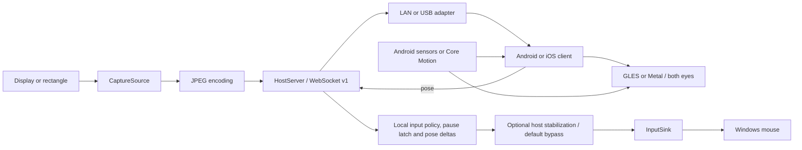
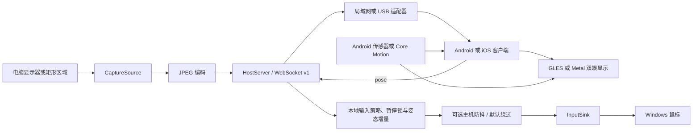

# 🧩 Architecture and integration / 架构与集成

[English](#english) · [简体中文](#简体中文)

<!-- vrization:english -->
## English

VRization separates the image source, transport, rendering and input sink. Reuse includes an embeddable Python host, an Android AAR and the Foundation-based Swift package `VRizationCore`. The Android and iOS apps default to USB, with LAN as an explicit alternative. Alpha APIs may change.



### Modules

| Path | Responsibility |
| --- | --- |
| `desktop/src/vrization_host/` | Python capture, protocol, server, input adapter and GUI. |
| `desktop/src/vrization_host/connection.py` | Pure connection coordination and independent loopback USB control service; explicit Connect can originate on either supported device. |
| `desktop/src/vrization_host/view_edit.py` | Pure per-eye fit geometry and local draft transactions. |
| `desktop/src/vrization_host/pose_filter.py` | Original host-only speed-adaptive first-person smoothing; strength 0 bypasses it. |
| `desktop/tests/` | Core checks without real games. |
| `android/vr-core/` | Reusable Android settings, pose interfaces and GLES renderer. |
| `android/vr-core/.../SocketAttempt.java`, `UsbConnectRequest.java`, `UsbConnectionAttempt.java`, `TransportEndpoints.java` | Pure Java socket ownership, one-shot explicit requests, bounded retry policy and shared control/video endpoints. |
| `android/app/` | Connection UI, WebSocket client, JPEG decoding and settings. |
| `desktop/src/vrization_host/ios_usb.py` | Paired one-shot iOS control and video readiness / relay; injected coordinator callback. |
| `ios/Sources/VRizationCore/` | Foundation protocol, settings synchronization, rotation math, session gates, USB framing and `USBConnectionControl`. |
| `ios/VRizationApp/` | UIKit UI, URLSession / Network transport, Core Motion, JPEG decoding and Metal renderer. |
| `docs/` | Tutorials, protocol, integration and scope. |

`vr-core` is written in Java but depends on Android OpenGL ES, Bitmap and sensor APIs. Its AAR embeds in Android software; it is not a platform-independent Java / Unity / Unreal library. Other platforms can implement the protocol and adapt pose / rendering to their engine.

The coordinator owns connection policy, while USB/OkHttp and UI layers adapt platform I/O and user actions. Explicit Stop invalidates connection/socket identities, cancels owned resources and clears displayed video; late retries and callbacks must not revive it. These connection modules were published in v0.3.3; the v0.3.4 default-enabled gyro policy has software/package/native Simulator checks documented separately from unverified physical/game/advanced GUI behavior. See [AI handoff and module calls](../AI_HANDOFF.md) for source/build/archive locations, portable seams, signing checks and acceptance. Older evidence remains scoped to its version.

### Replace the host image source

`CaptureSource` defines `read(config: CaptureConfig) -> Frame | None` and `close()`. `Frame` contains JPEG bytes, width, height and monotonic `captured_at`; `None` means no frame is ready yet. The default source captures and encodes the desktop. An adapter can supply game-rendered images, remote application output or test frames.

The original Windows GPU backend in [windows_gpu.py](https://github.com/LexZeon/VRization/blob/main/desktop/src/vrization_host/windows_gpu.py) uses DXGI Desktop Duplication and D3D11. It selects the adapter / output that fully contains the requested physical-pixel rectangle, copies the acquired image into an owned GPU texture, and applies crop, display rotation and linear downscaling in a shader. Only the smaller output texture is mapped into owned BGRX bytes for Pillow's RGB conversion and JPEG encoding. The bindings, shaders and lifecycle are original MIT code. Python `ctypes` calls Windows-supplied `dxgi`, `d3d11` and `d3dcompiler_47`; DXcam, NumPy and comtypes are research references, not dependencies of this backend. See [sources and credits](../THIRD_PARTY_NOTICES.md).

`WindowsGpuCapture.grab(rectangle, size, force_latest=False)` returns owned BGRX bytes or `None` when no new duplication frame is available. `force_latest=True` can re-render the owned GPU image after a same-output crop / size change, including a static desktop. Acquired duplication frames are released before returning; their borrowed textures are never kept as the cache. Creation, use and release stay on the same capture thread.

The source validates the requested output against Windows physical layout, output name, HMONITOR, rotation and panel identity before and after GPU work. Output names identify Windows display outputs rather than panel serial numbers. Layout / identity mismatch, access loss or fatal resource errors close the session and stop new frames; they do not silently choose another output or rebuild a lost session. Stop, reselect the display / region, then Start again. Capture errors latch First-person mouse input paused; resuming requires the PC Resume action. DXGI `ProtectedContentMaskedOut` means Windows has already blacked out protected regions in the supplied image; the backend continues streaming that masked surface and records the condition once. It does not remove the mask, recover those pixels or change capture backend to read them. See [Microsoft's frame-info contract](https://learn.microsoft.com/en-us/windows/win32/api/dxgi1_2/ns-dxgi1_2-dxgi_outdupl_frame_info).

A verified region spanning multiple outputs, or an explicitly unsupported initial GPU API / session, can use **the same validated rectangle** through GDI, then MSS. A layout / identity error does not permit fallback. The original GDI backend pre-scales into a bounded top-down DIB, flushes writes before reading, and returns an owned byte copy on the capture thread. MSS captures the same rectangle and scales in CPU memory when that path is needed. `MssCaptureSource(prefer_gpu=False, prefer_native=False)` selects MSS explicitly. The default adapter reuses an owned JPEG on a static desktop, retaining its original `captured_at`; refresh packets are not necessarily new captures. Hardware, load and fallback availability still determine the achieved rate. See [performance and measurement boundaries](PERFORMANCE.md) and [validation](VALIDATION.md).

Inject adapters with `HostServer(capture_source=..., input_sink=...)`. Capture and input are independent; sending images does not require enabling input.

The runnable [embedded_host.py](../examples/embedded_host.py) provides an original animated calibration card and a logging input sink. It neither captures the user's screen nor sends OS input. After installing the host package, run `python examples/embedded_host.py` from the root, choose **LAN** on the phone, then use the printed port and code plus the PC's LAN IP. This example does not enable automatic USB pairing.

```python
# Implement CaptureSource.read / close and InputSink.move in your adapters.
server = HostServer(capture_source=my_capture, input_sink=my_input)
```

v1 carries JPEG. Hardware H.264 / H.265 requires new framing, timestamps, keyframe recovery and a compatible decoder; do not send a video bitstream to the v1 JPEG decoder.

### USB adapters and capture presets

`desktop/src/vrization_host/usb.py` provides `UsbManager`, `AdbReverse` and `AppleMux`. `ios_usb.py` owns `IosRelay` and `request_ios_connect`; the historical `usb.IOSUsbRelay` spelling remains a lazy alias. Detection runs outside Tk; the video relay has its own thread. `connection.py` supplies a pure `ConnectionCoordinator` and independent loopback `UsbConnectService` at `18764`. Phone Connect requests host startup through the coordinator; PC Connect queues one selected-device request. Android uses `18764` control plus `18765` video. iOS uses foreground `18767` control plus explicit-attempt `18766` video and readiness before requesting startup. Host Stop invalidates pending identities, gates old iOS attempts and sends a paired acknowledged native stop before reopening detection startup; auto detection cannot restore the stopped session. Embedding `HostServer` alone does not enable these platform services; an embedder must own lifecycle and authorization:

```python
from vrization_host.usb import UsbManager

server = HostServer(capture_source=my_capture, input_sink=my_input)
usb = UsbManager(server, adb_path=my_official_sdk_adb_path)
server.usb_authorized = usb.authorized.is_set
server.start()  # The host application decides when screen capture is permitted.
usb.start(enabled=True)
# On exit: usb.stop(), then server.stop().
```

Android uses an owned, non-rebinding official ADB reverse mapping and a guarded loopback bootstrap. Native Windows SetupAPI verifies physical USB instances when ADB omits its USB path. iOS uses Apple's local USB service, an existing pairing record and the app's loopback listener; the relay bridges an authenticated host WebSocket into bounded JSON / JPEG frames. Neither route enables input solely from detection; valid First-person poses follow the host-local policy and cannot clear a pause latch. See [protocol details](PROTOCOL.md) and [USB prerequisites](USB.md). No ADB, Apple driver or libusbmuxd library is bundled.

Capture profiles alter only maximum long edge, target FPS and JPEG quality: low latency `640 / 60 / 45` for new GUI users, stable `640 / 30 / 50`, quality `960 / 30 / 60`, or custom. Existing saved capture settings and monitor / region selection are retained. Embedding `CaptureConfig()` now also defaults to `640 / 60 / 45`. Latest-frame handoff bounds stale work; it does not eliminate capture, JPEG, USB / network, decoder or presentation latency. Received FPS and link RTT are separate diagnostics, not end-to-end measurements. See [profile selection](PERFORMANCE.md).

### Embed in an Android application / game

`VrSettings` holds display and input settings; `PoseSource` abstracts orientation; `AndroidPoseSource` uses platform sensors; `VrRenderer` renders. The app's connection / settings UI can be replaced by the host application.

Run `./gradlew :vr-core:assembleRelease` in `android/`. Copy `vr-core/build/outputs/aar/vr-core-release.aar` into the host's `libs/` and add `implementation files('libs/vr-core-release.aar')`.

```java
VrRenderer renderer = new VrRenderer();
GLSurfaceView surface = new GLSurfaceView(activity);
surface.setEGLContextClientVersion(2);
surface.setRenderer(renderer);
renderer.setSettings(new VrSettings());

AndroidPoseSource pose = new AndroidPoseSource(
    activity, activity.getWindowManager().getDefaultDisplay());
if (pose.isAvailable()) {
    pose.start((yaw, pitch, roll, timestampNanos) ->
        renderer.setPose(yaw, pitch, roll));
}
// After JPEG decoding or when the host's image is ready:
// renderer.submitFrame(bitmap);
```

Integrate this wiring with your Activity lifecycle. Resume `GLSurfaceView`, call `renderer.resumeFrames()` and start sensors on foreground entry. Stop sensors, disconnect, call `renderer.pauseFrames()` and pause the surface on exit. **`submitFrame(bitmap)` transfers ownership**: the renderer recycles that Bitmap, so do not reuse it. Decode / receive off the main thread and avoid queues of stale frames.

The Android app keeps one pending JPEG and one renderer Bitmap slot. Its decoder hands the Bitmap directly through a session gate to the renderer and calls `requestRender()`, avoiding a per-frame main-thread post; invalidation rejects old-session work. GLES reuses texture storage when dimensions / format match, uses `texSubImage2D` for those updates, and caches shader locations per context. UI statistics update separately. Optional `TextureSubmissionListener` timing uses the phone's monotonic clock from complete JPEG reception to return of the texture-upload call; it excludes PC work, earlier transport, GPU completion and physical presentation. The handoff and system API sources are credited in [third-party notices](../THIRD_PARTY_NOTICES.md).

`PoseMath` has no Android dependency and can seed a separate math core; the complete AAR still needs Android. You can reuse pose only for a host camera, or render your own images without the Windows mouse adapter. Preserve original MIT notices when redistributing the library.

### Embed Swift core or an iOS viewer

Add the local Swift package at `ios/` to an Xcode project and depend on **VRizationCore**. The package uses Foundation without UIKit, Metal, Core Motion or Network dependencies. It exposes `VRSettings`, `VRProtocol`, `SettingsSync`, `SessionGeneration`, `HostSessionGate`, `ConnectionInput`, `PoseMath`, `RotationCenter`, `USBFraming` and `USBFrameDecoder`; v0.3 adds `HeadsetFit`, `PhonePreferencesStore` and `LocalProfileSync`. It contains no third-party package dependencies. The package declares iOS 13 / macOS 10.15 minima; the complete viewer app targets iOS / iPadOS 15+ and needs Metal.

```swift
import VRizationCore

let poseJSON = try VRProtocol.encodePose(sequence: 1, yaw: 0.12, pitch: 0.03)
let usbFrame = try USBFraming.encode(USBFrame(kind: .json, payload: poseJSON))
// Send poseJSON through WebSocket, or usbFrame through the USB connection.
```

Integrators can reuse validation, synchronization or math alone. The complete app supplies `StreamClient`, `USBListener`, `USBControlListener`, `MotionSource`, `JPEGDecoder` and `StereoRenderer`; adapt their lifecycle and UI for your host application. Stop network / listener and motion on backgrounding, clear stale session work, and reconnect explicitly. A custom in-game camera sink can consume pose without the Windows mouse adapter. The core is not an installed Unity / Unreal plugin or an ABI-stable SDK. Preserve original MIT notices. See [iOS build and signing](IOS.md).

### Windows and verification boundaries

The supplied host targets Windows 10 / 11 **x64**, with physical-pixel capture coordinates and a modern DPI-awareness API plus older Windows fallbacks. Actual local desktop evidence is from Windows 11; the fallback tests do not establish a Windows 10 hardware pass or every mixed-DPI monitor combination. Select the intended display by its current name, and verify small-window / scaling behavior on your system.

Hardware Huawei Android checks and the iOS simulated-usbmux / Simulator checks are recorded separately in [validation](VALIDATION.md). A native Simulator session does not verify an actual iPhone, motion-axis direction, viewer optics or real FPS games. USB does not make system mouse injection universal; raw input, privilege boundaries and game protection can reject it.

### Port to another platform

1. Implement [protocol v1](PROTOCOL.md), JPEG reception and settings.
2. Render one 2D frame in both eye regions and validate full screen first.
3. Integrate pose and calibrate axes, radians and landscape orientation.
4. If using remote mouse input, retain local input policy, sequence/number checks, disconnect output stop and latched emergency stop.
5. True stereo requires engine-side per-eye rendering and a new protocol; current desktop duplication cannot create it.

Swift protocol / math reuse is available now; engine adapters and a stable SDK remain possible future work. Alpha interfaces carry no long-term compatibility promise.

### Visual editing and committed phone preferences

The original host `view_edit.py` is a pure geometry / draft-transaction module. `fit_size` computes aspect fit; `resolved_fit` clamps signed separation to [fit.x × scale − 1, 0.2] and shared X to the remaining gap; `eye_bounds` returns these resolved y-up left / bottom / right / top bounds; `dragged` uses gesture-start deltas for eye_pan (selected-eye horizontal spacing and shared vertical movement), proportional resize and reusable ordinary pan. Resize keeps centers fixed when contact constraints permit it; enlargement at contact resolves spacing outward to avoid overlap. Rendering resolution is pure and does not rewrite raw saved preferences. `EditTransaction` exposes an immutable entry snapshot, local draft and one commit / discard action without storage or network side effects. Android / Swift cores use the same geometry contract; see [editor integration](EDITING.md).

App editors preview full-screen flat geometry with distortion disabled, while retaining actual mode / optical values in the draft. Phone poses pause during editing; entry sends one existing hello with editing:true to latch input paused on receipt, and desktop entry latches it locally. Phone Save commits the whole draft once; PC Save patches only the four fit fields (scale, offsetX, offsetY and eyeSeparation) into the latest state, preserving other concurrent changes. Discard restores the local entry preview, and phone lifecycle / disconnection ends an uncommitted draft. Phones persist committed complete VR profiles. A validated host hello opens the session first, then a saved local profile is sent once via normal settings / clientSeq; subsequent revision synchronization remains authoritative. Pairing secrets are excluded.

Reset restores VR / English / USB and low capture defaults. The host preserves explicit capture monitor / rectangle and ADB path to avoid selecting unintended content or deleting tools; phone reset disconnects and suppresses the immediate rebuilt page's initial attempt. A fresh Android launch can wait for an existing stream; iOS restores only foreground control until explicit Connect. These user-preference changes do not change protocol v1, the bounded JPEG pipeline or the host-local input preference and pause latch.

### Host-only stabilization and compatible profiles

`PoseStabilizer` in `pose_filter.py` is original pure filtering without a mouse API, timer or thread. `PoseController` retains local policy/pause-latch, sequence and raw-input validation, then applies optional angular smoothing before the existing sensitivity and mouse-output path. Zero bypasses it exactly; session, recenter and relevant input changes reset it, and silence cannot produce queued movement. The high-resolution elapsed-time clock is separate from wire pose values.

Clients persist eleven fields and migrate exact legacy ten with stabilization zero. Schema 2 stays inside protocol v1; old hosts get ten-field network settings while local stabilization survives replies. Initial legacy USB hello plus capability does not create a profile before the full snapshot. Phones do not filter again. See [protocol](PROTOCOL.md), [tuning](STABILIZATION.md) and [provenance](../licenses/references/README.md).

### Shared per-eye display bounds

Android GLES and iOS Metal resolve the same fit rectangle and apply it as a physical per-eye output mask in full, cinema and first-person modes, including lens distortion. The mask confines display range without changing the virtual-screen projection or sensor math. It is distinct from proving that projected content reaches the middle seam. Editor geometry remains pure; raw committed profiles are not rewritten by rendering.

---

### Default-enabled GUI input policy (v0.3.4)

Windows enables First-person gyro mouse control by default. A validated connection, First-person mode, available capture and fresh valid rotation data are required; the first pose sets a baseline before movement. Control works on the desktop, ordinary applications, games and VRization's own window regardless of foreground-window changes, with no five-second target-window deadline. A temporary sensor gap stops output and rebaselines on fresh poses before continuing. **F8**, the PC emergency stop, editor entry, PC Reset all settings, capture-region selection, capture/input failure and stream Stop latch a pause: late poses, settings and reconnecting cannot clear it. Click **Resume gyro control** on the PC, or explicitly turn the control checkbox off and on, to resume. Full screen and Cinema stop mouse output. The PC saves only the enabled preference, never the live armed state or pause latch.

`HostServer(..., auto_control=False)` and `PoseController(..., auto_control=False)` retain the manual embedding default, including legacy manual focus checks. The GUI passes the validated `input.json` preference to the server; `HostServer.set_auto_control()` / `PoseController.configure_auto_control()` change local policy and `resume_control()` clears a pause only for a PC action. The preference is separate from wire Settings and phone profiles. The first valid pose after activation/pause establishes a new baseline; no pose means no mouse output.

---

<!-- vrization:chinese -->
## 简体中文

VRization 把画面来源、传输、渲染与输入接收拆为相邻组件。现在可复用 Python 主机、Android AAR 与基于 Foundation 的 Swift 包 `VRizationCore`。Android / iOS 应用默认 USB，局域网为显式可选项；公共接口仍处于 Alpha，可能调整。



### 目录

| 路径 | 职责 |
| --- | --- |
| `desktop/src/vrization_host/` | Python 采集、协议、服务器、鼠标适配器与桌面界面。 |
| `desktop/src/vrization_host/connection.py` | 纯连接协调与独立本机 USB 控制服务；受支持设备任一端可以发起主动连接。 |
| `desktop/src/vrization_host/view_edit.py` | 纯单眼适配几何与本地草稿事务。 |
| `desktop/src/vrization_host/pose_filter.py` | 原创主机速度自适应第一人称平滑，强度 0 绕过。 |
| `desktop/tests/` | 不依赖真实游戏的核心检查。 |
| `android/vr-core/` | 可复用 Android library：设置、旋转传感器接口与 OpenGL ES 双眼渲染。 |
| `android/vr-core/.../SocketAttempt.java`、`UsbConnectRequest.java`、`UsbConnectionAttempt.java`、`TransportEndpoints.java` | 纯 Java socket 所有权、一次显式请求、有限重试策略及共用控制／视频端点。 |
| `android/app/` | 连接界面、WebSocket 客户端、JPEG 解码和设置交互。 |
| `desktop/src/vrization_host/ios_usb.py` | 已配对 iOS 一次控制与视频就绪／中继，注入协调器回调。 |
| `ios/Sources/VRizationCore/` | Foundation 协议、设置同步、旋转数学、会话门、USB 分帧和 `USBConnectionControl`。 |
| `ios/VRizationApp/` | UIKit 界面、URLSession / Network 传输、Core Motion、JPEG 解码与 Metal 渲染。 |
| `docs/` | 教程、协议、移植与版本边界。 |

`vr-core` 使用 Java 编写，但依赖 Android 的 OpenGL ES、Bitmap 与传感器 API。它可生成 AAR 并嵌入其他 Android 软件；不能直接作为无平台依赖的 Java / Unity / Unreal 库使用。跨平台客户端可以独立实现协议，将姿态与显示逻辑适配到目标引擎。

协调器拥有连接策略，USB／OkHttp 和界面层适配平台 I/O 与用户动作；主动停止使连接／socket 身份失效，取消自有资源并清掉显示画面，晚到重试和回调不能恢复。连接模块已随 v0.3.3 发布，v0.3.4 默认启用陀螺仪策略的软件／打包／原生模拟器检查与未验证真机／游戏／高级界面行为分开记录。[AI 接手与模块调用](../AI_HANDOFF.md) 说明源码／构建／归档位置、移植切口、签名门槛与验收清单；旧证据仍对应旧版。

### 替换电脑画面来源

桌面端 `CaptureSource` 接口定义 `read(config: CaptureConfig) -> Frame | None` 和 `close()`。`Frame` 包含 `jpeg: bytes`、`width`、`height` 和单调时钟 `captured_at`；`None` 表示暂时没有可用帧，默认实现采集并编码桌面。其他软件可以提供自己的 JPEG 帧，例如游戏已渲染的图像、远程应用输出或测试画面，再交给同一主机服务。

原创 Windows GPU 后端位于 [windows_gpu.py](https://github.com/LexZeon/VRization/blob/main/desktop/src/vrization_host/windows_gpu.py)，使用 DXGI Desktop Duplication 与 D3D11。它选择完整包含指定物理像素矩形的显卡 / 输出，将取得的画面复制到自有 GPU 纹理，再由着色器完成选区裁切、显示旋转和线性缩小。只将较小的输出纹理映射并复制为独立 BGRX 字节，交给 Pillow 转换 RGB、编码 JPEG。绑定、着色器与生命周期代码均为原创 MIT 实现；Python `ctypes` 调用 Windows 自带的 `dxgi`、`d3d11`、`d3dcompiler_47`，DXcam、NumPy 和 comtypes 是研究参考，不是该后端依赖。详见 [来源与鸣谢](../THIRD_PARTY_NOTICES.md)。

`WindowsGpuCapture.grab(rectangle, size, force_latest=False)` 返回独立 BGRX 字节，没有新的 duplication 帧时返回 `None`。`force_latest=True` 能在同一输出改变选区 / 尺寸后重新渲染自有 GPU 图像，静止桌面也适用。取得的 duplication 帧会在返回前释放，不把借用的纹理保留作缓存；创建、使用与释放均在同一采集线程。

GPU 操作前后核对 Windows 物理布局、输出名称、HMONITOR、旋转和面板身份；输出名称不是面板序列号。布局／身份不匹配、访问丢失或致命资源错误关闭会话并停帧，不悄悄换输出或重建失效会话；须停止、重选显示器／选区再启动。采集错误锁定第一人称鼠标暂停，恢复须电脑主动点恢复。DXGI `ProtectedContentMaskedOut` 表示 Windows 已把输出图像内受保护区域置黑，后端继续串流该已遮罩 surface、仅记录一次此状态；不解除遮罩、不恢复这些像素、不切换后端重新读取。见 [Microsoft 帧信息约定](https://learn.microsoft.com/en-us/windows/win32/api/dxgi1_2/ns-dxgi1_2-dxgi_outdupl_frame_info)。

已确认跨越多个输出的合法区域，或初始化时明确不支持 GPU 的 API / 会话，可对**同一个已校验矩形**依次采用 GDI、MSS。布局 / 身份错误不允许回退。原创 GDI 后端先缩放到有尺寸上限的顶向下 DIB，读取前完成写入，在采集线程返回独立字节副本；需要 MSS 时，仍采集同一区域并在 CPU 内存缩放。`MssCaptureSource(prefer_gpu=False, prefer_native=False)` 显式选择 MSS。默认适配器在静止桌面复用自有 JPEG，保留原始 `captured_at`，刷新传输包不一定是新采集。实际速度仍取决于硬件、负载与可用后端，见 [性能与测量边界](PERFORMANCE.md) 和 [验证记录](VALIDATION.md)。

通过 `HostServer(capture_source=..., input_sink=...)` 注入适配器。画面与输入接口分开，集成者可以只发送图像而不启用任何输入。

可运行的 [embedded_host.py](../examples/embedded_host.py) 用原创动态校准卡和日志输入接收器替换桌面采集 / 系统鼠标，不采集用户屏幕、不发送 OS 输入。安装电脑包后，在仓库根目录执行 `python examples/embedded_host.py`，手机显式选择**局域网**，填写控制台端口、配对码和电脑局域网 IP。此示例默认不开自动 USB 配对。

示意接口关系（具体类名与构造参数以源码为准）：

```python
# 自己实现 CaptureSource.read / close 与 InputSink.move。
server = HostServer(capture_source=my_capture, input_sink=my_input)
```

当前传输的数据是 JPEG。若替换为硬件 H.264 / H.265，应一起设计新帧封装、时间戳、关键帧恢复和客户端解码，不能直接把视频码流发送给 v1 的 JPEG 解码器。

### USB 适配器与捕获预设

`desktop/src/vrization_host/usb.py` 提供 `UsbManager`、`AdbReverse` 和 `AppleMux`；`ios_usb.py` 拥有 `IosRelay` 和 `request_ios_connect`，旧 `usb.IOSUsbRelay` 名称保留为懒加载别名。检测在 Tk 线程之外，中继另用线程。`connection.py` 提供纯 `ConnectionCoordinator` 和 `18764` 独立回环 `UsbConnectService`。手机主动连接经协调器请求主机启动，电脑主动连接对选定设备发一次请求。Android 为 `18764` 控制／`18765` 视频；iOS 为前台 `18767` 控制／主动尝试 `18766` 视频，请求启动前要求就绪预握手。主机停止使待处理身份失效、限制旧 iOS 尝试，并发送已配对、原生清理后确认的停止，再允许检测启动；自动检测不能恢复已停止会话。只嵌入 `HostServer` 不开启这些平台服务，宿主须拥有生命周期与授权：

```python
from vrization_host.usb import UsbManager

server = HostServer(capture_source=my_capture, input_sink=my_input)
usb = UsbManager(server, adb_path=my_official_sdk_adb_path)
server.usb_authorized = usb.authorized.is_set
server.start()  # 由宿主决定何时允许采集画面。
usb.start(enabled=True)
# 退出时先 usb.stop()，再 server.stop()。
```

Android 使用自己拥有且不重新绑定他人端口的官方 ADB reverse，再经受保护的回环 bootstrap 配对；ADB 不提供 USB 路径时，用 Windows 原生 SetupAPI 验证物理 USB 实例。iOS 使用 Apple 本地 USB 服务、已有配对记录及手机回环监听；中继把已认证主机 WebSocket 桥接成有限长 JSON / JPEG 帧。两条路线都不会仅因检测设备就启动鼠标；合法第一人称姿态遵循电脑本地策略，不能解除暂停锁。详见 [协议](PROTOCOL.md)、[USB 前提](USB.md)。软件不附带 ADB、Apple 驱动或 libusbmuxd 库。

捕获预设只改变最长边、目标帧率和 JPEG 质量：新界面用户默认低延迟 `640 / 60 / 45`，稳定 `640 / 30 / 50`，画质 `960 / 30 / 60`，或自定义。已有保存配置以及显示器 / 选区均保留。嵌入 `CaptureConfig()` 现在也默认 `640 / 60 / 45`。最新帧交接限制旧任务积累，但不消除采集、JPEG、USB / 网络、解码与显示延迟；接收帧率和链路 RTT 是独立诊断，不是端到端测量。见 [预设选择](PERFORMANCE.md)。

### 嵌入 Android 软件 / 游戏

`VrSettings` 表达观看和输入设置；`PoseSource` 隔离姿态来源；`AndroidPoseSource` 使用平台传感器；`VrRenderer` 负责显示。app 提供连接与设置界面，可根据宿主软件重写。

在 `android/` 运行 `./gradlew :vr-core:assembleRelease` 可生成 `vr-core/build/outputs/aar/vr-core-release.aar`，放进宿主的 `libs/` 并通过 `implementation files('libs/vr-core-release.aar')` 引入。最小显示接线为：

```java
VrRenderer renderer = new VrRenderer();
GLSurfaceView surface = new GLSurfaceView(activity);
surface.setEGLContextClientVersion(2);
surface.setRenderer(renderer);
renderer.setSettings(new VrSettings());

AndroidPoseSource pose = new AndroidPoseSource(
    activity, activity.getWindowManager().getDefaultDisplay());
if (pose.isAvailable()) {
    pose.start((yaw, pitch, roll, timestampNanos) ->
        renderer.setPose(yaw, pitch, roll));
}
// JPEG 解码或宿主图像就绪后：renderer.submitFrame(bitmap)。
```

这是接线片段，需放到宿主 Activity 的生命周期中。`PoseMath` 中的角度处理不依赖 Android，可作为抽出跨平台数学核心的起点；整个 AAR 仍依赖 Android。

嵌入时让宿主负责生命周期：进入前台时恢复 `GLSurfaceView`、调用 `renderer.resumeFrames()` 并启用传感器；离开时停止传感器、断开连接、调用 `renderer.pauseFrames()` 并暂停 `GLSurfaceView`。`submitFrame(bitmap)` **接管 Bitmap 所有权**，渲染器会回收提交的 Bitmap；不要再复用该实例。确保画面解码与网络接收不阻塞主线程；避免积累过期帧增加延迟。

Android 应用保留一张待解码 JPEG 和一个渲染 Bitmap 槽。解码线程经过会话门直接把 Bitmap 交给渲染器，并调用 `requestRender()`，避免每帧向主线程排任务；会话失效后拒绝旧任务。尺寸 / 格式一致时，GLES 复用纹理存储，用 `texSubImage2D` 更新，并按 context 缓存着色器位置；界面统计另行更新。可选 `TextureSubmissionListener` 用手机单调时钟测量完整 JPEG 接收至纹理上传调用返回，不含电脑工作、此前链路、GPU 完成或物理显示。帧交接与系统 API 来源见 [第三方鸣谢](../THIRD_PARTY_NOTICES.md)。

只需要头部输入时可以复用姿态接口，自行映射到宿主相机；只需要 VR 盒子显示时可以用自己的图像来源，不运行 Windows 鼠标适配器。

### 嵌入 Swift 核心或 iOS 观看端

在 Xcode 项目添加 `ios/` 本地 Swift 包并依赖 **VRizationCore**。该包使用 Foundation，不依赖 UIKit、Metal、Core Motion 或 Network；公开 `VRSettings`、`VRProtocol`、`SettingsSync`、`SessionGeneration`、`HostSessionGate`、`ConnectionInput`、`PoseMath`、`RotationCenter`、`USBFraming`、`USBFrameDecoder`，v0.3 新增 `HeadsetFit`、`PhonePreferencesStore` 与 `LocalProfileSync`，没有第三方包依赖。包声明最低 iOS 13 / macOS 10.15，完整观看应用要求 iOS / iPadOS 15+ 和 Metal。

```swift
import VRizationCore

let poseJSON = try VRProtocol.encodePose(sequence: 1, yaw: 0.12, pitch: 0.03)
let usbFrame = try USBFraming.encode(USBFrame(kind: .json, payload: poseJSON))
// WebSocket 发送 poseJSON；USB 连接发送 usbFrame。
```

可以只复用校验、同步或数学。完整应用提供 `StreamClient`、`USBListener`、`MotionSource`、`JPEGDecoder`、`StereoRenderer`，需按宿主生命周期和界面调整；进入后台时停止网络 / 监听与姿态，清掉旧会话任务，并显式重连。游戏内部相机可直接接收姿态而不运行 Windows 鼠标适配器。核心不是已安装的 Unity / Unreal 插件，也不是 ABI 稳定 SDK；分发时保留原创 MIT 声明。参见 [iOS 构建和签名](IOS.md)。

### Windows 与验证边界

电脑发行目标为 Windows 10 / 11 **x64**，采集使用物理像素坐标，并优先现代 DPI API、回退较旧 Windows API。本地实际桌面证据来自 Windows 11；回退单测不代表 Windows 10 硬件或所有混合 DPI 显示器组合已经通过。按当前名称选择目标显示器，核对自己系统的小窗口和缩放表现。

华为 Android 硬件检查与 iOS 模拟 usbmux / 模拟器检查在 [验证记录](VALIDATION.md) 分开列出。原生模拟器会话不验证真实 iPhone、姿态轴向、盒子镜片或真实 FPS 游戏。USB 不会令系统鼠标输入通用化；原始输入、权限边界和游戏保护可能拒绝它。

### 移植到其他平台

1. 按 [协议 v1](PROTOCOL.md) 实现连接、JPEG 帧接收和设置消息。
2. 把一张二维图像绘制到左右眼区域，先验证固定全屏。
3. 接入目标平台姿态，把坐标轴、角度单位和横屏方向校准清楚。
4. 如需要鼠标控制，保留电脑本地输入策略、序号／数值校验、断线停止输出与锁定紧急停止。
5. 如需要真正立体游戏画面，在游戏 / 引擎侧为左右眼分别渲染，并定义新协议。这超出当前二维桌面复制能力。

Swift 协议 / 数学已经可以复用；引擎适配器和稳定 SDK 仍是未来方向。现阶段不要把 Alpha 接口作为长期兼容承诺。


### 可视编辑与手机已提交偏好

原创主机 `view_edit.py` 是纯几何 / 草稿事务模块：`fit_size` 计算比例适配，`resolved_fit` 将有符号间距限制为 [fit.x × scale − 1, 0.2]、共用 X 限制在剩余间隙内，`eye_bounds` 返回解析后的 y 向上左 / 下 / 右 / 上边界，`dragged` 按手势起点总位移计算 eye_pan（选中眼水平间距与共用竖向移动）、等比缩放，另保留普通 pan；接触约束允许时中心固定，接触后放大必要时向外解析间距，避免重叠。渲染解析无副作用，不改写原始已存偏好；`EditTransaction` 提供不可变进入快照、本地草稿及一次提交 / 放弃，不带存储或网络副作用。Android / Swift 核心使用相同合同，见 [编辑器集成](EDITING.md)。

应用编辑器预览无畸变全屏平面，草稿仍保留实际模式 / 光学值。手机编辑时暂停姿态，进入时用已有 hello 的 editing:true 一次通知主机，收到后锁定输入暂停；电脑进入则本地锁定。手机一次提交完整草稿，电脑只把四个适配字段（scale、offsetX、offsetY、eyeSeparation）合并进最新状态以保留其他并发变化；放弃恢复本地进入预览，手机生命周期变化 / 断线结束未提交草稿。手机保存完整已提交 VR 配置：先合法主机 hello 建立会话，再通过普通 settings / clientSeq 一次恢复本地配置，之后继续 revision 同步；排除配对秘密。

重置恢复 VR / 英文 / USB 与低延迟采集默认；主机保留明确的显示器 / 选区和 ADB 路径，避免切到非预期内容或删除工具。手机重置断线，抑制当前重建界面的初次尝试；之后全新 Android 启动可等待已有串流，iOS 仅恢复前台控制，需显式连接。这些用户偏好变化不改变协议 v1、有限 JPEG 队列或电脑本地输入偏好与暂停锁。

### 主机单次防抖与兼容配置

`pose_filter.py` 的 `PoseStabilizer` 为原创纯滤波，不含鼠标 API、定时或线程。`PoseController` 保留本地策略／暂停锁、序号与原始输入校验，再处理可选角度平滑，沿用灵敏度与鼠标输出。零精确绕过，会话、回正及相关输入变化重置状态，静默不会产生排队移动；高精度间隔时钟不新增线上姿态值。

客户端保存十一字段，恰好十字段旧配置迁移防抖为零。在协议 v1 内协商 schema 2，旧主机网络用十字段，本地防抖不被回复清空；初始旧格式 USB hello 加能力时，先有完整快照才创建配置，手机不重复滤波。见 [协议](PROTOCOL.md)、[调节](STABILIZATION.md)、[来源](../licenses/references/README.md)。

### 共用单眼显示边界

Android GLES 与 iOS Metal 解析相同适配矩形，并在全屏、大屏幕、第一人称模式及镜片畸变后作物理单眼输出遮罩，限定显示范围，不改虚拟屏幕投影或传感器数学；这与证明投影内容填到中缝不同。编辑几何保持纯函数，渲染不改写原始已提交配置。

### 默认启用的界面输入策略（v0.3.4）

Windows 默认开启第一人称陀螺仪鼠标控制。必须有通过校验的连接、第一人称模式、可用采集与新的合法旋转姿态；首条姿态先建立基准，再产生移动。桌面、普通应用、游戏和 VRization 自身窗口均可控制，不受前台窗口切换影响，也不要求五秒内切到目标窗口。传感器短暂间断时停止输出，新姿态先重建基准再继续。**F8**、电脑紧急停止、进入编辑器、电脑重置全部设置、选择采集区域、采集／输入故障和停止串流会锁定暂停；迟到姿态、设置与重连都不能解除。需要在电脑点“**恢复陀螺仪控制**”，或主动关闭再开启控制复选框。全屏和大屏幕停止鼠标输出。电脑只保存启用偏好，不保存实时授权状态或暂停锁。

`HostServer(..., auto_control=False)` 与 `PoseController(..., auto_control=False)` 保留手动嵌入默认，包括旧手动模式的焦点检查。界面把合法 `input.json` 偏好交给服务器；`HostServer.set_auto_control()`／`PoseController.configure_auto_control()` 修改本地策略，只有电脑主动操作才用 `resume_control()` 解除暂停。该偏好独立于线上 Settings 与手机配置；启用／暂停后的首条合法姿态重建基准，没有姿态就没有鼠标输出。
