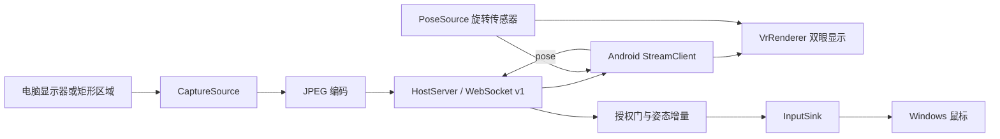

# 🧩 架构与集成

VRization 把“从哪里来画面”“怎样传输”“怎样显示”“怎样发出输入”拆为相邻组件。当前的复用方式是源码 / Android library 集成；公共接口仍处于 Alpha，可能随版本调整。



## 目录

| 路径 | 职责 |
| --- | --- |
| `desktop/src/vrization_host/` | Python 采集、协议、服务器、鼠标适配器与桌面界面。 |
| `desktop/tests/` | 不依赖真实游戏的核心检查。 |
| `android/vr-core/` | 可复用 Android library：设置、旋转传感器接口与 OpenGL ES 双眼渲染。 |
| `android/app/` | 连接界面、WebSocket 客户端、JPEG 解码和设置交互。 |
| `docs/` | 教程、协议、移植与版本边界。 |

`vr-core` 使用 Java 编写，但依赖 Android 的 OpenGL ES、Bitmap 与传感器 API。它可生成 AAR 并嵌入其他 Android 软件；不能直接作为无平台依赖的 Java / Unity / Unreal 库使用。跨平台客户端可以独立实现协议，将姿态与显示逻辑适配到目标引擎。

## 替换电脑画面来源

桌面端 `CaptureSource` 接口定义 `read(config: CaptureConfig) -> Frame` 和 `close()`。`Frame` 包含 `jpeg: bytes`、`width`、`height` 和单调时钟 `captured_at`；默认实现采集并编码桌面。其他软件可以提供自己的 JPEG 帧，例如游戏已渲染的图像、远程应用输出或测试画面，再交给同一主机服务。

通过 `HostServer(capture_source=..., input_sink=...)` 注入适配器。画面与输入接口分开，集成者可以只发送图像而不启用任何输入。

可直接运行的 [embedded_host.py](../examples/embedded_host.py) 用原创动态校准卡替换桌面采集，用日志接收器替换系统鼠标，不采集用户屏幕、不发送 OS 输入。安装电脑端包后，在仓库根目录执行 `python examples/embedded_host.py`，再用手机连接控制台显示的端口和配对码；服务的电脑 IP 仍需填写局域网地址。

示意接口关系（具体类名与构造参数以源码为准）：

```python
# 自己实现 CaptureSource.read / close 与 InputSink.move。
server = HostServer(capture_source=my_capture, input_sink=my_input)
```

当前传输的数据是 JPEG。若替换为硬件 H.264 / H.265，应一起设计新帧封装、时间戳、关键帧恢复和客户端解码，不能直接把视频码流发送给 v1 的 JPEG 解码器。

## 嵌入 Android 软件 / 游戏

`VrSettings` 表达观看和输入设置；`PoseSource` 隔离姿态来源；`AndroidPoseSource` 使用平台传感器；`VrRenderer` 负责显示。app 提供连接与设置界面，可根据宿主软件重写。

在 `android/` 运行 `./gradlew :vr-core:assembleRelease` 可生成 `vr-core/build/outputs/aar/vr-core-release.aar`，放进宿主的 `libs/` 并通过 `implementation files('libs/vr-core-release.aar')` 引入。最小显示接线为：

```java
VrRenderer renderer = new VrRenderer();
GLSurfaceView surface = new GLSurfaceView(activity);
surface.setEGLContextClientVersion(2);
surface.setRenderer(renderer);
renderer.setSettings(new VrSettings());

AndroidPoseSource pose = new AndroidPoseSource(
    activity, activity.getWindowManager().getDefaultDisplay());
if (pose.isAvailable()) {
    pose.start((yaw, pitch, roll, timestampNanos) ->
        renderer.setPose(yaw, pitch, roll));
}
// JPEG 解码或宿主图像就绪后：renderer.submitFrame(bitmap)。
```

这是接线片段，需放到宿主 Activity 的生命周期中。`PoseMath` 中的角度处理不依赖 Android，可作为抽出跨平台数学核心的起点；整个 AAR 仍依赖 Android。

嵌入时让宿主负责生命周期：进入前台时恢复 `GLSurfaceView`、调用 `renderer.resumeFrames()` 并启用传感器；离开时停止传感器、断开连接、调用 `renderer.pauseFrames()` 并暂停 `GLSurfaceView`。`submitFrame(bitmap)` **接管 Bitmap 所有权**，渲染器会回收提交的 Bitmap；不要再复用该实例。确保画面解码与网络接收不阻塞主线程；避免积累过期帧增加延迟。

只需要头部输入时可以复用姿态接口，自行映射到宿主相机；只需要 VR 盒子显示时可以用自己的图像来源，不运行 Windows 鼠标适配器。

## 移植到其他平台

1. 按 [协议 v1](PROTOCOL.md) 实现连接、JPEG 帧接收和设置消息。
2. 把一张二维图像绘制到左右眼区域，先验证固定全屏。
3. 接入目标平台姿态，把坐标轴、角度单位和横屏方向校准清楚。
4. 如需要鼠标控制，在电脑端保留主动授权、序号 / 数值校验、断线停止与紧急停止。
5. 如需要真正立体游戏画面，在游戏 / 引擎侧为左右眼分别渲染，并定义新协议。这超出当前二维桌面复制能力。

未来可能抽出纯数学核心、引擎适配器和稳定 SDK。现阶段不要把 Alpha 接口作为长期兼容承诺。
