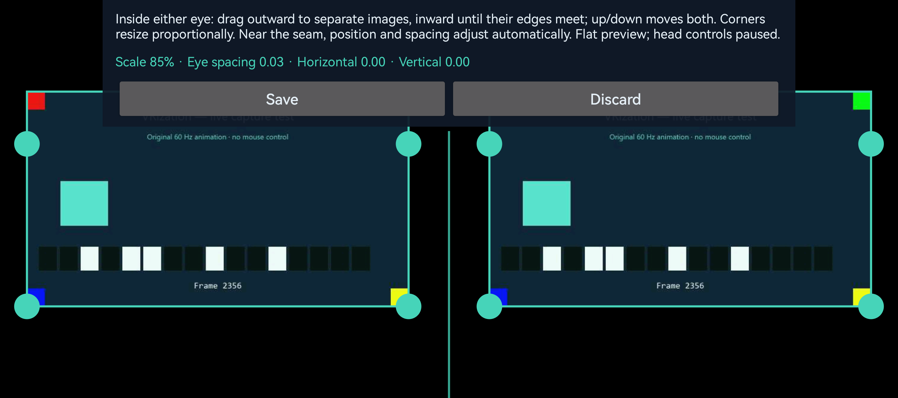
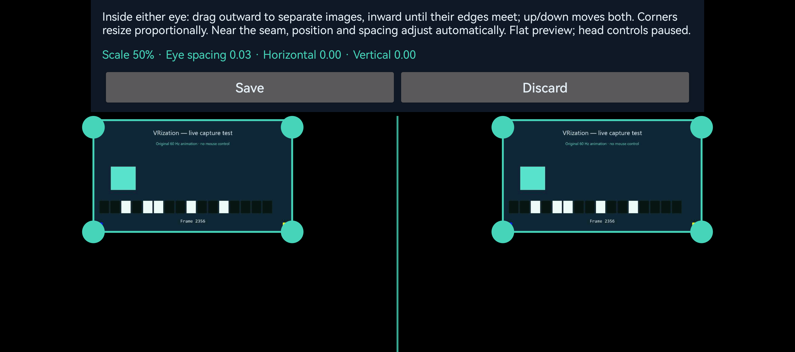
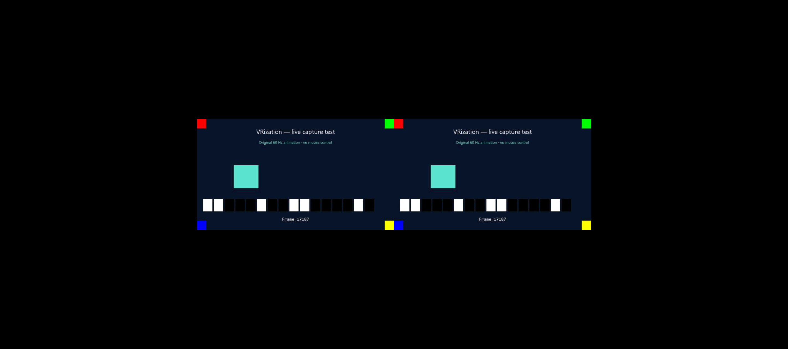
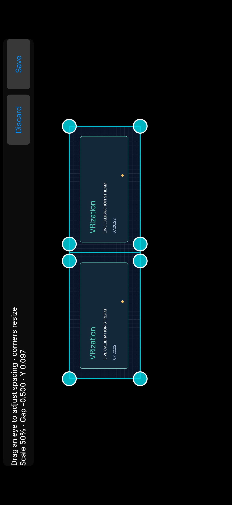
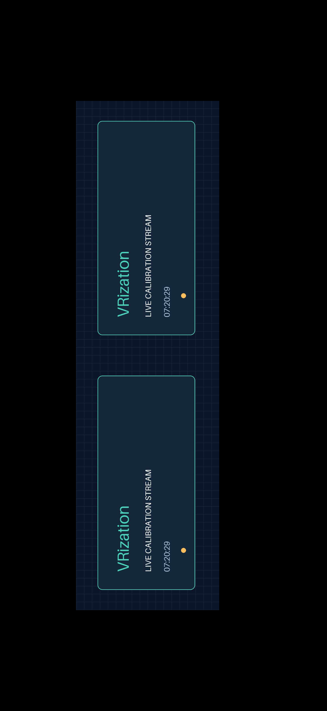

# 🥽 Headset-fit editor and saved profiles / 盒子适配编辑器与保存配置

[English](#english) · [简体中文](#简体中文)

<!-- vrization:english -->
## English

v0.3.0-alpha places visual headset fitting first in the settings on Windows, Android and iOS. It adjusts the image inside the two eye areas without adding a fourth viewing mode. The editor uses a flat, undistorted preview; your actual full-screen / cinema / FPS mode and other optical settings remain in the draft unchanged.

| Application | Entry and actions |
| --- | --- |
| Windows | First tab **Headset editor**, then **Open visual headset editor**; Save / Discard. |
| Android | **Fit headset visually**; Save / Discard. |
| iOS | **Visual headset fit editor**; Save / Discard. |

### Drag, preview, then choose

1. Open the editor using the entry above. The entry settings are captured as a snapshot. Windows shows an approximate phone-shaped preview with whole-phone aspect choices 20:9 (default), 16:9 and 19.5:9; a phone uses its own screen. The PC reuses the existing latest JPEG at up to 10 preview updates per second; it starts no additional capture and does not change the display / rectangle.
2. Drag inside either image to adjust **linked, mirrored eye spacing** on all three applications. Left-eye left or right-eye right widens the spacing; left-eye right or right-eye left narrows it. A smaller image can continue inward until the inner edges meet at the middle seam. Shared horizontal offset is retained while space allows, then constrained toward zero as the seam closes. Vertical dragging moves both normally. Corners preserve aspect ratio and normally keep centers fixed; enlargement at contact moves centers outward as needed to prevent overlap. Scale is limited to 50–100%, signed separation to −1…0.2 with an aspect-dependent inward stop, and vertical offset to −0.3…+0.3.
3. **Save** on a phone commits the complete draft through normal settings synchronization when connected. On Windows it updates only scale / offsetX / offsetY / eyeSeparation once against the current host snapshot, preserving other settings changed during editing, then saves that complete committed state. **Discard** restores the local entry preview and sends no update. Dragging the preview never writes host settings or saved preferences.

The preview temporarily suppresses motion-driven viewing and outgoing phone poses. A connected phone stops new poses and drops application-pending pose work (already submitted transport bytes cannot be recalled) and sends one normal hello with `editing: true` on entry; the current host disarms input immediately on receipt. Desktop entry also disarms it. Video, ping and normal exit recentering may continue; no draft settings or preferences are written. Older hosts still stop on the pose timeout. Saving or leaving the editor never grants new authorization. Use the normal PC authorization flow again before FPS control.

Phone backgrounding, disconnecting or changing language discards an open draft; iOS also cancels it when the viewport changes during rotation. Saved values remain separate from a temporary drag. The editor is a visual fit aid, not a measurement of physical lens alignment, interpupillary distance or headset comfort. A valid offset / eye separation can place an image partly outside an eye viewport; the viewport clips it.

Seam contact is guaranteed by the flat preview geometry and undistorted full / FPS display. Cinema perspective, head motion and lens distortion change projected edges, so this is not a guarantee of a seamless image in those views. The PC's selected phone aspect is an approximation; the phone resolves against its real viewport and current image aspect. Update both host and phone to v0.3 before saving negative separation: v0.2 clients / hosts accept only nonnegative values. Existing nonnegative profiles and the 0.03 default remain valid.

### Physical Android examples

These unmodified v0.3.0 screenshots come from a HUAWEI Pura 70 Ultra receiving an original test card over USB from a selected AW2726DL region. They illustrate the flat editor / viewer, not physical headset optics or an end-to-end latency benchmark. The English interface is shown; English / Chinese remain selectable.



The corner handles resize both eye images. Save / Discard are visible at the top.

| After resizing to 50%, before closing the seam | After dragging inward to contact |
| --- | --- |
|  |  |

The joined preview reads scale 50%, separation −0.50, horizontal 0.00. After Save, the normal viewer below displays the same fit with controls hidden; both inner edges meet at the center.



### Native iOS Simulator examples

These unmodified v0.3 originals come from the final native Simulator UI run, using an original calibration card. The first shows 50% / −0.500 contact; the second is the saved, enlarged approximately 71.6% / −0.284 fit. Both keep the middle seam closed. This is Simulator evidence, not a physical iPhone, headset or latency benchmark; see [iOS installation and validation](IOS.md).

| 50% contact in the editor | Saved Metal view after enlargement |
| --- | --- |
|  |  |

### Local phone profile and reconnecting

Both phones keep the complete **committed VR settings** locally, including mode, scale, offsets, eye separation, field of view, distance, distortion, sensitivity and invert Y. Changes made offline are retained; drafts are not. A restart restores the saved profile before connecting. An accepted complete settings snapshot from normal connected synchronization updates the committed profile.

After a valid host `hello`, a phone with a saved profile sends that complete profile once as a normal v1 `settings` update with a new `clientSeq`. This is an intentional user preference: it takes precedence over the host's initial settings for that connection. It does not skip session validation or input authorization. A phone without a saved profile starts from the validated host snapshot. Later PC changes and acknowledgments use the existing revision / sequence rules. See [protocol v1](PROTOCOL.md).

When connected, Save from either side propagates through normal validated settings, acknowledgments and broadcasts, and both sides retain the accepted committed state. Offline Save can only change that application's local preferences. **If both sides changed offline, the saved phone profile wins on the next validated connection**; Save again from the PC afterward to apply its chosen fit to both sides. This version does not compare unsynchronized clocks or merge conflicting complete offline profiles.

Pairing codes and Apple pairing records are never part of the saved view profile. USB remains the default, with LAN explicitly selectable. Saving a profile does not connect automatically or start streaming.

### Reset all settings

Reset is explicit and separate from Discard. It removes a pending edit and returns product preferences to their defaults:

| Preference | Default |
| --- | --- |
| Mode / scale / offsets | Full screen / 0.85 / 0, 0 |
| Eye separation / field of view / distance | 0.03 / 80° / 3 |
| Distortion / sensitivity / invert Y | 0 / 1000 / false |
| Language / preferred connection | English / USB |
| Windows capture preset | Low latency: long edge 640, target 60 FPS, JPEG Q45 |
| Phone LAN fields | Empty address, port 8765, empty pairing field |

The PC **preserves the explicitly selected capture display / rectangle and configured ADB executable path**. These identify the intended output and installed tools; resetting viewing preferences must not switch to another screen or remove the user's development environment. USB device choice returns to automatic selection. Reset does not uninstall drivers / SDKs, change platform authorization, start streaming or arm mouse input.

Phone reset clears local view and connection preferences, selects English / USB and ends the current connection; the current rebuilt reset page does not reconnect automatically. A later fresh app launch resumes the normal first-foreground USB detection / listener policy, and a valid hello restores the committed default profile. Any settings update on an already connected host uses the normal validated protocol. A saved reset profile can be restored on the next explicitly established session.

### Reusable geometry contract

The original Python helper is `desktop/src/vrization_host/view_edit.py`; Android `HeadsetGeometry` / `HeadsetEdit` and Swift `HeadsetFit` use the same math in their cores. Swift additionally exposes `PhonePreferencesStore` and `LocalProfileSync` for committed preferences and restoration. No platform UI, networking or storage is required for the geometry itself.

Each eye has normalized coordinates **[−1, 1], y upward**. For image aspect `a` and eye viewport aspect `e`:

```text
fit = (min(1, a/e), min(1, e/a))
h = fit.x × scale
minimum separation = h − 1
resolved separation = clamp(raw separation, h − 1, 0.2)
gap = max(0, 1 + resolved separation − h)
resolved offsetX = clamp(raw offsetX, −min(0.3, gap), +min(0.3, gap))
center = (resolved offsetX ± resolved separation, offsetY)
half-size = fit × scale

start = resolved_fit(gesture-start settings, a, e)
eyeSign = −1 for left, +1 for right
drag separation = clamp(start.eyeSeparation + eyeSign × dx, h − 1, 0.2)
drag offsetY = clamp(start.offsetY + dy, −0.3, +0.3)
drag result = resolved_fit(start with drag separation / offsetY, a, e)
resize scale = clamp(start.scale +
    dot((dx × cornerX, dy × cornerY), fit) / dot(fit, fit), 0.5, 1)
resize result = resolved_fit(start with resize scale, a, e)
```

Use `−` for the left eye and `+` for the right. Corner signs are −1 / +1 for left / right and bottom / top. Pointer deltas are measured from the **gesture-start snapshot**, never accumulated from each event, with image / viewport aspects frozen for that gesture. Screen y increases downward, so convert it with the opposite sign. At contact, `gap = 0` and shared X resolves to zero. For `fit.x = 0.5`, `scale = 0.5`, the inward limit is −0.75. Rendering resolution does not itself rewrite a saved raw profile; changing image / viewport aspects can change its resolved fit.

All three UI adapters convert pointer movement directly: `dx = 2 × pointerDeltaX / eyeWidth`, `dy = −2 × pointerDeltaY / height`. The selected eye sign makes horizontal movement mirrored; do not negate x globally. X and center positions remain unchanged when the seam constraint is inactive. Ordinary X settings are still available, subject to the remaining gap during flat rendering. Corner motion remains direct. FPS gyro / mouse mapping is unchanged; protocol v1 keeps its existing field but expands the signed range.

Python exposes `fit_size`, `resolved_fit`, `eye_bounds` (resolved left, bottom, right, top; eye 0 left / 1 right), `dragged` (`eye_pan` / `resize`, with reusable ordinary `pan` also available) and an optional `EditTransaction` with local preview / commit / discard. Ordinary `pan` retains generic wire offset clamps for integrations; the editor uses the seam-aware path. Callers own rendering, persistence and broadcasts. Automated geometry checks do not establish real headset optics or completed UI / device acceptance; consult [validation](VALIDATION.md).

---

<!-- vrization:chinese -->
## 简体中文

v0.3.0-alpha 将可视盒子适配放在 Windows、Android 与 iOS 设置首位，在两眼区域内直接调整画面，不增加第四种观看模式。编辑器采用平面、无畸变预览；实际全屏 / 大屏幕 / FPS 模式与其他光学设置原样保留在草稿中。

| 应用 | 入口与操作 |
| --- | --- |
| Windows | 第一个标签页**画面编辑**，再点**打开可视画面编辑器**；保存 / 弃用。 |
| Android | **可视化适配 VR 盒子**；保存 / 放弃。 |
| iOS | **可视化盒子画面编辑器**；保存 / 放弃。 |

### 拖动、预览，再决定

1. 按上表打开编辑器，进入时的完整设置会保存为快照。Windows 提供近似手机形状的预览，可选整部手机宽高比 20:9（默认）、16:9 和 19.5:9；手机使用自身屏幕。电脑最多每秒 10 次复用现有最新 JPEG，不新增采集、不改变显示器或选区。
2. 三端拖画面内部都调整**左右眼镜像联动间距**：左眼向左或右眼向右拉开，左眼向右或右眼向左收拢。缩小后仍可继续向内拖，直到两眼内边在中缝相接。空间允许时保留整体水平偏移，接近中缝时会限位并逐渐归零；竖向仍同步正常移动。角点保持图像比例，通常中心固定；在接触状态放大时，必要时向外调整中心以避免重叠。缩放范围为 50–100%，有符号间距为 −1…0.2、向内终点按画面比例计算，竖向偏移为 −0.3…+0.3。
3. 手机**保存**提交完整草稿，已连接时通过正常设置同步发送；Windows 保存时只向当前主机快照一次更新 scale / offsetX / offsetY / eyeSeparation，保留编辑期间其他设置改动，再保存完整已提交状态。**放弃**恢复本地进入预览，不发送更新。预览拖动不会写主机设置或保存偏好。

预览暂时停用姿态控制画面，并暂停手机发送姿态。已连接手机停止新姿态、丢弃应用层待发姿态（已提交传输层字节无法撤回），进入时用普通 hello 一次发送 `editing: true`，当前主机收到后立即解除输入授权；电脑进入也解除授权。视频、ping 和正常退出回正可以继续，但不写草稿设置或偏好。旧主机仍由姿态超时停止输入。保存或退出不会重新授予权限；继续 FPS 控制前，重新走电脑正常授权流程。

手机进入后台、断线或切语言会放弃尚未保存的草稿；iOS 在旋转导致显示区域改变时也取消编辑。已保存值与临时拖动分开。编辑器帮助肉眼适配，不测量实际镜片对齐、瞳距或舒适度。合法偏移 / 眼间距也可能使部分画面越出单眼区域，超出部分会被裁切。

中缝相接由平面预览及无畸变全屏 / FPS 的几何保证。大屏幕透视、头部运动和镜片畸变会改变投影边缘，不保证这些视图也无缝。电脑选择的手机比例只是近似，手机按实际视口和当前图像比例解析。保存负间距前请把电脑与手机都更新到 v0.3：v0.2 只接受非负值。已有非负配置和默认 0.03 仍有效。

### Android 真机示例

以下未修改的 v0.3.0 原始截图来自 HUAWEI Pura 70 Ultra，经 USB 接收选定 AW2726DL 区域里的原创测试卡；展示平面编辑器 / 观看界面，不代表实际盒子镜片或端到端延迟基准。截图采用英文界面，软件仍可选择英文 / 中文。


角点控制两眼同步缩放，顶部可见保存 / 放弃。

| 缩小至 50%，尚未收拢 | 向内拖到中缝相接 |
| --- | --- |
|  |  |

相接预览读数为缩放 50%、间距 −0.50、水平 0.00。保存后，下面的普通观看界面隐藏操作区并采用相同适配，两眼内边在中心相接。


### 原生 iOS 模拟器示例

以下未修改的 v0.3 原图来自最终原生模拟器界面检查，内容为原创校准卡：第一张为 50% / −0.500 相接，第二张是保存后放大的约 71.6% / −0.284 状态，两者中缝均相接。这是模拟器证据，不是 iPhone 真机、盒子或延迟基准，见 [iOS 安装与验证](IOS.md)。

| 编辑器中 50% 相接 | 放大后保存的 Metal 画面 |
| --- | --- |
|  |  |

### 手机本地配置与重连

两种手机都在本地保存完整的**已提交 VR 设置**，包括模式、缩放、偏移、眼间距、视场角、距离、畸变、灵敏度与 Y 反转。离线修改也会保留，草稿不保存；重启后先恢复已保存配置。正常连接同步接受的完整设置快照也更新已提交配置。

收到合法主机 `hello` 后，有已保存配置的手机会用新的 `clientSeq`，通过普通 v1 `settings` 一次发送完整配置。这是用户明确选择的偏好，优先于本次连接的主机初始设置，但不跳过会话校验或输入授权。没有已保存配置时先采用合法主机快照。后续电脑更改与确认继续遵循原有 revision / 序号规则，见 [协议 v1](PROTOCOL.md)。

已连接时，任一端保存都经普通合法设置、确认与广播传播，两端保留接受的已提交状态；离线保存只能改本应用的本地偏好。**若两边离线都改过，下次合法连接由已保存手机配置优先**；之后再从电脑保存，就能把电脑选择的适配应用到两端。本版不比较未同步的时钟，也不合并冲突的完整离线配置。

配对码和 Apple 配对记录不属于观看配置，也不会保存进去。仍默认 USB，可显式选择局域网；保存配置不会自动连接或开始串流。

### 重置全部设置

重置需要主动选择，与放弃分开；它清除待保存编辑，把产品偏好恢复默认：

| 偏好 | 默认值 |
| --- | --- |
| 模式 / 缩放 / 偏移 | 全屏 / 0.85 / 0, 0 |
| 眼间距 / 视场角 / 距离 | 0.03 / 80° / 3 |
| 畸变 / 灵敏度 / Y 反转 | 0 / 1000 / false |
| 语言 / 优先连接 | English / USB |
| Windows 采集预设 | 低延迟：最长边 640、目标 60 FPS、JPEG Q45 |
| 手机局域网字段 | 空地址、端口 8765、空配对码 |

电脑**保留明确选择的采集显示器 / 选区及配置的 ADB 程序路径**，因为它们标识用户要分享的画面与已安装工具；重置观看偏好不应偷偷切到其他屏幕或删除开发环境。USB 设备选择恢复自动。重置不会卸载驱动 / SDK、改变平台授权、开始串流或授权鼠标。

手机重置清除本地观看与连接偏好，选择英文 / USB 并结束当前连接，当前重建的重置界面不自动重连。之后全新启动应用，会恢复正常首前台 USB 检测 / 监听策略，合法 hello 后恢复已提交默认配置。已经连接的主机设置更新仍用正常校验协议。保存后的默认配置可在下次明确建立会话后恢复。

### 可复用的几何合同

原创 Python 工具位于 `desktop/src/vrization_host/view_edit.py`；Android 核心 `HeadsetGeometry` / `HeadsetEdit` 与 Swift 核心 `HeadsetFit` 使用相同数学。Swift 还提供 `PhonePreferencesStore` 与 `LocalProfileSync` 处理已提交偏好及恢复。几何本身不依赖平台界面、网络或存储。

每眼采用**[−1, 1] 归一化坐标，y 向上**。图像宽高比为 `a`、单眼区域宽高比为 `e`：

```text
fit = (min(1, a/e), min(1, e/a))
h = fit.x × scale
间距下限 = h − 1
解析间距 = clamp(原始间距, h − 1, 0.2)
gap = max(0, 1 + 解析间距 − h)
解析 offsetX = clamp(原始 offsetX, −min(0.3, gap), +min(0.3, gap))
center = (解析 offsetX ± 解析间距, offsetY)
half-size = fit × scale

start = resolved_fit(手势开始设置, a, e)
eyeSign = 左眼 −1，右眼 +1
拖动间距 = clamp(start.eyeSeparation + eyeSign × dx, h − 1, 0.2)
拖动 offsetY = clamp(start.offsetY + dy, −0.3, +0.3)
拖动结果 = resolved_fit(start 替换拖动间距 / offsetY, a, e)
resize scale = clamp(start.scale +
    dot((dx × cornerX, dy × cornerY), fit) / dot(fit, fit), 0.5, 1)
缩放结果 = resolved_fit(start 替换 resize scale, a, e)
```

左眼取 `−`，右眼取 `+`；角点符号为左 / 右 −1 / +1、下 / 上 −1 / +1。指针位移根据**手势开始快照**计算，不重复累加事件，并在本次手势冻结图像 / 视口比例。屏幕 y 向下，转换时取相反符号。接触时 `gap = 0`、共用 X 归零；`fit.x = 0.5`、`scale = 0.5` 的向内下限为 −0.75。渲染解析不会自行改写已保存的原始配置，图像 / 视口比例改变时解析结果可能变化。

三端界面都直接转换指针位移：`dx = 2 × 指针水平位移 / 单眼宽度`，`dy = −2 × 指针竖向位移 / 高度`；由选中眼符号产生水平镜像联动，不统一反转 x。接缝约束未触发时 X 与中心保持不变；普通设置仍可调整 X，但平面渲染受剩余间隙限制。角点方向仍正常，FPS 陀螺仪 / 鼠标映射不变；协议 v1 沿用已有字段，但扩大为有符号范围。

Python 提供 `fit_size`、`resolved_fit`、`eye_bounds`（解析后的左、下、右、上；eye 0 左 / 1 右）、`dragged`（`eye_pan` / `resize`，另保留普通 `pan` 供复用）及可选 `EditTransaction`，负责本地预览 / 提交 / 放弃。普通 `pan` 保留通用协议偏移限位供集成使用，编辑器采用接缝路径。调用方负责渲染、存储与广播。几何自动检查不代表真实盒子镜片或界面 / 设备验收已完成，实测范围见 [验证记录](VALIDATION.md)。
