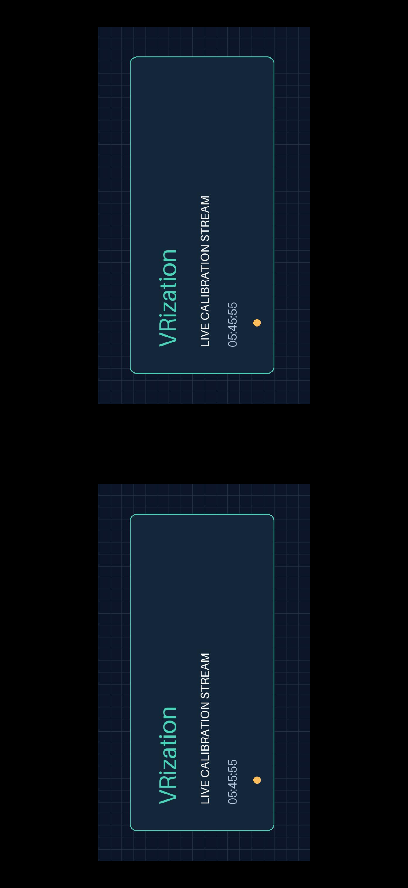
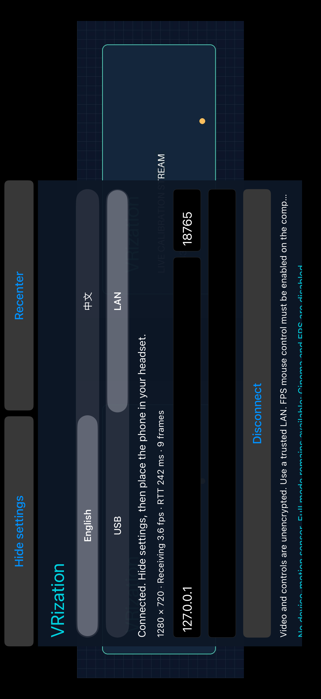
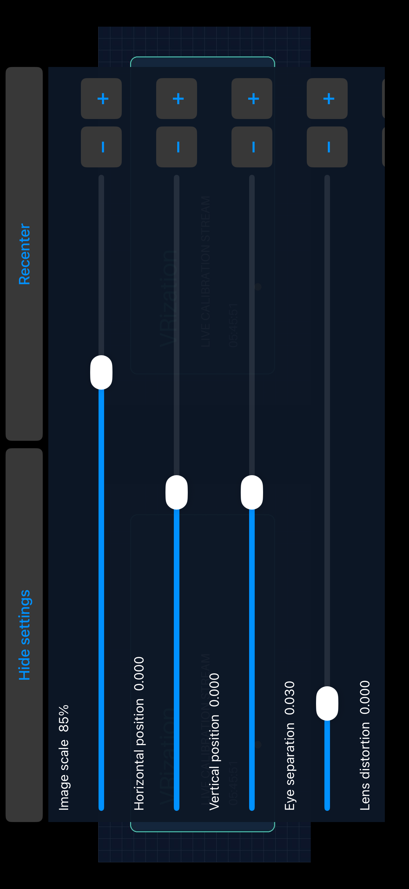
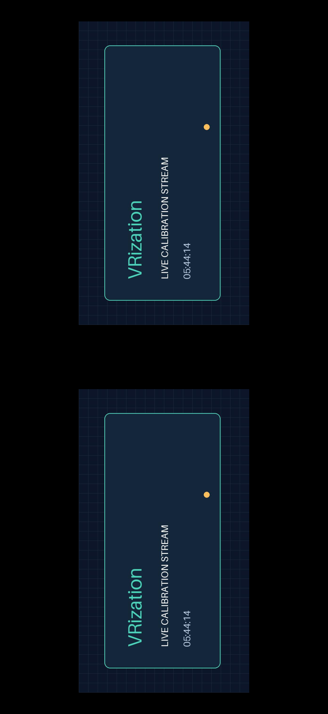
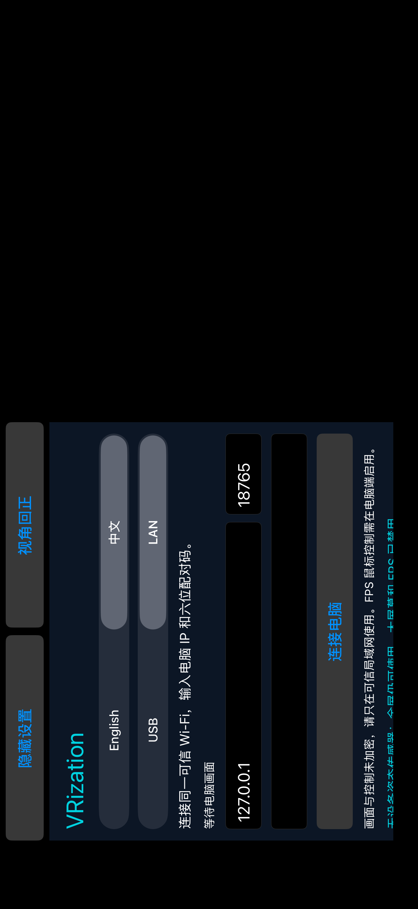

# 🍎 iPhone / iPad with Windows / iPhone、iPad 与 Windows

[English](#english) · [简体中文](#简体中文)

<!-- vrization:english -->
## English

The native iOS client connects to the same Windows host as Android. It targets **iOS / iPadOS 15+**, landscape and a Metal-capable device. **USB is the default connection method**; trusted LAN is an explicit alternative. English is the default even on a Chinese system; select Simplified Chinese in the app to save that preference. This is an Alpha client, not an App Store or TestFlight release.

### 📦 What the downloads mean

| File | Use |
| --- | --- |
| `VRization-Windows-x64.zip` | The Windows 10 / 11 x64 host for both phone platforms. |
| `VRization-iOS-source.zip` | Editable Xcode project, reusable Swift package, license and offline documentation. Open the project on a Mac to sign for your own iPhone. |
| `VRization-iOS-Simulator.zip` | The verified CI application is **arm64**, for the iOS Simulator on an **Apple Silicon Mac**. Intel Mac users need to build the source locally for their simulator architecture. It cannot be installed on an iPhone or run on Windows. |

There is no universally installable unsigned iPhone IPA. The cloud build checks the iPhone device SDK without signing, and builds / exercises the simulator app. Apple signing and provisioning are still needed for physical installation. Signing credentials are never included in this repository or requested by the app.

### 🛠️ Install on your iPhone with Xcode

1. On a Mac with a compatible [Xcode](https://developer.apple.com/xcode/system-requirements), clone the repository or extract the iOS source archive completely. Open `ios/VRization.xcodeproj`.
2. In **Xcode → Settings → Accounts**, add your own Apple Account locally. Select the **VRizationApp** target, **Signing & Capabilities**, enable automatic signing, and choose your team. A personal team can be used for personal device testing; TestFlight / App Store distribution needs the applicable Apple Developer Program membership. See [Apple's team instructions](https://help.apple.com/xcode/mac/current/en.lproj/dev23aab79b4.html) and [distribution guide](https://developer.apple.com/documentation/xcode/preparing-your-app-for-distribution).
3. If Xcode reports that the bundle identifier is unavailable, replace `org.vrization.ios` with a unique identifier you control. Do not commit your team, certificate, provisioning profile or account credentials.
4. Connect and unlock the iPhone, trust the Mac, select the phone as the run destination and press **Run**. Enable Developer Mode if the device asks. Follow [Apple's device-running guide](https://developer.apple.com/documentation/xcode/running-your-app-on-simulated-or-physical-devices) for device trust / signing errors.
5. Keep Xcode available for re-signing when your development profile expires. The app does not renew signing by itself.

Windows runs the streaming host normally. A Mac is used for this documented Xcode installation path; no Mac is needed while using an already signed and installed client. No Apple ID is entered into the Windows host or VRization.

### 🔌 Default: USB to Windows

Install Apple's official [Apple Devices](https://support.apple.com/guide/devices-windows/welcome/windows) / Apple Mobile Device Support on Windows, connect a data USB cable, unlock the iPhone and approve **Trust This Computer**. Start streaming in the Windows app and open the installed iOS app with **USB** selected. The PC looks for a USB device with an existing local Apple pairing record; the phone waits on a loopback-only port. They recognize each other from the normal host handshake without entering an IP or six-digit code. Neither client can automatically start screen capture or arm mouse input.

This is direct USB framing through Apple's USB service, not Personal Hotspot, Wi-Fi or a charging cable used alongside wireless streaming. No jailbreak or hotspot subscription is required. The original relay and native client are tested with a **simulated usbmux service** in CI; a physical iPhone / Windows Apple driver combination still needs testing. Connect one iPhone for automatic selection. See [USB setup and exact limitations](USB.md).

Leaving the foreground or changing language stops the listener and connection. Tap **Connect** to resume waiting; this prevents a background app from silently resuming control.



Original calibration stream in the native iPhone 17 Pro Max Simulator, iOS 26.2. The USB test uses a **simulated usbmux service** and the real application listener / relay; this is not a physical iPhone USB test. Both eyes are complete at 85% scale.

### 📶 Alternative: trusted LAN

1. Connect the Windows PC and iPhone to the same trusted LAN. The PC may use Ethernet. Guest Wi-Fi isolation, a VPN or a firewall can prevent local connections.
2. Start the Windows host, select the intended display or rectangle, and start streaming. For a two-monitor PC, choose your test display explicitly. `Start-on-second-monitor.bat` selects monitor 2; verify its name in the host because enumeration can change.
3. Allow the host through Windows Firewall on your trusted **private network**. Do not disable the whole firewall. Enter the host's displayed LAN IP, port (normally `8765`) and six-digit pairing code in the iOS app. Keep leading zeros; enter only the host, not a `ws://` URL or path.
4. Select **LAN**, tap **Connect** and allow iOS **Local Network** access. If it was denied, open iOS Settings, find VRization under Apps / Privacy & Security → Local Network, enable access, return and connect again. The exact Settings path varies by iOS version. [Apple's local-network explanation](https://developer.apple.com/documentation/technotes/tn3179-understanding-local-network-privacy) describes the permission.
5. Start with **Full screen**, adjust scale and offsets, and confirm both eyes show a complete image before inserting the phone into the viewer. Only one phone can connect to the host at a time; disconnect Android first.

`ws://` is unencrypted and the six-digit code is not encryption. The app declares local networking for this LAN protocol, while keeping the Internet transport defaults. Use trusted networks only. See [security](../SECURITY.md).



Native iOS Simulator receiving the original calibration stream through the **LAN / WebSocket code path on CI loopback**. The screenshot's `127.0.0.1:18765` and displayed statistics belong to that simulator test; enter your Windows host's displayed LAN address and port for everyday use.

### 🥽 Viewing and controls

- **Full screen:** fixed side-by-side images, no motion sensor needed.
- **Cinema:** a virtual screen; Core Motion changes the viewing direction. Recenter after placing the phone in the viewer.
- **FPS:** fixed side-by-side images and rotation messages to Windows. The phone cannot arm mouse input. Authorize it explicitly on Windows and use **F8** to stop.
- Adjust scale, horizontal / vertical offset, eye separation, field of view, distance, distortion, sensitivity and invert Y. Drag a slider for larger changes; use its **− / +** buttons for exact one-step adjustments (scale changes by 1%). These are viewing parameters, not a measurement of physical interpupillary distance.
- Hide the controls for viewing; use the app's recovery gesture to restore them. Double-tap to recenter. Returning to the background, changing language or disconnecting ends the connection and motion updates; reconnect explicitly when ready.
- A device without usable motion support falls back to fixed viewing. The simulator cannot validate physical gyro axes, drift or headset comfort.

Both eyes show the same 2D source. There is no automatic stereo conversion, audio or promised VR latency. Windows / iOS client versions share [protocol v1](PROTOCOL.md); older hosts can omit revision fields, but the current host gives stronger settings synchronization. The client validates incoming values and keeps only bounded latest-frame work.



Native iOS Simulator with the original calibration stream behind the controls: scale 85%, zero offsets and eye separation 0.030. The normal **− / +** buttons were used to confirm exact values and synchronized settings.



The same original 2D calibration image appears in both eyes after hiding the controls. This native Simulator screenshot uses the LAN / loopback WebSocket test; it verifies rendering, not physical headset optics.



The native iOS Simulator after an app restart, before connecting: **中文** and Chinese controls are preserved. English remains the default until the user changes the selection.

### 🧩 Reuse and build

Add the local Swift package at `ios/` in your own Xcode project and depend on **VRizationCore**. It contains protocol / settings, synchronization and rotation math without UIKit or Metal dependencies. Adapt the application's transport, `CoreMotion` and Metal renderer to your own lifecycle; the full application is not an engine plug-in. Preserve the original [MIT license](../LICENSE).

On a Mac, from the repository root:

```sh
swift test --package-path ios
xcodebuild -project ios/VRization.xcodeproj -scheme VRization \
  -destination 'generic/platform=iOS Simulator' CODE_SIGNING_ALLOWED=NO build
xcodebuild -project ios/VRization.xcodeproj -scheme VRization \
  -destination 'generic/platform=iOS' CODE_SIGNING_ALLOWED=NO build
```

`python3 scripts/build_ios.py` additionally runs the UI test suite against a loopback synthetic host and simulated usbmux service, exports genuine screenshots and packages the simulator / source downloads. Install the host package and fixture dependencies first as configured in [the workflow](https://github.com/LexZeon/VRization/blob/main/.github/workflows/build.yml). The fixture neither captures a screen nor moves the mouse. Successful compilation / simulator checks do not establish real iPhone USB, iOS 15 hardware or game compatibility. Exact observed checks appear in [validation](VALIDATION.md) and [compatibility](COMPATIBILITY.md).

---

<!-- vrization:chinese -->
## 简体中文

原生 iOS 客户端和 Android 使用同一个 Windows 主机，目标为 **iOS / iPadOS 15+**、横屏和支持 Metal 的设备。**默认使用 USB**，也可显式选择可信局域网。即使系统是中文，软件仍默认英文；在应用内选择简体中文后会保存偏好。目前是 Alpha 客户端，并非 App Store 或 TestFlight 发行版。

### 📦 下载文件的用途

| 文件 | 用途 |
| --- | --- |
| `VRization-Windows-x64.zip` | 同时服务两类手机的 Windows 10 / 11 x64 电脑端。 |
| `VRization-iOS-source.zip` | 可编辑的 Xcode 工程、可复用 Swift 包、许可与离线文档；在 Mac 上打开，为自己的 iPhone 签名安装。 |
| `VRization-iOS-Simulator.zip` | 已验收的 CI 应用为 **arm64**，适用于 **Apple Silicon Mac 的 iOS 模拟器**；Intel Mac 需从源码本地编译对应模拟器架构。不能安装到 iPhone 或在 Windows 运行。 |

没有一种无需签名就能通用安装的 iPhone IPA。云端构建会检查真机 SDK 编译，并构建、运行模拟器应用；实际手机安装仍需 Apple 签名和配置描述文件。仓库不包含签名凭据，软件也不会索取这些凭据。

### 🛠️ 用 Xcode 安装到自己的 iPhone

1. 在具备兼容 [Xcode](https://developer.apple.com/xcode/system-requirements) 的 Mac 上克隆仓库，或完整解压 iOS 源码包。打开 `ios/VRization.xcodeproj`。
2. 在 **Xcode → Settings → Accounts** 中本地添加自己的 Apple 账户。选择 **VRizationApp** target，打开 **Signing & Capabilities**，启用自动签名并选择团队。个人团队可用于自己的设备测试；TestFlight / App Store 分发需要适用的 Apple Developer Program 资格。参见 [Apple 团队设置说明](https://help.apple.com/xcode/mac/current/en.lproj/dev23aab79b4.html) 与 [分发指南](https://developer.apple.com/documentation/xcode/preparing-your-app-for-distribution)。
3. 若 Xcode 提示 bundle identifier 被占用，把 `org.vrization.ios` 改为自己控制的唯一标识。不要把团队、证书、描述文件或账号凭据提交到仓库。
4. 连接并解锁 iPhone，信任 Mac，在运行目标中选择手机，按 **Run**。设备要求时开启开发者模式。设备信任 / 签名报错可按 [Apple 真机运行说明](https://developer.apple.com/documentation/xcode/running-your-app-on-simulated-or-physical-devices) 处理。
5. 开发配置文件到期时，需要再次通过 Xcode 签名运行，软件不会自动续签。

Windows 正常运行串流主机。本文的 Xcode 安装方法需要 Mac；客户端签好并装好后，日常串流不需要 Mac。不必在 Windows 主机或 VRization 内输入 Apple ID。

### 🔌 默认：USB 连接 Windows

Windows 安装 Apple 官方 [Apple Devices](https://support.apple.com/guide/devices-windows/welcome/windows) / Apple Mobile Device Support，接入数据 USB 线，解锁 iPhone 并批准**信任此电脑**。Windows 应用开始串流，手机打开已经签名安装的 iOS 应用并选择 **USB**。电脑查找已有本地 Apple 配对记录的 USB 设备，手机在仅本机可访问的端口等待，双方通过主机握手相互识别，不用填写 IP 或六位码。客户端不能自动开启电脑画面采集或授权鼠标。

该方式通过 Apple USB 服务直接传帧，不依赖个人热点、Wi-Fi，也不是一边充电一边无线串流；不需要越狱或热点套餐。目前 CI 通过**模拟 usbmux 服务**检查原创桥接器与原生客户端，真实 iPhone / Windows Apple 驱动组合仍需测试。自动选择时只接一台 iPhone，详见 [USB 配置与实际边界](USB.md)。

进入后台或切换语言会停止监听和连接；点击 **Connect / 连接** 才重新等待，避免后台应用悄悄恢复控制。


原生 iPhone 17 Pro Max 模拟器（iOS 26.2）显示原创校准串流。USB 测试使用**模拟 usbmux 服务**和实际应用监听器 / 中继，并非真实 iPhone USB 测试；85% 缩放下两眼画面完整。

### 📶 可选：可信局域网

1. Windows 与 iPhone 连同一个可信局域网，电脑可接网线。访客网络隔离、VPN 或防火墙可能阻止本地连接。
2. 开电脑端，选择目标显示器或矩形区域，开始串流。双屏电脑明确选择测试屏；`Start-on-second-monitor.bat` 选择编号 2，但显示器枚举可能变化，应核对电脑界面中的名称。
3. Windows 防火墙只为可信的**专用网络**放行主机，不要关闭整个防火墙。iOS 应用填写主机显示的局域网 IP、端口（通常 `8765`）及六位配对码，保留开头的零；主机栏只填地址，不填 `ws://` 链接或路径。
4. 选择 **LAN / 局域网**，点 **Connect**，允许 iOS 的**本地网络**权限。如果曾拒绝，在系统设置的应用 / 隐私与安全性 → 本地网络中找到 VRization 并允许，回应用重新连接。不同 iOS 版本路径可能不同，详见 [Apple 本地网络权限说明](https://developer.apple.com/documentation/technotes/tn3179-understanding-local-network-privacy)。
5. 先用 **Full screen / 全屏**，调整缩放和偏移，确认左右眼完整显示后再装入盒子。主机一次只接一台手机；先断开 Android 再连 iPhone。

`ws://` 是明文，六位配对码并非加密。应用为局域网协议声明本地网络访问，并保留互联网传输默认限制。仅用于可信网络，参见 [安全说明](../SECURITY.md)。


原生 iOS 模拟器经 **CI 本机回环上的局域网 / WebSocket 代码路径**接收原创校准串流。截图中的 `127.0.0.1:18765` 及统计值属于该模拟器测试；日常使用应填写 Windows 主机显示的局域网地址和端口。

### 🥽 模式和操作

- **全屏**：固定左右眼图像，不需要运动传感器。
- **大屏幕**：把图像放在虚拟屏幕上，用 Core Motion 改变观看方向；放入盒子后回正。
- **FPS**：固定双眼图像，向 Windows 发送旋转姿态。手机不能主动授权鼠标，须在电脑明确授权，按 **F8** 停止。
- 可调缩放、水平 / 垂直偏移、眼间距、视场角、距离、畸变、灵敏度和 Y 反转。拖动滑条可大幅调整，使用旁边的 **− / +** 按钮可精确微调一格（缩放每次 1%）。这些是观看参数，不是对实际瞳距的测量。
- 观看时隐藏操作区，用应用的恢复手势重新显示；双击回正。进入后台、切换语言或断线会终止连接与运动更新，需要时手动重连。
- 没有可用运动支持时回退固定观看。模拟器不能验证真实陀螺仪轴向、漂移和盒子舒适度。

两眼显示同一张二维源画面，不自动变成立体、不提供音频，也不承诺 VR 延迟。Windows / iOS 共享 [协议 v1](PROTOCOL.md)；旧主机可以不带 revision，新主机提供更完整的同步。客户端校验传入值，并限制最新帧处理队列。


原生 iOS 模拟器的设置区，背景为原创校准串流：缩放 85%、偏移为零、眼间距 0.030。实际通过正常 **− / +** 按钮检查了精确值与设置同步。


隐藏操作区后，两眼显示同一张原创二维校准图。本原生模拟器截图来自局域网 / 回环 WebSocket 测试，验证画面渲染，不代表真实盒子镜片已通过。


原生 iOS 模拟器重启应用、尚未连接时，**中文**选择与中文控件仍然保留；用户主动切换前仍默认英文。

### 🧩 复用与构建

在自己的 Xcode 工程中添加 `ios/` 本地 Swift 包，依赖 **VRizationCore**。它提供协议 / 设置、同步及旋转数学，不依赖 UIKit 或 Metal。应用中的传输、Core Motion 和 Metal 渲染可按宿主生命周期改接；完整应用尚不是游戏引擎插件。分发时保留原创 [MIT 许可](../LICENSE)。

Mac 上从仓库根目录执行：

```sh
swift test --package-path ios
xcodebuild -project ios/VRization.xcodeproj -scheme VRization \
  -destination 'generic/platform=iOS Simulator' CODE_SIGNING_ALLOWED=NO build
xcodebuild -project ios/VRization.xcodeproj -scheme VRization \
  -destination 'generic/platform=iOS' CODE_SIGNING_ALLOWED=NO build
```

`python3 scripts/build_ios.py` 还会对本机合成串流主机与模拟 usbmux 服务运行 UI 测试、导出真实截图并打包模拟器 / 源码下载。需先按 [构建工作流](https://github.com/LexZeon/VRization/blob/main/.github/workflows/build.yml) 安装主机包和测试依赖。测试主机不采集屏幕、不移动鼠标。编译 / 模拟器通过不能代表真实 iPhone USB、iOS 15 硬件和游戏兼容性已验证；实际检查范围见 [验证记录](VALIDATION.md) 和 [兼容性](COMPATIBILITY.md)。
