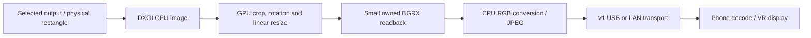
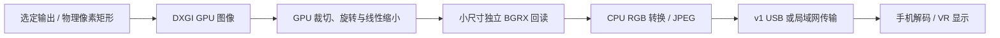

# ⚡ Performance and measurement / 性能与测量

[English](#english) · [简体中文](#简体中文)

<!-- vrization:english -->
## English

The v0.2.0-alpha Windows capture work moves image crop, display rotation and scaling onto the GPU before reading pixels into Python. Its purpose is to avoid repeatedly transferring a full high-resolution desktop through CPU memory when the phone only needs a smaller image. JPEG encoding and the v1 protocol remain unchanged. A first production full-output USB check on a Huawei phone showed two decoded-FPS readings of **59.9 and 57.7**; broader region / profile and hardware acceptance remains separate. The prototype and phone measurements below describe different stages, not a delivered-FPS guarantee for other systems.

### Choose a profile

Profiles set the **maximum long edge**, target capture FPS and JPEG quality. A portrait output at edge 640 is approximately 360 × 640 for a 9:16 screen; a 16:9 landscape output is approximately 640 × 360. Smaller sources are not upscaled.

| Profile | Long edge | Target FPS | JPEG quality | Intended tradeoff |
| --- | ---: | ---: | ---: | --- |
| Low latency, new-user default | 640 | 60 | 45 | Smaller frames and more frequent updates; fine text loses detail. |
| Stable | 640 | 30 | 50 | Fewer frames to capture, encode, transfer and decode. |
| Quality | 960 | 30 | 60 | More image detail with larger frames and more work. |
| Custom | User-selected | User-selected | User-selected | Tune for the selected region, PC and phone. |

Saved custom settings and display / region selection are retained. Embedders using `CaptureConfig()` directly now also get 640 / 60 / 45 defaults. A target of 60 is a requested rate: the display's refresh, changes in its image, capture backend, PC load, link and phone decoding / presentation can each limit the result. USB is the default connection preference; an authorized data connection is required. See [USB setup](USB.md).

### Why the capture path changed

The original implementation uses Python `ctypes` with Windows system APIs. It does not ship DXcam, NumPy or comtypes. The project credits those research tools and the Microsoft / Win32CaptureSample references in [third-party notices](../THIRD_PARTY_NOTICES.md), including ideas rewritten into original code.

The backend binds one verified output rather than assuming the primary display. GPU resources and frame releases belong to one capture thread; returned bytes own their memory. A same-output size / crop change can reuse the owned GPU image on a static desktop. Explicitly unsupported initial GPU capture or a verified multi-output region can use the same selected rectangle through GDI / MSS. Layout / identity changes or access loss stop the capture session and revoke FPS input authorization. More details are in [architecture](ARCHITECTURE.md).

### First production phone check

The production `MssCaptureSource` / `windows_gpu.py` path captured the selected ASUS **2160 × 3840** physical output, scaled it to **360 × 640** at Q45 / target 60 FPS, and streamed over authorized USB to a **Huawei Pura 70 Ultra**. The phone's own UI showed decoded FPS of **59.9, then 57.7**, and application RTT of **2, then 7 ms**. These are two readings, not a sustained min / max or end-to-end latency measurement.

The stable follow-up used an original 1280 × 720 calibration-card region; its captured corner colors matched red / green / blue / yellow. Quality used the same full portrait output as low latency. The measured components were:

| Profile / output | Phone decoded-FPS readings | Host sent FPS, steady mean / mean including startup | Mean host read time |
| --- | --- | --- | --- |
| Low, 360 × 640 / Q45 / target 60 | 59.9, then 57.7 | 60.00 / 59.66, 41 samples | 4.06 ms |
| Stable, 640 × 360 / Q50 / target 30 | 30.2 | 30.00 / 29.43, 13 samples | 4.26 ms |
| Quality, 540 × 960 / Q60 / target 30 | 30.0 | 30.00 / 29.56, 14 samples | 7.71 ms |

Startup samples were respectively **45.97, 22.64 and 23.92 sent FPS**. All three checks recorded **zero capture errors and zero OS mouse outputs**, without importing DXcam, NumPy or comtypes. In the low-latency check, source instrumentation recorded **2,338 changed JPEG reads and 173 repeated / static reads**. Sent / decoded FPS must not be labeled 60 unique displayed images per second; repeated reads, decoding and physical presentation are different stages.

These are selected-output / region results on that hardware and workload, not blanket 30 / 60 FPS guarantees. Sustained workload comparisons, real games / headset use and iPhone hardware still need their own evidence. Detailed counts and acceptance checks are in [validation](VALIDATION.md).

### What the measured delay does and does not mean

The first phone check measured approximately **4.1 ms mean host read time**, including the capture / pixel conversion / JPEG work, and **2–7 ms application RTT** in the two phone readings. Do not add these as an end-to-end video-delay estimate: RTT is a control-message round trip rather than one-way JPEG transfer, and these figures omit waiting for a desktop update, queueing, phone decode, GPU upload, display scheduling and the panel's physical response.

After installing the final Android build, another limited 50-second production USB check used the default 360 × 640 / Q45 / target 60. The phone UI showed **59.9 decoded FPS**, **7 ms link RTT**, and **11.3 ms mean phone processing from reception to texture submission**. The last figure is the displayed phone statistics window, not an average over the entire session; its timestamps come from the phone's own monotonic clock. It includes its JPEG queue / decode, renderer handoff and texture-upload call, but excludes PC work, transport before reception, GPU completion and physical screen presentation.

In the same run, **39 host samples** averaged **59.68 sent FPS**, including startup. Excluding startup, mean capture / conversion / JPEG work was **4.06 ms**, latest-buffer queue wait **0.30 ms**, and awaited frame-send submission **0.11 ms**, timed within the host's own clock. Submission means handing the bytes to the local transport, not arrival at the phone. The animated pattern started later in the run: **1,117 changed reads and 1,280 repeated / static reads** were counted, so the session cannot be described as 60 unique frames per second throughout. No capture errors or OS mouse outputs occurred. Host components and the phone's 11.3 ms are separate measurements; adding them and RTT does not yield end-to-end video delay.

On the host, the capture thread keeps one pending frame and schedules at most one handoff callback; the network-facing buffer keeps the latest frame. Android keeps one pending JPEG and one renderer Bitmap slot, bypasses per-frame main-thread posting, and reuses matching GLES texture storage. A slower consumer replaces stale pending work rather than growing an application queue. This does not cancel bytes already being sent or bound operating-system socket buffers, and it does not make phone processing instantaneous. v1 carries no capture timestamp that a phone can compare across independent clocks. End-to-end evidence still requires a visible common event and an appropriate measurement method.

An end-to-end test can use an **original** calibration pattern that changes a visible color and counter, while a high-speed camera films both the source monitor and phone in one view. Match the same change on the two displays, divide the intervening camera-frame count by the measured camera FPS, and repeat across many events. Report the distribution and timing uncertainty from camera exposure, refresh / scanout and frame counting. This is a proposed method; it has not been performed here. It avoids adding unrelated component timings or assuming the PC and phone clocks are synchronized.

### Earlier prototype experiment

An original animated test pattern ran on the selected ASUS portrait output at 60 Hz. The system-only prototype produced **30 distinct JPEG images out of 30 samples**, with changed-frame capture near the display's 60 Hz cadence. At edge 640 / JPEG Q45, the reported GPU capture / resize / readback stage was approximately 2.32 ms and RGB conversion / JPEG 1.44 ms, totaling 3.76 ms. At edge 960 / Q45, the reported total was approximately 5.80 ms. These stage timings omit waiting for the next display update and phone transport, decoding and presentation; their reciprocal is not the delivered FPS.

This was a short experiment on one Windows 11 system, one selected display and an original pattern. It establishes feasibility for that capture path; it does not establish every Windows 10 / 11 GPU, monitor layout, real game, headset or iPhone, sustained production FPS, end-to-end latency, or a controlled comparison against earlier busy-desktop samples. Keep it separate from the production phone check. The backend also has 18 simulated resource / coordinate regression tests; those do not measure a real GPU or phone.

### Measure the right thing

- **Target capture FPS** is the requested scheduling rate.
- **Changed-frame FPS** counts new desktop images; repeated static images are a separate case.
- **Host sent FPS** and **phone received FPS** describe different stages. Neither proves how many unique images reached the physical screen.
- **Link RTT** measures application ping / pong, not capture-to-display video delay.
- **Phone processing mean** measures complete JPEG reception to return of the texture-submission call on one phone clock. It does not wait for GPU completion or physical display.
- **End-to-end latency** needs a shared visible event and a method such as high-speed video covering the source and phone together.

For a useful report, record the release, backend, Windows / GPU, selected display and refresh / rotation, region, output dimensions, FPS / JPEG quality, phone, transport, load, duration, distinct-frame method and metric stage. Keep screen geometry fixed for comparisons. Report background-app load as an observation; a changed layout or uncontrolled workload prevents attributing an FPS change to one application. If a capture error occurs, stop and reselect before retrying; preserve explicit PC mouse arming and F8 emergency stop.

### Editor and measurement versions

The v0.3 headset editor previews a local flat / undistorted draft and pauses phone pose output; Save commits viewing settings, not a new codec or transport. Reset selects the existing 640 / 60 / Q45 default. Measurements above are the recorded v0.2 production / prototype sessions and must not be relabeled as new v0.3 measurements. Editor geometry tests establish consistency, not frame rate, headset comfort or end-to-end latency. See [editing](EDITING.md) and [versioned validation](VALIDATION.md).

---

<!-- vrization:chinese -->
## 简体中文

v0.2.0-alpha 的 Windows 采集优化把图像裁切、显示旋转和缩放放到 GPU，再将像素读入 Python。手机只需要较小画面时，可以避免反复把完整高分辨率桌面搬入 CPU 内存；JPEG 编码与 v1 协议保持不变。首轮正式全输出 USB 实测中，华为手机两次解码 FPS 读数为 **59.9 和 57.7**；更多选区 / 预设与硬件验收仍需分别验证。下方原型和手机测量属于不同阶段，不保证其他系统送达相同帧率。

### 选择预设

预设设置**最长输出边**、目标采集帧率和 JPEG 质量。9:16 竖屏在最长边 640 时约为 360 × 640，16:9 横屏约为 640 × 360；较小来源不放大。

| 预设 | 最长边 | 目标 FPS | JPEG 质量 | 取舍 |
| --- | ---: | ---: | ---: | --- |
| 低延迟，新用户默认 | 640 | 60 | 45 | 帧较小、更新较频繁，细小文字损失细节。 |
| 稳定 | 640 | 30 | 50 | 减少采集、编码、传输与解码的帧数。 |
| 画质 | 960 | 30 | 60 | 提高图像细节，帧更大、工作量更高。 |
| 自定义 | 用户设置 | 用户设置 | 用户设置 | 按选区、电脑和手机调整。 |

已保存的自定义设置及显示器 / 选区保留；直接嵌入 `CaptureConfig()` 现在也默认 640 / 60 / 45。目标 60 是请求的速率，显示刷新、画面变化、采集后端、电脑负载、链路、手机解码 / 呈现均可能限制实际结果。默认优先 USB，需要已授权的数据连接，见 [USB 设置](USB.md)。

### 为什么调整采集路径

原创实现通过 Python `ctypes` 调用 Windows 系统 API，不分发 DXcam、NumPy 或 comtypes。项目在 [第三方声明](../THIRD_PARTY_NOTICES.md) 鸣谢这些研究工具及 Microsoft / Win32CaptureSample 参考，包含重写为原创代码的思路。

后端绑定一个已核对的输出，不默认选择主屏。GPU 资源与帧释放属于同一采集线程，返回字节拥有独立内存；静止桌面也能使用自有 GPU 图像更新同一输出的尺寸 / 选区。初始化时明确不支持 GPU，或已确认的跨输出区域，可对原选区采用 GDI / MSS。布局 / 身份改变或访问丢失会停止采集会话并解除 FPS 输入授权，详见 [架构](ARCHITECTURE.md)。

### 首轮正式手机验证

正式 `MssCaptureSource` / `windows_gpu.py` 路径采集选定 ASUS **2160 × 3840** 物理输出，以 Q45 / 目标 60 FPS 缩小到 **360 × 640**，通过已授权 USB 串流到 **华为 Pura 70 Ultra**。手机自身界面解码 FPS 先后显示 **59.9、57.7**，应用 RTT 先后为 **2、7 毫秒**；这是两次读数，不是持续最小 / 最大值或端到端延迟测量。

稳定预设后续检查使用原创 1280 × 720 校准卡区域，采集四角颜色与红 / 绿 / 蓝 / 黄一致；画质预设与低延迟使用同一完整竖屏输出。测得各阶段为：

| 预设 / 输出 | 手机解码 FPS 读数 | 主机发送 FPS：稳定均值 / 包含启动的均值 | 主机平均读取 |
| --- | --- | --- | --- |
| 低延迟，360 × 640 / Q45 / 目标 60 | 先 59.9，后 57.7 | 60.00 / 59.66，41 样本 | 4.06 毫秒 |
| 稳定，640 × 360 / Q50 / 目标 30 | 30.2 | 30.00 / 29.43，13 样本 | 4.26 毫秒 |
| 画质，540 × 960 / Q60 / 目标 30 | 30.0 | 30.00 / 29.56，14 样本 | 7.71 毫秒 |

启动样本发送 FPS 分别为 **45.97、22.64、23.92**。三轮**采集错误和 OS 鼠标输出均为零**，未导入 DXcam、NumPy 或 comtypes；低延迟检查的来源检测记录 **2,338 次改变 JPEG 读取和 173 次重复 / 静态读取**。不能把发送 / 解码 FPS 标为每秒 60 张不同图像实际显示，重复读取、解码和物理呈现属于不同阶段。

这些是对应硬件和负载上的选定输出 / 区域结果，不是普遍的 30 / 60 FPS 保证；持续负载对比、真实游戏 / 头显使用及 iPhone 硬件仍需分别记录证据。详细计数与验收检查见 [验证文档](VALIDATION.md)。

### 实测延迟代表什么

首轮手机检查测得主机平均读取约 **4.1 毫秒**，包含采集 / 像素转换 / JPEG 工作；手机两次读数的应用 RTT 为 **2–7 毫秒**。不能相加作为端到端视频延迟：RTT 是控制消息往返，不是 JPEG 单向传输；这些数值不含等待桌面更新、排队、手机解码、GPU 上传、显示调度和面板物理响应。

安装最终 Android 构建后，再进行一次限时 50 秒正式 USB 检查，使用默认 360 × 640 / Q45 / 目标 60。手机界面显示 **59.9 解码 FPS**、**7 毫秒链路 RTT**，以及**接收到纹理提交的手机处理均值 11.3 毫秒**。最后一项是界面所显示统计窗口，不是整段会话均值；时间戳来自手机自己的单调时钟，包含手机 JPEG 排队 / 解码、渲染器交接与纹理上传调用，不包含电脑工作、接收前的链路、GPU 完成或物理屏幕呈现。

同一轮 **39 个主机样本**平均 **59.68 发送 FPS**，包含启动阶段。去掉启动后，采集 / 转换 / JPEG 工作平均 **4.06 毫秒**，最新帧缓冲等待 **0.30 毫秒**，await 帧发送提交 **0.11 毫秒**，均由主机自身时钟测量；提交仅表示把字节交给本地传输，不代表手机收到。该轮动画图案在后段才启动，记录 **1,117 次改变读取和 1,280 次重复 / 静态读取**，不能把整个会话称为每秒 60 张不同图像。采集错误与 OS 鼠标输出均为零；主机各阶段和手机 11.3 毫秒属于独立测量，与 RTT 相加也不能得到端到端视频延迟。

主机采集线程仅保留一张待交接帧，最多安排一个交接回调，网络侧缓冲保存最新帧；Android 保留一张待解码 JPEG 和一个渲染 Bitmap 槽，绕开每帧主线程排任务并复用相同 GLES 纹理存储。慢消费者替换陈旧待处理工作，不增长应用队列；这不能取消已发送中的字节，不能限制操作系统 socket 缓冲，也不会让手机处理瞬间完成。v1 不传输可供手机跨独立时钟比较的采集时间戳，端到端证据仍需要共同可见事件与合适测量方法。

端到端测试可采用改变可见颜色和计数器的**原创**校准图，由高速相机同时拍摄来源显示器与手机。在两屏匹配同一变化，把相隔的相机帧数除以实测相机 FPS，重复多次事件，报告分布以及曝光、刷新 / 扫描和帧计数的不确定度。这是建议的方法，当前没有执行；避免相加不相干的组件计时，也不用假定电脑与手机时钟同步。

### 此前原型实验

原创动画测试图在选定 ASUS 竖屏输出以 60 Hz 运行。仅使用系统 API 的原型在 **30 个样本中产生 30 张不同 JPEG**，改变帧采集接近显示器 60 Hz 更新节奏。最长边 640 / JPEG Q45 时，报告的 GPU 采集 / 缩放 / 回读阶段约 2.32 毫秒，RGB 转换 / JPEG 约 1.44 毫秒，合计 3.76 毫秒；最长边 960 / Q45 的合计约 5.80 毫秒。这些阶段计时不包含等待下一次显示更新，以及手机传输、解码和呈现，不能把其倒数当作实际送达帧率。

这是单台 Windows 11、一个指定显示器和原创测试图的短实验，验证该采集路线的可行性；不能代表所有 Windows 10 / 11 显卡、显示布局、真实游戏、头显或 iPhone，不能代表正式版本持续帧率、端到端延迟，也不是同此前忙碌桌面样本的受控对比；与正式手机检查分开列出。后端另有 18 项模拟资源 / 坐标回归检查，它们不测量真实 GPU 或手机性能。

### 区分测量指标

- **目标采集 FPS** 是请求的调度速率。
- **改变帧 FPS** 统计新的桌面图像，重复静态图像需另外区分。
- **主机发送 FPS** 与**手机接收 FPS** 属于不同阶段，都不能证明有多少张不同图像到达物理屏幕。
- **链路 RTT** 测量应用 ping / pong，不是采集到显示的视频延迟。
- **手机处理均值** 使用手机同一时钟，测量完整 JPEG 接收到纹理提交调用返回，不等待 GPU 完成或物理显示。
- **端到端延迟** 需要共同可见事件和测量方法，例如同时拍摄来源屏幕与手机的高速视频。

有效反馈应记录版本、后端、Windows / 显卡、选定显示器及刷新 / 旋转、选区、输出尺寸、FPS / JPEG 质量、手机、传输、负载、时长、不同帧判断方法与指标所属阶段。对比时保持屏幕几何不变；后台应用负载仅作为观察，布局变化或未控制的工作负载不能把帧率变化归因于某个应用。发生采集错误时停止并重新选区再试，保留电脑明确鼠标授权和 F8 紧急停止。

### 编辑器与测量版本

v0.3 盒子编辑器预览本地无畸变平面草稿并暂停手机姿态；保存提交观看设置，不新增编码或传输。重置选择已有 640 / 60 / Q45 默认。上述数字属于记载的 v0.2 正式 / 原型会话，不改称新的 v0.3 测量；几何检查证明规则一致，不证明帧率、舒适度或端到端延迟。见 [编辑教程](EDITING.md) 与 [分版本验证](VALIDATION.md)。
