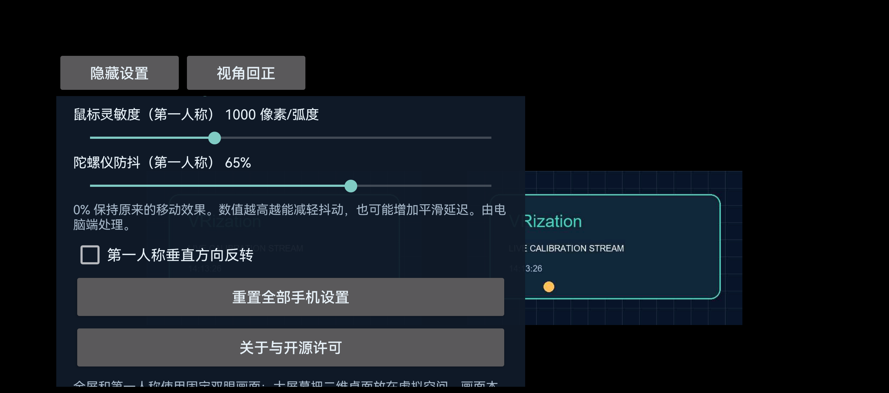
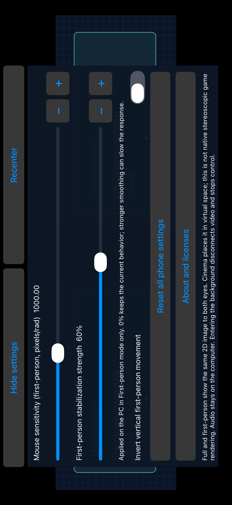

# 🎯 First-person gyro stabilization / 第一人称陀螺仪防抖

[English](#english) · [简体中文](#简体中文)

<!-- vrization:english -->
## English

The **First-person stabilization** slider controls how much the Windows host smooths phone rotation before producing mouse movement. Its default is **0%**, an exact filter bypass that preserves the previous input behavior. It does not change the video, cinema rendering or sensor sampling, and its value is separate from the default-enabled PC gyro-control preference.

### Adjust mouse control

1. Use v0.3.2 or newer host and phone applications, connect, then choose First-person mode.
2. Find **First-person stabilization strength** in the PC / iOS controls, or **Gyro stabilization (First-person)** in Android settings. Start at 0% and raise it gradually if small involuntary movements make aiming jittery.
3. Keep **Mouse sensitivity** separate: sensitivity changes movement gain; stabilization smooths movement. Stronger smoothing can increase the feeling of following behind your head. Lower the strength if turns feel slow.
4. Recenter and use the default-enabled PC gyro preference in First-person mode. **F8** latches input paused; use **Resume gyro control** on the PC to resume. Moving the slider cannot clear that latch.

The 0–100% control represents `stabilization` from 0 to 1. A connected update uses normal validated settings, acknowledgments and broadcasts, so the PC and phone show the accepted value and retain their committed profiles. An offline phone change is saved locally and restored once after the next validated connection; if both sides changed offline, the saved phone profile wins on reconnect. **Reset all settings** restores stabilization to 0%, along with the other documented [reset defaults](EDITING.md).

### Physical Android example

This unmodified screenshot is from the physical HUAWEI Pura 70 Ultra receiving VRization's original calibration card over USB. The Chinese **陀螺仪防抖（第一人称）** control shows **65%**, a temporary synchronization-test value; the product default remains **0%**. The screenshot shows the setting, not measured game smoothing or latency.

### Native iOS Simulator example

This unmodified image comes from the genuine UI checks on the arm64 iPhone 17 Pro Max Simulator running iOS 26.2. The English control shows **60%**, a temporary test value; the default remains **0%**. It is Simulator evidence, not a physical iPhone or real Apple USB connection.

### Older hosts and saved profiles

Earlier complete profiles have ten fields. They migrate by adding stabilization = 0, retaining the other values. New complete profiles have eleven fields; unknown fields, malformed values and incomplete persisted profiles are rejected. Partial network settings still validate every supplied field.

New clients negotiate settings schema 2 within **protocol v1**. A valid host capability or a settings snapshot containing stabilization enables the new field. If an older host supports neither, the client omits stabilization from network settings while preserving its full local value. The phone explains that a newer PC host is needed: moving the slider locally does not make the old host filter input. Legacy acknowledgments do not erase the local stabilization value.

A new USB host can first send a valid ten-field hello while advertising stabilization. The client requests the full eleven-field snapshot before initial profile adoption or sensor fallback. This avoids treating an omitted initial field as a remote setting of zero. See [protocol negotiation](PROTOCOL.md).

### What the filter does

Filtering runs **only on the Windows host**. Raw-angle/session/sequence validation, the local enabled preference, pause latch, capture checks and pose freshness remain in force. Foreground changes do not stop this policy; short pose gaps rebaseline before new valid poses resume; F8/editor/failure/Stop stays paused until PC Resume. The filter adds no timer or background output: without a new valid pose it cannot keep moving the mouse. Session changes, recentering and relevant input changes reset accumulated state.

VRization's original implementation adapts the One Euro Filter idea: smooth low-speed motion more and increase the cutoff as motion speeds up. For positive strength `s`, the rest cutoff is `3 / s²` Hz, the speed coefficient is `15` and the derivative cutoff is `5` Hz. These are **VRization's choices**, not asserted upstream defaults. There is no dead zone intended to discard deliberate small movements. The strength range balances smoothing against following lag; it is not a measured millisecond delay control.

Algorithm credit: **Géry Casiez, Nicolas Roussel and Daniel Vogel**, CHI 2012, [DOI 10.1145/2207676.2208639](https://doi.org/10.1145/2207676.2208639); [the authors' official explanation](https://gery.casiez.net/1euro/). Implementation reference: OneEuroFilter Python 0.2.1 at commit `d78925584245597f2aa9c4c01a802eb0f0b77fb9`, Nicolas Roussel / Géry Casiez, BSD-3-Clause. VRization copies no upstream implementation source and adds no OneEuroFilter runtime dependency. Its [unchanged reference license and provenance](../licenses/references/README.md) and [third-party notices](../THIRD_PARTY_NOTICES.md) record the reference even though the implementation was rewritten.

### Verification scope

Synthetic input checks exercise jitter reduction, moving input, exact 0% bypass and reset / no-output boundaries. On the physical Huawei, an actual phone-slider change saved **50%** locally and reached the host; a **65%** host update persisted on the phone and survived restart, then restored to the host. The earlier committed viewing profile was preserved, and no OS mouse moves were emitted. Windows / Android build and test jobs passed. iOS passed 77 Swift core tests and five genuine Simulator UI cases; this remains simulated-USB / LAN evidence, without a physical-iPhone result. Exact scope is in [validation](VALIDATION.md).

These are algorithm and settings-flow checks, **not** real-game control acceptance, measured smoothing lag or end-to-end video delay. Prior [performance measurements](PERFORMANCE.md) retain their original version and configuration.

---

<!-- vrization:chinese -->
## 简体中文

“**第一人称防抖强度**”滑块控制 Windows 主机将手机转动转换成鼠标移动前的平滑程度。默认 **0%** 完全绕过滤波，保留此前输入行为；它不改变视频、大屏幕渲染或传感器采样，与电脑默认启用的陀螺仪控制偏好分开。

### 如何调节鼠标控制

1. 使用 v0.3.2 或更新的电脑端与手机端，连接后选择第一人称模式。
2. 在电脑 / iOS 控件找到“**第一人称防抖强度**”，Android 设置中对应“**陀螺仪防抖（第一人称）**”。从 0% 开始，若细小的不自主移动让瞄准抖动，再逐步提高。
3. “**鼠标灵敏度**”单独调整：灵敏度改变移动倍率，防抖平滑移动。更强平滑可能让视角跟随头部时稍显迟缓；转头感觉慢时降低防抖。
4. 回正后在第一人称使用电脑默认启用的陀螺仪偏好；**F8** 锁定暂停，须在电脑点“**恢复陀螺仪控制**”。移动滑块不能解除暂停锁。

0–100% 对应 `stabilization` 的 0–1。已连接时经普通设置校验、确认与广播同步，电脑和手机显示接受的值并保存已提交配置。手机离线修改会本地保存，在下次合法连接后恢复一次；双方都离线改过时，重连以手机保存配置优先。“**一键重置所有设置**”会将防抖恢复 0%，其他范围见 [重置说明](EDITING.md)。

### Android 真机示例

这张未经修改的截图来自 HUAWEI Pura 70 Ultra 真机，通过 USB 接收 VRization 原创校准卡。“**陀螺仪防抖（第一人称）**”显示 **65%**，这是同步测试临时值，产品默认仍为 **0%**。截图证明设置状态，不是游戏平滑效果或延迟测量。

### 原生 iOS 模拟器示例

这张未修改原图来自 arm64 iPhone 17 Pro Max 模拟器、iOS 26.2 的真实界面检查。英文控件显示 **60%**，属于临时测试值，默认仍为 **0%**。这是模拟器证据，不是 iPhone 真机或真实 Apple USB 连接。

### 较早电脑端与保存配置

旧完整配置有十个字段，迁移时添加防抖 = 0，保留其他值。新完整配置有十一个字段；未知字段、非法值和不完整的保存配置会被拒绝。网络部分更新继续逐项严格校验。

新客户端在 **协议 v1** 内协商配置 schema 2。合法主机能力声明或含防抖的配置快照使该字段可用。较早电脑端都不支持时，手机仅从网络设置中去掉防抖字段，本地完整值仍保留，并提示需要新版电脑端：本地移动滑块不会让旧电脑端开始滤波。旧格式确认不会清空手机防抖值。

新版 USB 主机最初可能发十字段的合法 hello，同时声明支持防抖。客户端先取得完整十一字段快照，再接纳首个配置或处理传感器缺失回退，避免把尚未发送的字段误当成主机设置为零。详见 [协议协商](PROTOCOL.md)。

### 滤波如何工作

防抖**只在 Windows 主机执行**。原始角度／会话／序号校验、本地启用偏好、暂停锁、采集检查和姿态新鲜度继续生效。前台切换不停止此策略；姿态短暂间断后先重建基准，再由新合法姿态恢复；F8／编辑器／故障／Stop 则保持暂停，须电脑恢复。滤波不新增定时或后台输出；没有新的合法姿态时不会继续移动鼠标，会话变化、回正及相关输入变化重置累积状态。

原创实现参考 One Euro Filter 思路：低速时多平滑，移动变快时提高截止频率。正强度 `s` 的静止截止频率为 `3 / s²` Hz，速度系数为 `15`，导数截止频率为 `5` Hz。这些是 **VRization 自己选择的参数**，不冒称上游默认；没有用来丢弃细小主动移动的死区。强度在平滑与跟随迟滞间取舍，不是以毫秒为单位的实测延迟控制。

算法鸣谢 **Géry Casiez、Nicolas Roussel、Daniel Vogel**，CHI 2012，[DOI 10.1145/2207676.2208639](https://doi.org/10.1145/2207676.2208639)，见 [作者官方网站](https://gery.casiez.net/1euro/)。实现参考为 OneEuroFilter Python 0.2.1，commit `d78925584245597f2aa9c4c01a802eb0f0b77fb9`，作者 Nicolas Roussel / Géry Casiez，BSD-3-Clause。没有复制上游实现源码，也没有新增 OneEuroFilter 运行依赖。即使重写，仍在 [参考许可原文与来源](../licenses/references/README.md) 和 [第三方声明](../THIRD_PARTY_NOTICES.md) 记录。

### 验证范围

合成输入检查覆盖抖动降低、运动输入、0% 精确绕过与重置 / 不输出边界。华为真机实际拖动滑块后，**50%** 本地保存并到达主机；主机更新 **65%** 后手机保存，重启仍保留并恢复到主机。此前已提交的观看配置保留，没有操作系统鼠标移动。Windows / Android 构建与测试任务通过；iOS 通过 77 项 Swift 核心与五项真实模拟器界面用例，仍属于模拟 USB / 局域网证据，没有 iPhone 真机结果。精确范围见 [验证记录](VALIDATION.md)。

这些是算法与设置流程检查，**不是**真实游戏控制验收、平滑迟滞测量或端到端视频延迟。[已有性能测量](PERFORMANCE.md) 保留对应版本与配置范围。
