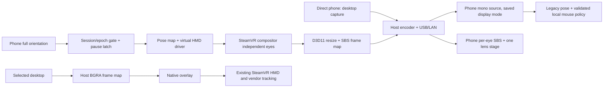
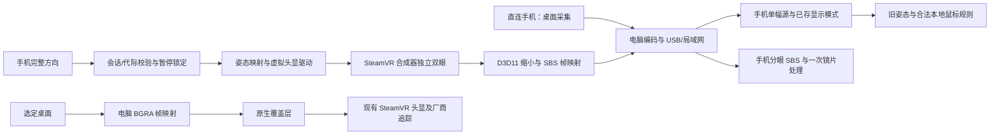

# SteamVR architecture / SteamVR 架构

[English](#english) · [简体中文](#简体中文)

<!-- vrization:english -->
## English

The experiment reuses the released direct-phone core through explicit extension points. A transient **stream session** chooses video layout and input destination; saved schema-2 VR settings still describe user fit. SteamVR route choice is separate from `full`, `cinema`, `fps` and `fps_enhanced`. No runtime or device is activated by importing modules or opening diagnostics. See [entry guide](../README.md) and [native implementation](../native/README.md).

The diagram describes implemented source paths; actual SteamVR and physical-device behavior remains unverified this session. The existing-headset path is a desktop overlay; native SteamVR applications render to the already connected HMD through SteamVR, not through VRization's phone encoder.

### Module boundaries and replacement points

| Module | Responsibility / reusable boundary |
| --- | --- |
| `python/vrization_steamvr/app.py` | Separate launcher and route-specific panels; selects routes, local profile, display and explicit registration/runtime actions |
| `python/vrization_steamvr/host.py` | `PreviewHost` extends `HostServer` hooks; pairs negotiated SBS with full HMD pose and installs a `NoMouse` sink only for the HMD route |
| `python/vrization_steamvr/session.py` | Strict transient session descriptor and `hmdPose` parser; independent of saved settings and native APIs |
| `python/vrization_steamvr/pose.py` | `HmdPoseGate`: accepted epoch, increasing sequence/time, quaternion baseline, pause latch, invalidation and 500 ms timeout; replaceable pose sink and clock |
| `python/vrization_steamvr/ipc.py` | Windows map/event ownership, exact little-endian layouts, bounded snapshot/payload validation and `GetTickCount64` |
| `python/vrization_steamvr/capture.py` | `MirrorCaptureSource`: starts only its helper on demand, retries readonly map discovery and wraps downsized BGRA in the normal host frame interface |
| `python/vrization_steamvr/runtime.py` | Readonly OpenVR inventory, explicit own-path driver registration, helper location, owned Stop event/process cleanup and diagnostics |
| `native/phone_driver.cpp`, `pose.hpp` | Pinned driver ABI, late map discovery, display properties and per-frame valid/invalid pose publication |
| `native/gpu.hpp`, `mirror.cpp` | Selected-adapter eye SRVs, original shader resize/color conversion, compact SBS readback, writer ownership and SRV release |
| `native/overlay.cpp` | Existing-headset texture submission; hides/clears stale input and destroys only its unique overlay before texture teardown |
| `native/ipc.hpp`, `stop.hpp`, `runtime.hpp` | Native layout/bounds, cooperative Stop and client OpenVR lifetime; no OS mouse API |
| Android `ClientVariant`, `StreamSession`, `HmdPoseValues` | Separate install/prefs/endpoints; video/input pairing and epoch-bound full quaternion messages |
| Android core `OrientationMath`, `AndroidPoseSource`, `StereoProjection`, `VrRenderer` | Framework rotation matrix + landscape remap + recenter; normalized Hamilton quaternion; per-eye aspect/UV clamps and GPU rendering |
| iOS `SteamVRProtocol`, `StreamSession`, `HMDQuaternion`, `StereoSampling`, `SteamVRPreferences` | Independent Swift package for pairing, counters, full orientation, stereo slices and isolated preferences |
| iOS shared `MotionSource`, `StereoRenderer`, `ViewerController`, stream/USB listeners | Core Motion full-attitude path, actual Metal per-eye rendering, lifecycle, editor and negotiated transport |
| `scripts/build_steamvr_native.py`, native CMake | Exact SDK pin/license verification, x64 `/MD` build, runtime-independent fixtures and reproducible staging |

For another project, implement a new `CaptureSource` that supplies the ordinary `Frame` contract, a validated pose sink for `HmdPoseGate`, or a transport adapter behind the existing stream client/server. Keep full HMD orientation separate from legacy mouse poses. Replace native graphics/runtime only behind frame/pose ownership contracts; a new encoder can consume downsized BGRA without changing session negotiation. Current mirror encoding uses CPU Pillow JPEG after GPU resize/readback; current desktop overlay capture also passes through the ordinary JPEG frame interface. Neither is claimed to be a complete GPU zero-copy encoder.

### Negotiated session and data lifetime

Host capability tokens are `stereo-sbs` and `hmd-orientation`, alongside existing capabilities. A `streamSession` object has exactly `v`, `epoch`, `accepted`, `streamLayout` and `inputTarget`. Supported pairings are `mono` + `mouse`, or `sbs` + `virtual-hmd`; hybrid pairings are rejected. Session epoch is a positive safe integer. The host initially marks the HMD session unaccepted, validates the client's hello capabilities, sends a complete accepted settings snapshot, then permits SBS frames/full orientation. A query parameter alone is not permission to stream SBS. No descriptor means legacy mono/mouse, never an inferred HMD.

The `hmdPose` message uses protocol v1 with epoch, monotonic `seq`, monotonic phone `timeUs`, boolean `trackingValid`, and four finite near-unit XYZW values when valid. Unknown fields, malformed numbers, wrong epochs and reused sequences are rejected before IPC. Tracking-invalid messages need no quaternion. Pose recenter updates a baseline; full orientation is never reconstructed from legacy yaw/pitch/roll. Android uses the framework fused rotation matrix, display remap and `R0ᵀR`; iOS uses Core Motion full attitude with the equivalent landscape/recenter convention. Cross-platform quaternion goldens check the mathematical convention, not physical sensor axes.

All user fit remains local schema 2 and synchronizes through the existing settings snapshot. `streamSession` is transient and must not be saved inside VRSettings. SBS rendering selects each half-source aspect, clamps UV to that eye's texel bounds, bypasses already-owned Cinema/enhanced projection, and restores the user's persisted mode on saved edits. Display edit Save/Discard is independent of tracking Resume.

IPC contracts are fixed in [native guide](../native/README.md). The phone route alone creates `Local\VRizationPhonePoseV1`. Mirror creates a unique per-session frame map; host opens it readonly. Existing-headset overlay has the opposite direction: host writes a unique frame map, native overlay reads. Seqlock prevents torn header/payload reads; timestamp freshness is Windows uptime. Native readers expire at 500 ms, reject nonfinite/invalid tracking, and close stale/inactive mapping handles so old ownership cannot survive forever. Stop invalidates shared data before writer close. New frame sessions use new names instead of reusing old payloads.

### Local control and runtime preservation

The HMD route's input sink cannot invoke mouse movement; legacy Euler pose messages are rejected there. Tracking defaults enabled locally but remains gated by accepted session, valid sensor data and pause state. F8, editing and Stop latch a local emergency pause; disconnect also invalidates current tracking. Reconnect, mode/setting changes, phone recenter and Save/Discard cannot clear the latch. Only the PC's local Resume action releases it, and the next fresh pose establishes its baseline. The inherited emergency boundaries and F8 availability checks remain active. The existing-headset overlay never writes HMD pose or injects OS input.

Explicit registration changes only the extracted preview's driver path. There is no automatic registration on startup, no `forceDriver` edit, no deletion/replacement of DPVR or another driver, and no runtime termination on Stop. Helper processes have unique Stop events; cleanup is graceful with bounded fallback only for that owned child. Graphics adapter selection follows `GetDXGIOutputInfo`, which matters on integrated/discrete-GPU systems; real adapter compatibility and phone headless rendering require the next hardware test.

### Evidence and license boundaries

Native tests cover byte layout/maps, Stop event/latch, pose validation, real WARP eye packing and factory ABI without a runtime context. Android preview JVM tests and compiled instrumentation, Swift tests/Simulator and both Apple SDK builds have distinct scopes; report actual completed results, not expected counts. Physical USB, optical fitting, real SteamVR initialization/compositor output, existing-headset lifecycle, gyro axes, sustained FPS and motion-to-photon latency are deferred.

OpenVR interfaces, import library and redistributable DLL are unchanged pinned SDK dependencies under BSD-3-Clause. Official simple HMD/overlay examples inform lifecycle ideas; VRization writes its own IPC, validation, shader packing and overlay implementation under MIT. The legacy virtual-display sample is architecture-only and not compiled/bundled. Preserve the [exact native notices](../native/licenses/README.md), root third-party records and historic released artifacts.

---

<!-- vrization:chinese -->
## 简体中文

实验版通过显式扩展点复用正式直连核心。临时“串流会话”选择画面布局和输入目标，schema-2 持久 VR 设置仍描述用户适配；SteamVR 路线独立于 `full`、`cinema`、`fps`、`fps_enhanced`。导入模块或打开诊断不会激活运行环境／设备。参见[入口教程](../README.md)、[原生实现](../native/README.md)。

图描述已编写的源码通路，本轮没有验证真实 SteamVR 或实体设备。已有头显路线只是桌面覆盖层；原生 SteamVR 应用由 SteamVR 直接渲染到已连接头显，不经过 VRization 手机编码器。

### 模块边界与替换点

| 模块 | 职责／可复用边界 |
| --- | --- |
| `python/vrization_steamvr/app.py` | 独立启动器和分路线界面，选择路线、本地设置、显示器及显式注册／运行环境操作 |
| `python/vrization_steamvr/host.py` | `PreviewHost` 扩展 `HostServer` 钩子，配对协商后的 SBS 与完整姿态，仅头显路线装入 `NoMouse` |
| `python/vrization_steamvr/session.py` | 严格临时会话和 `hmdPose` 解析，独立于持久设置与原生 API |
| `python/vrization_steamvr/pose.py` | `HmdPoseGate`：合法代际、递增序号／时间、四元数基准、暂停锁定、失效及 500 毫秒超时；可替换姿态输出和时钟 |
| `python/vrization_steamvr/ipc.py` | Windows 映射／事件所有权、准确小端布局、有边界的快照／载荷校验及 `GetTickCount64` |
| `python/vrization_steamvr/capture.py` | `MirrorCaptureSource`：按需只启动自身工具，重试只读发现映射，把缩小 BGRA 包装成原电脑帧接口 |
| `python/vrization_steamvr/runtime.py` | 只读 OpenVR 清单、显式注册自身路径、工具定位、自有 Stop 事件／进程清理与诊断 |
| `native/phone_driver.cpp`、`pose.hpp` | 锁定驱动 ABI、延迟映射发现、显示属性、逐帧发布有效／无效姿态 |
| `native/gpu.hpp`、`mirror.cpp` | 指定显卡双眼 SRV、原创 shader 缩小／颜色转换、紧凑 SBS 读回、写入所有权和 SRV 释放 |
| `native/overlay.cpp` | 已有头显纹理提交，隐藏／清空旧输入，在纹理销毁前仅销毁自身覆盖层 |
| `native/ipc.hpp`、`stop.hpp`、`runtime.hpp` | 原生布局／边界、协作 Stop 及 OpenVR 客户端生命周期，没有系统鼠标 API |
| Android `ClientVariant`、`StreamSession`、`HmdPoseValues` | 独立安装／设置／端点、视频／输入配对及代际绑定完整四元数消息 |
| Android 核心 `OrientationMath`、`AndroidPoseSource`、`StereoProjection`、`VrRenderer` | 系统旋转矩阵、横屏重映射、居中、归一化 Hamilton 四元数、分眼比例／UV 边界与 GPU 渲染 |
| iOS `SteamVRProtocol`、`StreamSession`、`HMDQuaternion`、`StereoSampling`、`SteamVRPreferences` | 独立 Swift 包，管理配对、序号、完整方向、双眼切片和隔离设置 |
| iOS 共享 `MotionSource`、`StereoRenderer`、`ViewerController`、串流／USB 监听 | Core Motion 完整姿态、真实 Metal 分眼渲染、生命周期、编辑器和协商传输 |
| `scripts/build_steamvr_native.py`、原生 CMake | 准确 SDK／许可校验、x64 `/MD` 构建、不依赖运行环境的测试及可复现暂存 |

移植时可实现返回原 `Frame` 契约的新 `CaptureSource`、为 `HmdPoseGate` 换已校验姿态输出，或在现有串流端后替换传输适配器。完整头显方向始终与旧鼠标姿态分离；原生图形／运行环境只在帧／姿态所有权边界后替换，新编码器可直接消费缩小 BGRA 而不改协商。目前 Mirror 在 GPU 缩小／读回后仍用 CPU Pillow JPEG 编码，桌面覆盖层也经过原有 JPEG 帧接口，不宣称完整 GPU 零复制编码。

### 会话协商与数据生命周期

电脑能力除旧项外增加 `stereo-sbs`、`hmd-orientation`。`streamSession` 精确包含 `v`、`epoch`、`accepted`、`streamLayout`、`inputTarget`；仅接受 `mono`＋`mouse` 或 `sbs`＋`virtual-hmd`，混合组合拒绝。代际为正安全整数。头显会话初始未接受，验证手机 hello 能力并发送完整已接受设置快照后，才放行 SBS 帧／完整方向；仅 URL 查询参数不能授权 SBS。没有描述符则为旧 mono／mouse，不推测头显。

`hmdPose` 使用 v1，带代际、递增 `seq`、递增手机 `timeUs`、布尔 `trackingValid`，有效时提供四个有限、接近单位的 XYZW 数值。未知字段、异常数值、错误代际与重复序号在 IPC 前被拒绝，无效追踪消息无需四元数。居中更新基准，绝不从旧 yaw／pitch／roll 重建完整方向；Android 使用系统融合旋转矩阵、显示重映射和 `R0ᵀR`，iOS 使用等价横屏／居中约定的 Core Motion 完整姿态。跨平台四元数 golden 证明数学约定，不证明实体传感器坐标。

用户适配仍保存在本地 schema 2，通过原设置快照同步，`streamSession` 临时字段不得存入 VRSettings。SBS 按每眼半幅比例渲染，将 UV 限制在该眼像素边界，绕过已由 SteamVR 决定的大屏幕／加强投影；保存编辑时恢复用户持久模式。显示保存／弃用与追踪恢复相互独立。

IPC 准确约定见[原生教程](../native/README.md)。只有手机头显路线创建 `Local\VRizationPhonePoseV1`；Mirror 创建每会话独立帧映射，电脑只读。已有头显相反：电脑写独立帧映射，原生 Overlay 只读。seqlock 防止头／载荷撕裂，时间使用 Windows 开机毫秒；原生读端 500 毫秒过期，拒绝无效／非有限追踪，并关闭旧／停用映射句柄，避免永久遗留所有权。停止先失效共享数据再关闭写入者；新帧会话换名称，不复用旧载荷。

### 本地控制与运行环境保留

头显路线的输入输出不能移动鼠标，也拒绝旧欧拉角消息。追踪本地默认启用，但仍受已接受会话、有效传感器与暂停状态限制。F8、编辑和停止锁定本地紧急暂停，断开也令当前追踪无效；重连、切模式／设置、手机居中及保存／弃用都不能解除。仅电脑“恢复”解除，下一份新姿态建立基准；既有紧急边界与 F8 可用性检查仍有效。已有头显覆盖层不写头显姿态，也不注入系统输入。

显式注册只改变本包驱动路径，无启动时自动注册、无 `forceDriver` 修改、不删除／替换 DPVR 或其他驱动，停止也不终止运行环境。工具有独立 Stop 事件，优先正常清理，后备操作限于自身子进程。图形显卡由 `GetDXGIOutputInfo` 选择，集显／独显电脑尤其需要这点；真实显卡兼容与手机无实体显示运行留待下次测试。

### 证据与许可边界

原生测试覆盖字节布局／映射、Stop 事件／锁定、姿态校验、实际 WARP 双眼拼接和无运行环境上下文的工厂 ABI。Android 实验版 JVM／已编译仪器测试、Swift／模拟器与双 Apple SDK 构建范围不同，记录已完成结果而不是预期数量。实体 USB、光学适配、真实 SteamVR 初始化／合成输出、已有头显生命周期、陀螺仪坐标、持续帧率、运动到显示延迟均留待真机。

OpenVR 接口、导入库、可再分发 DLL 是原样锁定的 BSD-3-Clause SDK 依赖；官方 Simple HMD／Overlay 示例提供生命周期思路，VRization 用 MIT 原创实现 IPC、校验、shader 拼接和覆盖层。旧 virtual-display 示例只作架构比较，不编译／打包。保留[准确原生声明](../native/licenses/README.md)、根第三方记录及历史发布产物。
