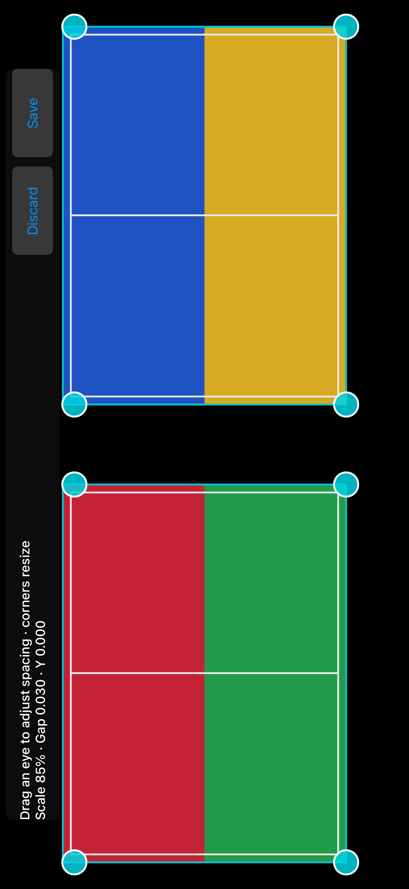

# 🥽 Three ways to connect / 三种连接方式

[English](#english) · [简体中文](#简体中文)

<!-- vrization:english -->
## English

Download the separate [SteamVR preview](https://github.com/LexZeon/VRization/releases/tag/v0.5.0-steamvr-preview), extract the complete Windows ZIP and open `Start-SteamVR-Preview.bat`. Choose English or 简体中文 in the launcher. Keep the ordinary VRization app and its release folders; the preview uses independent phone app identities, ports and saved preferences. Install the matching **SteamVR Android APK** for these preview USB routes. iPhone source/Simulator downloads require Apple signing before physical installation.

| Choose | Use it for | First steps |
| --- | --- | --- |
| 📱 Original direct phone | Desktop, a display/region, or ordinary games in the four original viewing modes | Choose the direct-phone entry, connect an authorized USB phone, start streaming on PC or connect on phone. LAN is also available. No SteamVR registration is needed. |
| 🥽 Phone as SteamVR HMD | Experimental SteamVR games viewed through a phone box, with gyro rotation | Register this package's Phone HMD driver using the launcher, open SteamVR, choose Phone HMD and start/connect the matching phone app. Use PC Resume if tracking is paused. |
| 🎮 Existing SteamVR headset | A desktop overlay while using an already connected PCVR/standalone headset | First connect the headset to SteamVR using its existing software. Choose Existing SteamVR headset, select the desktop/display and start the overlay. Native games and controllers keep their original SteamVR path. |

Phone HMD support is **rotation-only 3DOF**, with a fixed head position and no simulated tracked controllers. It is a test version: actual SteamVR initialization and compositor availability, phone axes/optics and hardware performance await the next physical-device session. A standalone headset needs an existing compatible PC connection; the preview does not add a universal standalone transport. Driver registration/removal changes only this package's path and leaves other drivers in place. Keep the registered folder at the same path.

### 🎛️ Fit the phone box

Open the first settings item, **Headset fit editor**. Drag either eye to change mirrored spacing; moving the left eye left moves the right eye right. Drag inward until the inner edges touch if needed. Drag a corner to resize proportionally, or move vertically to fit the phone box. **Save** commits and synchronizes the display profile with the connected PC. **Discard** restores the last committed profile. These fit settings also apply to SBS; SteamVR projection is kept while each eye samples only its own source half.

Original iPhone Simulator capture from [CI 38092654893](https://github.com/LexZeon/VRization/actions/runs/38092654893), showing the actual native editor with an original synthetic SBS grid. Red/green and blue/yellow are deliberately different source eyes. This is not a physical iPhone or a SteamVR runtime capture. The screenshot is preserved without pixel edits; SHA256 `4dd40ca9acacaa994e8e6d34f486bd7e78db22e6efb056142cb7e876fe4ee70a`.

The Simulator viewer retains straight SBS borders even with a saved Enhanced first-person profile: SteamVR owns the projection, so the direct-phone square/fisheye step is bypassed. A phone lens correction stage remains available once. The ordinary direct-phone Enhanced mode continues to use its square angular projection.

### ⏹️ Stop and resume

Phone Disconnect and PC Stop close their active session and clear old frames. **F8, the fit editor and Stop latch HMD tracking paused**; reconnect and Save do not release it. Use **Resume HMD tracking on PC** after closing the editor. Recenter changes the baseline only. The HMD route never injects Windows mouse input; the direct-phone first-person route retains its existing local mouse policy. The existing-headset Stop hides and destroys this preview's overlay without closing SteamVR.

For reusable interfaces, handoff guidance and the hardware checklist, see [architecture](ARCHITECTURE.md), [AI handoff](AI_HANDOFF.md), [verification](VALIDATION.md) and [OpenVR credit](../native/licenses/README.md).

---

<!-- vrization:chinese -->
## 简体中文

下载独立的 [SteamVR 测试版](https://github.com/LexZeon/VRization/releases/tag/v0.5.0-steamvr-preview)，完整解压 Windows ZIP，打开 `Start-SteamVR-Preview.bat`；启动器可选英文或简体中文。保留普通 VRization 和历史版本目录，实验版采用独立手机应用标识、端口和本地设置。实验版 USB 路线请安装对应的 **SteamVR Android APK**。iPhone 源码／模拟器下载还需 Apple 签名才能安装真机。

| 选择 | 用途 | 起步操作 |
| --- | --- | --- |
| 📱 原版手机直连 | 桌面、显示器／选区、普通游戏，保留原来的四种显示模式 | 选手机直连入口，接入已授权 USB 手机，在电脑开始串流或手机连接；另有局域网。此入口无需注册 SteamVR 驱动。 |
| 🥽 手机作为 SteamVR 头显 | 用手机盒子和陀螺仪旋转尝试 SteamVR 游戏 | 在启动器注册本包手机头显驱动，打开 SteamVR，选手机头显并开始／连接对应手机应用；追踪暂停时用电脑恢复。 |
| 🎮 已有 SteamVR 头显 | 已连接的 PCVR／一体机中显示桌面覆盖层 | 先用头显已有软件连接 SteamVR，选已有头显入口，选桌面／显示器并启动覆盖层。原生游戏与控制器沿用原 SteamVR 通路。 |

手机头显目前只有 **3DOF 旋转**，头部位置固定，没有模拟追踪控制器。它是测试版，SteamVR 实际初始化／合成画面、手机轴向／光学及性能留到下次实体设备测试。一体机需要已有兼容电脑连接方式，本版不增加通用一体机传输协议。注册／移除只针对本包路径，保留其他驱动；注册后请保持文件夹位置。

### 🎛️ 适配手机盒子

打开设置第一项“头显适配编辑器”。拖任一眼调整镜像间距：左眼向左，右眼向右；向内拖时，两眼内侧边缘可接触。拖顶点等比例缩放，或上下移动以适配盒子。“保存”提交显示配置并与已连接电脑同步；“弃用”恢复上次已提交配置。这些显示范围同样用于 SBS，每眼只取对应半幅图像，保留 SteamVR 的投影。

来自 [CI 38092654893](https://github.com/LexZeon/VRization/actions/runs/38092654893) 的原始 iPhone 模拟器截图：真实原生编辑器和原创合成双眼网格，红／绿、蓝／黄刻意表示不同源眼。它不是实体 iPhone 或 SteamVR 运行环境截图。图片像素未经修改，SHA256 `4dd40ca9acacaa994e8e6d34f486bd7e78db22e6efb056142cb7e876fe4ee70a`。

即使保存过加强第一人称配置，模拟器 SBS 查看器边缘仍保持直线：SteamVR 决定投影，因此绕过直连模式的正方形／鱼眼步骤，手机镜片补偿仍可只做一次。普通手机直连的加强模式仍使用正方形角度投影。

### ⏹️ 停止与恢复

手机断开和电脑停止关闭各自活动会话并清掉旧帧。**F8、适配编辑器、停止会锁定头显追踪暂停**，重连和保存不解除。关闭编辑器后，使用电脑“恢复头显追踪”；重新居中只改变基准。头显路线不注入 Windows 鼠标输入，手机直连第一人称沿用既有本地鼠标规则。已有头显的停止会隐藏并销毁本版覆盖层，不关闭 SteamVR。

可移植接口、接手说明和真机清单见[架构](ARCHITECTURE.md)、[AI 接手](AI_HANDOFF.md)、[验证](VALIDATION.md)及 [OpenVR 鸣谢](../native/licenses/README.md)。
